# Spork — Agent-Centric IDE
## Technical Design Document

| | |
|---|---|
| **Working codename** | Spork |
| **Document** | Technical Design |
| **Status** | Draft for review |
| **Version** | 0.1 |
| **Date** | 2026-06-20 |

> **One-line concept:** An agent-centric IDE for codebase-editing and workflow-oriented coding tasks, built around a central **branching timeline (a Directed Acyclic Graph)** of typed nodes — code edits, validations, stress tests, and deterministic sanity checks — where every change by human or agent is tracked, any point can be inspected/restored/branched locally, and the agent can hot-swap between model providers (Claude, OpenAI, Copilot CLI, local/Ollama) with managed, lineage-aware context.

> **⟳ Realignment (2026-06) — read alongside this spec.** [REALIGNMENT_PLAN.md](REALIGNMENT_PLAN.md) re-centers the product on its thesis after the MVP UI drifted git-ward. It **refines, never contradicts** this design (every change is additive over the frozen F0–F4/P5–P7 contracts — C2). Where they differ in *framing*, the realignment wins: **(1)** nodes are the spine; a "branch" is an **emergent line** in the DAG (`branch`/`HEAD`/`refs` are internal tip/fork bookkeeping, never user-facing git chrome; merge/push become **action nodes**). **(2)** Node types come in two families — **agentic** (Planning/Ask/Exploratory/Working, differing by instructions/skills/tools/MCP, carried in payload) and **deterministic action** (run-tests/stress/sanity/git-push) — both via the existing registry; per-type **states** ride as a `presentation_status` in the node payload surfaced via an additive `NodeView` field (the frozen `Lifecycle` is untouched; `require_review → Blocked`). **(3)** Connectivity has two arrows: *Spork drives a model* (local HTTP default; cloud BYOK over a new additive TLS `Transport`) and *your agent drives Spork* via a write-capable **Orchestration MCP** (new `Command::OrchestrateInvoke`, mirroring the read-only History MCP). The generic-CLI-as-model provider is **deprecated** (it impersonates a coding agent as a one-shot model over a protocol nothing speaks — the source of the connectivity errors). **(4)** Spork is **not a code editor**: "open codebase" hands off to VS Code/Cursor (open-in-editor); in-app Monaco is read-only diff. See REALIGNMENT_PLAN §7 for the C2 risk register proving no-domino.

---

## Table of Contents

1. Vision & Executive Summary
2. Problem Statement & Motivation
3. Goals & Non-Goals
4. Core Concepts & Glossary
5. System Architecture
6. Data Model: The Timeline DAG
7. Node Type System
8. Validation, Testing & Quality Gates
9. Extensibility & Custom Node SDK
10. Snapshot & State-Tracking Engine
11. Execution, Isolation & Parallel Branches
12. Model Provider Abstraction & Fast Switching
13. Context Management & Handoff System
14. User Experience & Frontend Architecture
15. Security, Permissions & Privacy
16. Technology Stack
17. MVP Scope & Phased Roadmap
18. Risks, Trade-offs & Open Questions
19. Collaboration Model: Local-First with Shared Sandbox Reconciliation
- Appendix A — Addenda, Deeper Dives & Consistency Notes

---


## 1. Vision & Executive Summary

Spork is an agent-centric IDE whose central abstraction is a **branching timeline modeled as a Directed Acyclic Graph (DAG)**. Where today's AI-native tools treat history as a linear, ephemeral, per-conversation checkpoint stack that destroys forward state on revert, Spork makes the full task lifecycle a persistent, typed, branchable, content-addressed graph. Every codebase state — and every observation about it — is a durable, restorable, comparable node.

### 1.1 The Wedge

The market has converged hard on a single shape: an agentic loop (read repo, edit files, run commands, iterate) wrapped in a checkpoint/restore safety net. By 2025–2026 every major player ships agent modes (Cursor Composer, Windsurf Cascade, Zed Agent, JetBrains Junie, Copilot agent mode), and the frontier has moved to parallel agents over git worktrees (Cursor 2.0: up to 8; Antigravity: up to 5). Yet **no incumbent treats history as a first-class branching DAG.** Cursor restores all files to a chat-timeline point; Windsurf's revert is itself irreversible and destroys forward history; Cline and Aider use shadow-git or commit-per-edit with strictly linear rollback. Parallel exploration is bolted on as a worktree workaround, not a unified visual model.

Spork's white space is the inverse: a graph where parallel branches are the native model, every node is restorable and branchable, and validation, stress, and deterministic checks are durable typed artifacts rather than transient terminal output.

### 1.2 Core Idea in One Diagram

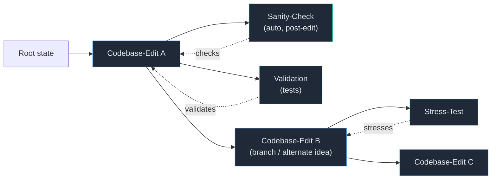

### 1.3 What Ships

- A **typed-node DAG** with four built-in node kinds — Codebase-Edit, Validation/Testing, Stress-Test, and Deterministic Sanity/Pattern-Check — plus a registry that lets users define new node types through the same contract the built-ins use.
- A **two-layer state model**: an immutable, content-addressed object store (Git-style blobs/trees/snapshots, sidecar in `.spork/`, git-aware but not git-polluting) bound to an append-only, hash-chained event log that makes restore and merge non-destructive operations rather than mutations.
- **Transactional restore** of code *and* conversation together — research shows chat-only recovery yields 8–13% correctness versus ~100% for semantics-aware filesystem+process checkpointing.
- **Multi-provider model routing** (Claude, OpenAI, Copilot CLI, Ollama/local) with fast switching and **per-node** model selection and cost attribution.
- A **left-to-right DAG canvas** with a node-details panel, a node-type legend, a top-bar model selector, and an action toolbar (View, Analyze, Recalibrate, Validate, Create DT, Submit DT, Create Process, Metadata).

### 1.4 Why Now, and the Honest Constraints

Adoption of AI coding tools is near-universal (~84% of developers), but trust is collapsing (~29% trust output accuracy) and the top frustration is code that is "almost right but not quite" (66%). The category is enormous (~$7–10B in 2025–2026) but brutally concentrated and capital-intensive. Spork therefore competes on **workflow and trust**, not raw model quality: the DAG timeline, deterministic checks, branch/restore, and local-first multi-provider routing directly target the privacy and reliability gaps incumbents under-serve. We are explicit about the limits this imposes — there is a real hardware ceiling on running parallel branches (worktree storage can balloon by several multiples of repo size, which is why CoW snapshots are the default — see §11.2). The earlier local-first-vs-shared-team tension is now **resolved** by making the sandbox the unit of state, sharing, and reconciliation: shared-team is the same local-first machinery at a wider scope (content-addressed node+sandbox bundles grafted onto one shared project DAG), not a separate distributed system — see §19.

## 2. Problem Statement & Motivation

### 2.1 The Linear-History Failure Mode

Today's checkpoint/restore is a stack, not a graph. This produces four recurring, well-documented failures:

| Problem | How incumbents fail | Consequence |
|---|---|---|
| **Destroyed forward history** | Windsurf revert is irreversible; Cursor/Cline restore collapses the timeline | A discarded exploration is unrecoverable; you cannot compare two ideas |
| **Untracked mutations** | bash `rm`/`mv`, codegen, build steps, and non-edit-tool changes escape edit-tool tracking (Cline, Aider, Cursor) | A node's "exact state" silently diverges from disk — the core promise breaks |
| **Chat/code divergence** | Snapshots restore files OR chat, associated by timestamp | Restored agent behaves against state it doesn't understand (8–13% correctness) |
| **Ephemeral observations** | Test/lint/perf output lives in a terminal, not the timeline | Results are not durable, not diffable across branches, not usable as gates |

### 2.2 What Developers Actually Want

The RedMonk agentic-IDE wishlist — background agents, persistent memory, MCP, multi-agent orchestration, rollbacks/checkpoints, predictable pricing — maps almost directly onto a DAG-timeline concept. The autonomous-agent market has independently made state-tracking and reversibility *table stakes* (Replit's bidirectional checkpoint navigation with alternate-history branches; Cursor's per-agent worktrees; draft-PR-per-task in GitHub/Jules/Codex), and handoff/context-persistence (AGENTS.md, DeepWiki, session-handoff docs) is an emerging battleground. The primitives are commoditizing; **the structured, branchable, multi-node-type history is not.**

### 2.3 The Specific Gaps Spork Must Close

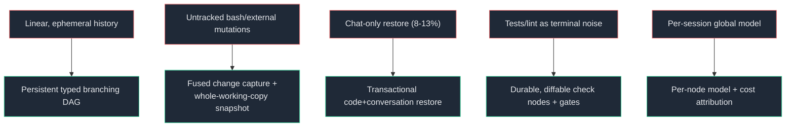

Three of these are genuinely hard engineering problems the design treats as first-order risks, not afterthoughts:

1. **The untracked-mutation gap.** This is the single biggest reliability gap in every competitor. Spork must capture the actual working-copy tree (not edit-tool deltas) and fuse an in-process interceptor, an OS filesystem watcher, a reconciliation rescan, and an editor-buffer bridge into one authoritative snapshot — or it inherits the exact bug it claims to fix.
2. **Transactional restore.** Code state, conversation state, and the operation-log pointer must move together; a partial restore is the 8–13%-correctness trap.
3. **The large-repo / parallel-branch performance cliff.** `node_modules`, build artifacts, nested `.git`, and monorepo size degrade snapshotting; parallel worktrees share databases, ports, and Docker and balloon storage. The design accepts that parallel *execution* of every branch cannot be promised, and models scarce resources explicitly.

### 2.4 Why a DAG, Specifically

A DAG is not decoration over checkpoints — it is the data structure that makes the rest possible. Explicit parent/child and provenance edges enable clean handoff-document generation (the agent decides whether it needs a prior discussion node's context). Content-addressed snapshots make "click a node, see exact state" a single tree resolve and make branch/restore `O(diff)` rather than `O(repo)`. And per-node typing lets validation, stress, and sanity results become comparable artifacts across siblings — a capability linear-history tools cannot cheaply replicate.

## 3. Goals & Non-Goals

### 3.1 Goals

| # | Goal | Success criterion |
|---|---|---|
| G1 | **Total change capture** | Every user- and agent-initiated change — including bash `rm`/`mv` and external edits — maps to a node; no working-tree drift goes unattributed |
| G2 | **Exact-state fidelity** | Clicking any node resolves the exact codebase state at that point via its content-addressed snapshot |
| G3 | **Non-destructive restore & branch** | Any node is restorable and branchable locally; restore is an *event*, not a mutation; forward history survives |
| G4 | **Transactional restore** | Code, conversation, and op-log pointer restore atomically; restore fails closed on divergence |
| G5 | **Typed, durable observations** | Validation, stress, and sanity results are immutable, diffable across nodes, and usable as gates |
| G6 | **Extensible node types** | Built-ins ship out of the box and register through the same public NodeTypeRegistry that user-defined types use |
| G7 | **Fast multi-provider switching** | Claude, OpenAI, Copilot CLI, and local (Ollama) providers are peers; model choice is per-node with cost attribution |
| G8 | **Cache-friendly context** | Context is compiled from DAG lineage with stable→volatile prefix ordering to preserve provider KV/prompt-cache hits across turns and siblings |
| G9 | **Git interop without pollution** | The DAG lives in a `.spork/` sidecar; snapshots import from / export to real Git commits on demand, keeping team history clean |
| G10 | **Local-first & private** | No code leaves the machine by default; BYO-key; secrets never enter the content-addressed store |

### 3.2 Non-Goals

| # | Non-goal | Rationale |
|---|---|---|
| N1 | **Execution-replay time-travel** (rr/Pernosco-style) | 10–20× record overhead; Spork's time-travel is the cheap *snapshot* kind, not deterministic execution replay — conflating them would tank performance |
| N2 | **Replacing Git** | Git remains the source of truth for team sharing; Spork is git-aware and interoperates, not a fork of git |
| N3 | **Out-competing on indexing/model breadth** | Incumbents are deeply invested here; differentiation is workflow/trust, and model connectivity is a thin swappable adapter (reuse Vercel AI SDK / LiteLLM) |
| N4 | **Guaranteed parallel execution of every branch** | Worktrees share DBs/ports/Docker and storage balloons; the scheduler serializes when resources conflict and is honest about it |
| N5 | **Frozen-RAG / vector search over code** | The field has converged on agentic exploration; retrieval is a budgeted *tool* the agent calls, not a fixed pre-fill |
| N6 | **Live co-editing / cloud CRDT multiplayer in v1** | Local-first single-process is the v1 target. Asynchronous shared-team via content-addressed node+sandbox bundles grafting onto one project DAG is now the *resolved* collaboration model (see §19), and the op-log/event model is designed for it; only *live* co-editing and stateful-runtime reconciliation are deferred as genuinely hard |
| N7 | **Undoing external side effects** | Snapshots capture the working copy, not rows written to a shared dev DB or pushed remotes; restore warns rather than promising to undo system-boundary effects |

### 3.3 Guiding Principles

- **The DAG is the single source of truth.** Context, cost, restore, and handoff are all derived from lineage, never from a flat scrollback.
- **Append-only over mutable.** A bad merge or restore is just another node you branch away from; nothing is destroyed.
- **Dogfood the extension point.** Built-in node types use the public registry, guaranteeing the extension API is first-class.
- **Be honest about scope.** "Exact state" is honest about its exclusion lists; "parallel" is gated by `canRunParallel`; restore fails closed rather than silently wrong.

## 4. Core Concepts & Glossary

The system separates an immutable **content layer** (what the code *is*) from an append-only **timeline layer** (what *happened*), mirroring Git's object/ref split and Jujutsu's commit-graph/operation-log split.

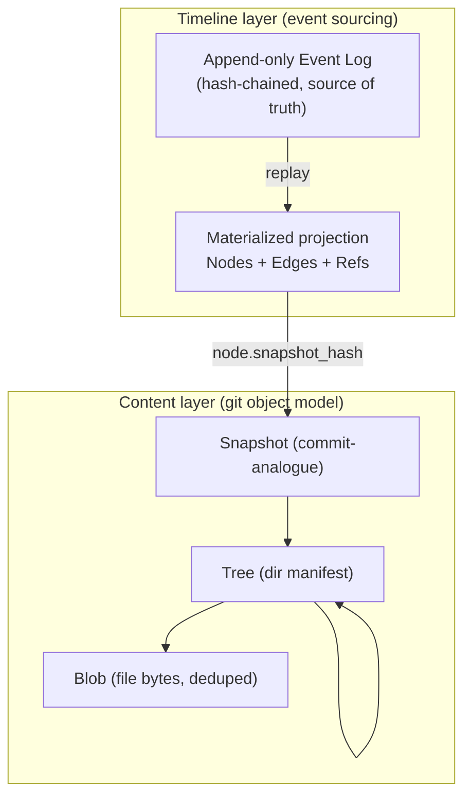

### 4.1 Structural Concepts

| Term | Definition |
|---|---|
| **Timeline DAG** | The persistent, content-addressed graph of typed lifecycle nodes that is Spork's single source of truth |
| **Blob / Tree / Snapshot** | Content-layer objects (Git-analogues): file bytes, directory manifest, and the commit-analogue binding a whole codebase state to a `root_tree_hash` |
| **Node** | A common **Envelope** (identity, type, parents, snapshot pointer, status, model/cost attribution, lineage hash) plus a type-specific **Payload** |
| **Edge** | A typed, directional relation: `PARENT_CHILD` (lineage), `BRANCH` (fork origin), `DERIVED_FROM` (handoff/context provenance), `VALIDATES`/`CHECKS`/`STRESSES` (a test node targeting an edit), `MERGE_PARENT` |
| **Event** | An immutable, hash-chained log entry (`NODE_CREATED`, `RESTORE_PERFORMED`, `MERGE_PERFORMED`, …); the projection is rebuildable from the event stream |
| **Ref** | A mutable pointer (`HEAD`, `branch/*`) into the immutable graph; a ref move is itself an event |
| **Operation log (op-log)** | The append-only journal of DAG mutations enabling universal undo/redo and time-travel over the graph itself |

### 4.2 Node Families & Built-in Types

Nodes split into three families sharing one envelope:

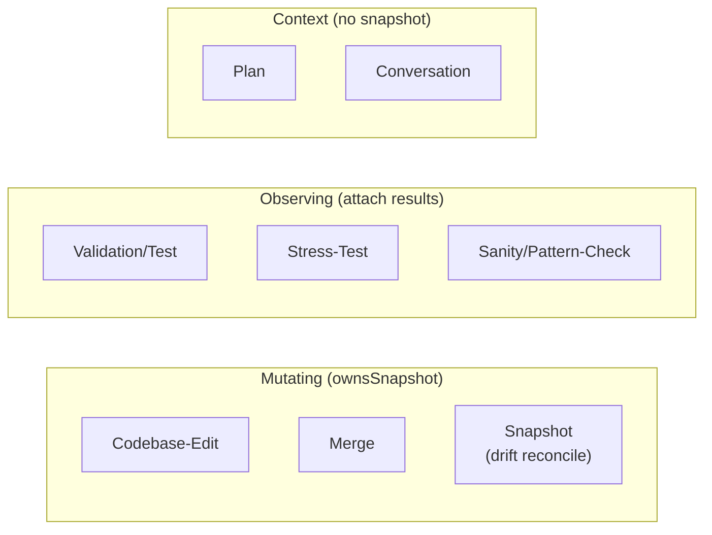

| Node type | Family | Purpose |
|---|---|---|
| **Codebase-Edit** | Mutating | An agent conversation that changed the codebase; owns a snapshot + conversation transcript + diff |
| **Validation/Testing** | Observing | User- or agent-defined tests run against a parent; results stored for review |
| **Stress-Test** | Observing | Load/perf/fuzz tests against a parent; metrics (p50/p95/p99, throughput, errors) stored |
| **Deterministic Sanity/Pattern-Check** | Observing | Deterministic lint/format/architectural-rule checks auto-run after agentic edits |
| **Snapshot** | Mutating | Reconciles untracked (bash/external) drift so all changes map to a node |
| **Plan / Conversation** | Context | Carry no snapshot; feed handoff-document generation and per-node model attribution |

**Mutating** nodes own a snapshot — clicking them restores state. **Observing** nodes attach immutable, append-only **ResultArtifacts** to a parent's snapshot and never mutate it. **Context** nodes carry no snapshot.

### 4.3 Lifecycle & Staleness

A node's run outcome and its validity-relative-to-lineage are **two orthogonal axes.** Lifecycle status is a small state machine `{pending → running → passed | failed | blocked | cancelled}`; **staleness** is a separate flag set when a mutating ancestor's snapshot changes. This avoids state explosion (no `passed-stale` sixth state) and lets the UI show "passed but stale" (amber over green). An **effectiveStatus** helper folds both into a single UI token.

### 4.4 Extensibility & Provider Concepts

| Term | Definition |
|---|---|
| **NodeTypeRegistry / NodeTypeDescriptor** | The registry and declarative manifest (id, color, JSON-schema payload, allowed edge types, runner, staleness rule) through which built-in *and* user-defined types are registered |
| **Runner SPI** | The uniform execution interface for observing nodes; built-in Test/Stress/Sanity runners plus Command/MCP adapters; user runners are sandboxed and capability-limited |
| **inputDigest / derivationKey** | A deterministic hash of (parent snapshot + canonical config + executor version) that makes results cacheable, dedupable, and staleness-detectable |
| **ProviderAdapter** | The owned port normalizing chat/streaming/tool-calling across Claude, OpenAI, Copilot CLI, and local servers |
| **ModelSelector** | A per-node `pinned`-or-`policy` declaration resolved to a concrete model; the top-bar selector edits the default for new nodes |
| **CredentialVault** | OS-keychain/external-store abstraction; plaintext keys never touch config or the DAG |

### 4.5 Operational Concepts

| Term | Definition |
|---|---|
| **Snapshot pointer** | The binding from a node to a content-layer Snapshot, enabling transactional code+conversation restore |
| **Drift detection** | Hashing the working tree (with exclusion lists, debounced on turn boundaries) to catch out-of-band mutations and auto-create a Snapshot node |
| **Handoff document** | A durable, regenerable AGENTS.md-style distillation of parent→child lineage that lets a fresh agent start cold |
| **Gate / GatePolicy / GateVerdict** | Declarative quality rules evaluated against check results that block or warn on transitions (merge, promote, Submit-DT) |
| **Worktree (CoW)** | A per-branch working copy materialized via reflink/clonefile where the filesystem supports it; copy fallback otherwise |
| **`.spork/`** | The sidecar holding the SQLite event log + projection and the content-addressed object store, keeping the user's real `.git` untouched |

These concepts are the shared vocabulary for the remainder of this document; subsequent sections specify the engines that realize them.


## 5. System Architecture

Spork is a local-first desktop application whose primary surface is a left-to-right, typed-node DAG canvas, but whose architectural center of gravity is a long-lived local **daemon** that owns the timeline, the snapshot store, model routing, and node execution. The renderer is deliberately thin: a reactive React client that subscribes to daemon state and never touches the filesystem, model keys, or shell directly. This split is the spine of the whole system — it is what lets running tests and background agents survive a window reload, lets every privileged operation be capability-gated and auditable, and lets a future CLI or headless mode reach the same engine.

### 5.1 Process topology

We adopt **Tauri (Rust core) + React/TypeScript renderer** over Electron, with the engine extracted into a **separate daemon process** rather than living in the window's main process. The hard work in Spork is local and CPU-bound — content-addressed (CAS) hashing, Git plumbing, worktree materialization, tree diffing, node execution — and Rust gives near-native performance with a smaller, more securely-defaulted shell (per-command allowlist, capability model) than Electron's broad Node integration. Extracting the daemon means the DAG and in-flight executions are decoupled from the UI lifecycle.

The trade-off is real: Tauri's ecosystem is smaller and webview behavior diverges across WKWebView (macOS), WebView2 (Windows), and WebKitGTK (Linux), so Monaco, canvas, and Web Worker behavior must be tested per platform. We mitigate by keeping all UI in standards-based React, so a fallback to Electron is mechanical if webview parity becomes blocking.

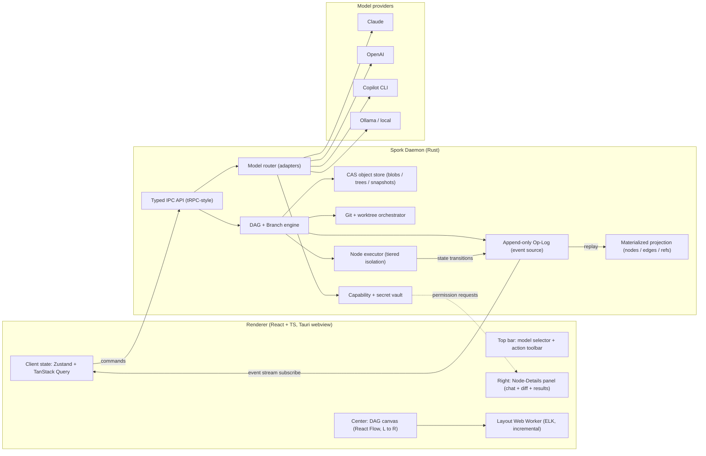

### 5.2 Engine internals

The daemon is organized around the same two-layer separation that Git makes between objects and refs, and that Jujutsu makes between the commit graph and the operation log:

| Concern | Mechanism | Why |
|---|---|---|
| Source of truth | Append-only, hash-chained **Event Log** (event sourcing) | Complete, tamper-evident audit trail; restore and merge become events, not destructive mutations |
| Read model | **Materialized projection** of nodes/edges/refs into SQLite | Fast graph walks, legend counts, and node-details without replaying the whole log |
| Codebase state | **Content-addressed object store** (blobs/trees/snapshots) | Free structural dedup; "show exact state" is one tree resolve; restore/branch is O(diff) |
| Type system | **Node Type Registry** (built-ins registered through the public extension API) | Built-in and user-defined types share one contract; the UI is data-driven |

Persistence lives entirely under a sidecar `.spork/` directory so the user's real Git history stays clean: **SQLite in WAL mode** holds the event log, projection, and metadata (single writer, many concurrent readers — a clean fit for one IDE process), while a **CAS object store** (loose objects plus periodic packfiles, mirroring `.git/objects`) holds code bytes. We deliberately do not put blob bytes in SQLite: that would bloat the DB, make vacuum/GC painful, and make large-blob reads contend with hot graph queries. Two coordinated stores demand crash-consistency discipline — objects are always written and fsynced *before* the event that references them commits in SQLite, with orphan-object GC to reclaim partials. The single SQLite writer is wrapped in a **serializing writer actor** that batches event appends so many parallel-branch runners don't bottleneck on it.

### 5.3 Execution and isolation

Materializing a node's exact state into a runnable workspace uses a **tiered isolation ladder**, chosen per node by policy rather than forcing one backend everywhere:

- **Worktree-on-CoW (default)** — reflink/clonefile checkout (APFS, Btrfs, XFS, ZFS) makes per-branch checkout near-instant and storage-light; right for trusted edits and unit tests. Falls back to hardlink/copy on filesystems without reflink (ext4, NTFS).
- **Container / devcontainer** — dependency, network, and filesystem isolation plus reproducible toolchains for language-specific test runners.
- **microVM (Firecracker / Cloud Hypervisor)** — hardware-virt isolation for untrusted agent-run code and noisy stress tests. On arm64 macOS this rides a lightweight Linux VM host (Lima/Colima/krunkit), a platform-divergent path we accept for the strongest tier.

A **constraint-based scheduler** classifies each test/stress node by the scarce resources it needs (host ports, GPUs, databases, the Docker daemon, disk budget) and admits sibling branches to run **in parallel only when their resource sets are disjoint**, otherwise serializing them. This directly honors the product premise that parallel testing of two branches is not always possible: worktrees share ports/DBs and storage balloons by several multiples of repo size (quantified in §11.2 and budgeted in A.5). Auto port allocation plus env-var rewriting eliminate most port conflicts; unknown stateful services default to exclusive. Every workspace and resource is held under a **TTL lease** with a crash-safe reaper, and a **secrets broker** injects credentials at runtime that are never written into snapshots (a leaked key in an immutable, shareable node would be permanent).

### 5.4 Model provider abstraction

Model connectivity is a thin, swappable adapter layer behind Spork's own `ProviderAdapter` port — we wrap proven engines (the Vercel AI SDK running in a managed Node.js sidecar process supervised by the Rust daemon, or native Rust provider clients; an embedded LiteLLM-style proxy for headless/team self-host) rather than reinvent normalization, since the genuinely hard problem is normalizing tool-call schemas, streaming framing, and error/cache semantics, not connectivity. A `CapabilityRegistry` (static table refined by a cheap runtime probe) prevents assuming OpenAI-compatibility for local models that lack native tool-calling. Model choice is a **per-node property** — the top-bar selector sets the default for new nodes — and a `CostAccountant` attributes every token, cache read, and dollar to its originating node, turning the timeline into an auditable cost ledger. Crucially, the prompt is laid out **stable-prefix to volatile-suffix** so sibling branches and successive turns reuse provider KV/prompt caches (Anthropic cache reads at 0.1x input); a naive per-node recompile that reorders the prefix would silently destroy the ~80% cost saving the design depends on.

### 5.5 Real-time data flow and security boundary

Updates flow **unidirectionally** from the daemon's op-log tail into an event reducer in the renderer, with optimistic UI on user actions reconciled against acks via correlation ids. Durable state transitions ride the ordered op-log; high-frequency ephemeral streams (chat tokens, test stdout) use lightweight side-channels keyed by node id so token volume never stalls the graph. All privileged operations — filesystem, Git, command execution, model keys — are centralized in the daemon behind a capability-scoped IPC API; the renderer holds **zero secrets** and references state by content hash, fetching blobs lazily, so even a compromised webview cannot exfiltrate keys or the codebase.

## 6. Data Model: The Timeline DAG

The Timeline DAG is Spork's single source of truth: a persistent, append-only, content-addressed graph of typed lifecycle nodes that records every codebase state and every relationship between states. This is the product's wedge — no incumbent treats history as a first-class branching DAG; the field ships linear, ephemeral, per-conversation checkpoint/restore that destroys forward history. The model is deliberately split into two layers (content and timeline) bound by snapshot pointers, and a registry-driven type system that dogfoods its own extension point.

### 6.1 The two layers

**Content layer (immutable, content-addressed).** Borrowed wholesale from Git's object model, hashed with BLAKE3 (parallel, tree-hashable, no SHA-1 baggage):

- **Blob** — file content, optionally FastCDC-chunked so a one-region change in a 2GB asset re-stores only the changed chunks.
- **Tree** — a canonically-sorted directory manifest; identical subtrees dedup to a single hash.
- **Snapshot** — Git's "commit" analogue, binding a `root_tree_hash` to creation metadata, a `git_parent_commit` for import/export, and an `ignore_profile_hash` recording which exclusion set produced it.

Every hash Spork *computes* — snapshot, tree, blob, lineage, and the event-log `prev_event_hash` chain — is BLAKE3, so the design rests on a single primitive. The lone exception in the ERD below is `SNAPSHOT.git_parent_commit`, which is `sha1` **only because it is an imported Git object id** (Git's own commit hash), not a hash Spork produces.

**Timeline layer (append-only log + materialized graph).** The ground truth is an ordered, hash-chained **Event Log**; every mutation (node created, edge added, snapshot attached, test result recorded, branch forked, restore performed, merge performed) is an immutable event carrying a `schema_version`. Nodes and edges are a **materialized projection** rebuildable from that log, with periodic projection checkpoints to bound replay cost. This makes restore non-destructive — it is just another event, with forward nodes preserved — directly fixing the irreversible-revert and linear-rollback weaknesses of incumbents.

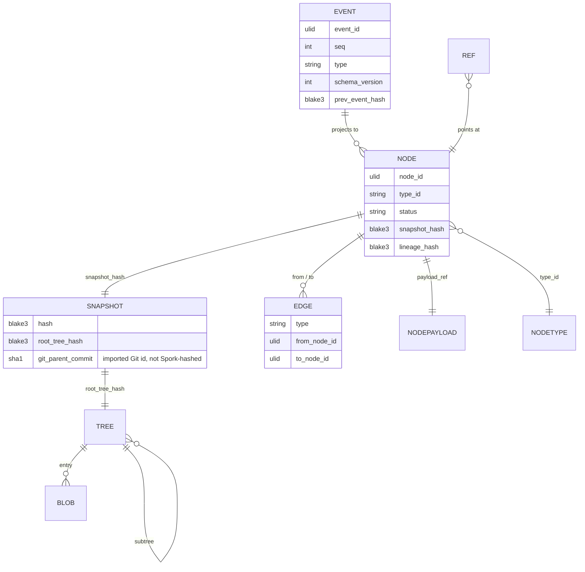

### 6.2 Nodes: envelope plus payload

A Node is a common **Envelope** plus a type-specific **Payload**. The envelope (`node_id` as a time-sortable ULID, `type_id`, `status`, `snapshot_hash`, `parent_node_ids`, `created_by`, optional `model_ref`, optional `cost`, `lineage_hash`) gives the graph engine, layout, restore, and handoff generation a **stable contract independent of payload**. The payload is JSON-schema validated per type. Hot fields (status, test-pass counts) are promoted into indexed envelope columns rather than queried inside JSON via SQLite's JSON1 functions, which are less efficient for hot paths.

Built-in types split into two families that share the envelope but differ in their relationship to the codebase:

| Type | Family | Owns snapshot | Payload essentials |
|---|---|---|---|
| Codebase-Edit | Mutating | Yes | conversation transcript, diff stat, files changed, context sources |
| Snapshot (drift reconcile) | Mutating | Yes | origin (auto_drift / manual / import), drift source |
| Merge | Mutating | Yes (≥2 parents) | base ref, conflict resolution |
| Validation / Test | Observing | No | test spec, results, target node, input digest |
| Stress-Test | Observing | No | load/fuzz profile, p50/p95/p99 metrics, target node |
| Sanity / Pattern-Check | Observing | No | rule set, violations, auto-triggered flag, target node |
| Plan, Conversation | Context | No | steps / transcript; feed handoff generation, no snapshot |

**Mutating** nodes own a snapshot — clicking them restores exact state. **Observing** nodes attach immutable, append-only `ResultArtifacts` keyed to `(nodeId, runId, inputDigest)` to a parent's snapshot and never mutate it; this is what makes durable, comparable test/lint/perf history Spork's differentiator versus ephemeral checkpoints.

### 6.3 Edges, acyclicity, and lineage

Edges are typed and directional, enforced acyclic on insert via an ancestor check against the projection:

- **PARENT_CHILD** — timeline lineage.
- **BRANCH** — fork-point marker (a `forkBranch` creates a head `Ref` and copies no code until checkout).
- **DERIVED_FROM** — handoff/context provenance; this is how the agent decides via `includeAncestorContext` whether it needs a prior discussion node's context.
- **VALIDATES / CHECKS / STRESSES** — a test-class observing node targeting an Edit node.
- **MERGE_PARENT** — the additional parents of a merge node.

Mutable **Refs** (`HEAD`, `branch/*`, tags) point into the immutable graph like Git refs; a ref move is itself an event, so pointer history is recoverable.

### 6.4 Three correctness invariants

The data model lives or dies on three guarantees, each with an identified failure mode:

1. **Transactional restore across code and conversation.** Every Edit node binds a code `contentRef` and a conversation/context ref; restore swaps both atomically. Research shows chat-only recovery yields 8–13% task correctness versus ~100% for semantics-aware filesystem+process checkpointing — so a partial restore (code restored, conversation rehydrate fails) is the precise failure to avoid, prevented by the **atomic dual-restore guard**: the restore runs under a single lock and fails closed (rolling back) if the snapshot and conversation refs diverge, so the two refs always move together or not at all.

2. **No untracked mutation.** All codebase changes must map to a node, including out-of-band bash `rm`/`mv` and external-editor edits that escape edit-tool tracking — the gap every competitor leaves open. A `DriftDetector` hashes the working tree (with exclusion lists for `node_modules`, build dirs, nested `.git`, debounced on agent-turn boundary) and materializes a **Snapshot node** capturing any unattributed change. The honest cost: drift hashing has a large-repo penalty, and exclusion lists risk a false negative inside an excluded dir, so the UI must flag uncaptured working-tree drift rather than imply perfect fidelity.

3. **Cache-friendly, non-recomputing graph.** Content-addressing means identical `(parent, inputs, executor-version)` re-runs dedup; the projection + checkpoints keep reads off the full log. A reachability-aware GC reclaims orphaned objects without deleting anything still reachable from any node, ref, or replayable event — a bug here is silent loss of restorable states.

### 6.5 Merge and extensibility

Branches are first-class and **never auto-merged** — silent code merges produce the "almost-right" bugs that are the top developer frustration. A Merge is an explicit, recorded operation producing a new Edit node with multiple parents and a stored conflict-resolution payload, computed as a standard three-way file merge against the nearest common ancestor snapshot. Because the log is append-only, a bad merge is just a node you branch away from. Conversation transcripts have no clean three-way analogue, so conversation merge is necessarily append-style; test-class nodes are generally re-run against the merged Edit rather than merged.

New node types register through the same `NodeTypeRegistry` the built-ins use — a declarative `NodeTypeDescriptor` (type id, display name, legend color, payload JSON schema, allowed edge types, optional sandboxed runner, staleness rule) validated at registration. This keeps the engine closed to modification but open to extension, makes types serializable and shareable, and lets the legend and node-details panel be fully data-driven, satisfying the requirement to ship built-ins out of the box while letting users define their own.

### 6.6 Automatic branching & work attachment (non-destructive by construction)

Branching is not a manual chore the user must remember — it is the **default outcome of starting work**, so an existing line of work can never be silently overwritten (the D1+D3 bet). The policy is **daemon-owned** (so it is identical whether work originates from the GUI, the headless client, an agent run, or drift capture; the renderer holds no graph authority, §15.1) and is decided when a new node is appended:

- **Fork on divergence.** Starting code-changing work from the **current branch tip** *continues* that branch (the new Edit/Snapshot is its child on the same `branchId`). Starting work from any **non-tip node** — an earlier point that already has a child, or a historical node you checked out and edited — **auto-forks a new branch** (a fresh ref + the new node on it), because a second child of an existing node is, by definition, a divergence. This guarantees non-destructive exploration with the fewest possible branches; the explicit `branch.fork` (§6.3, A.1) remains as the manual override for forking on purpose.
- **Read-only work attaches, it does not branch.** An agent task that produces no code change — *analysis* or *planning* — is an **observing/context node** (it owns no snapshot, §4.2), so there is no code "line" to fork. It attaches to the node it was asked about via a non-lineage edge (`DERIVED_FROM` for context, `VALIDATES`/`CHECKS`/`STRESSES` for observations) and stays on the current line. Only snapshot-owning (mutating) work participates in the fork-on-divergence rule above.
- **Lineage vs. attachment is visually explicit.** Lineage edges (`PARENT_CHILD`, `BRANCH`, `MERGE_PARENT`) render **solid**; attachment/observation edges (`DERIVED_FROM`, `VALIDATES`/`CHECKS`/`STRESSES`) render **dotted** — so it is immediately clear which branch a node *belongs to* versus which node it merely *refers to* (UI_UX §6.2).

The triggers that exercise this policy arrive with their phases: the **agent-run path** (click a node → ask the agent → analyze/plan/change) is P6; **checking out a historical node** to edit it is P7. Drift capture (F3) already records out-of-band human edits as Snapshot nodes; applying the fork-on-divergence policy in the drift-reconcile + agent-run paths is additive engine work behind the frozen `create_node` seam (the `branch_id` is caller-supplied today; auto-assignment is a new policy, not a contract change — see plan §9).


## 7. Node Type System

The Node Type System is the type layer of Spork's branching-DAG timeline. Every mutation to the codebase, and every observation made about it, is reified as a typed node whose payload binds three things together: a content-addressable snapshot of the codebase, the agent/conversation context that produced it, and any attached results. The system answers three questions — *what kinds of nodes exist*, *how does a node move through its lifecycle*, and *how do users add kinds we did not ship* — and it does so through one uniform envelope so the graph engine, layout, restore, and handoff generation can stay generic over every kind, built-in or custom.

### 7.1 The built-in taxonomy

The taxonomy is organized into three families that share a common node envelope but differ in their relationship to the codebase. **Mutating** nodes own a snapshot (`ownsSnapshot = true`): clicking one materializes the exact codebase state, and it can be a branch point. **Observing** nodes attach durable, comparable results to a parent's snapshot and never mutate it — they are Spork's white-space differentiator against incumbents' ephemeral, linear checkpoints. **Context** nodes carry no snapshot at all; they feed handoff-document generation and per-node model attribution.

| Kind | Family | `ownsSnapshot` | Payload core | Default lifecycle on create |
|------|--------|----------------|--------------|------------------------------|
| Codebase-Edit | Mutating | yes | `contentRef`, `conversationRef`, `diffSummary`, `toolCalls[]` | `passed` once snapshot captured |
| Snapshot (drift reconcile / import) | Mutating | yes | `contentRef`, `origin(auto_drift\|manual\|import)`, `driftSource`, `importSource{type,uri,gitRef}?` | `passed` |
| Merge | Mutating | yes | `contentRef`, `baseRef`, `conflictResolution{}` | `passed` / `blocked` on conflict |
| Validation/Test | Observing | no | `targetNodeId`, `runnerRef`, `config`, `inputDigest` | `pending` |
| Stress-Test | Observing | no | `targetNodeId`, `profile{kind,duration,concurrency,seed}` | `pending` |
| Sanity/Pattern-Check | Observing | no | `targetNodeId`, `checks[]`, `autorun` | `pending` |
| Plan | Context | no | `steps[]`, `derivedFrom` | n/a |
| Conversation | Context | no | `transcriptRef`, `contextSources[]` | n/a |

The four product-required built-ins (Edit, Validation, Stress-Test, Sanity-Check) are the headline kinds; Merge and Snapshot are the supporting mutating kinds that keep the DAG a true, gapless record (a Snapshot node reconciles untracked bash mutations, and the *same* Snapshot kind with `origin = import` ingests external state — an import is not a separate kind but a Snapshot whose origin is an external source, consistent with §6.2; a Merge node carries two-or-more parents). Critically, **all of these are registered through the same `NodeTypeRegistry` that user-defined types use** — we dogfood the extension point rather than special-casing built-ins (see §9).

### 7.2 The node envelope and the mutating/observing split

Every node is a common `NodeEnvelope` (`id`, `kind`, `family`, `ownsSnapshot`, `parentIds[]`, `childIds[]`, `branchId`, `status`, `isStale`, `model`, `opLogId`, `payloadSchemaVersion`) plus a discriminated, JSON-schema-validated `payload`. We chose a uniform envelope with a `kind` discriminator over both a flat nullable mega-struct (which destroys type safety and produces wide, ambiguous rows) and a separate table per kind (which explodes joins on every graph walk and breaks polymorphic queries). The `ownsSnapshot` capability flag lets the engine decide *generically* whether clicking a node restores state or merely overlays results on a parent's state — no per-kind branching in the layout, restore, or handoff code. The cost is a versioning discipline: payload schemas evolve independently of the envelope, so every node carries `payloadSchemaVersion` and a malformed custom type that claims `ownsSnapshot` without producing a `contentRef` is rejected at registration time.

Mutating nodes bind **both** a codebase `contentRef` and a conversation/context ref, and `restore` swaps them transactionally. This is grounded in the research finding that chat-only recovery yields 8–13% task-correctness versus ~100% for filesystem-plus-conversation checkpointing — a Codebase-Edit node is meaningless without the conversation that produced it, and handoff generation needs both.

### 7.3 Lifecycle: two orthogonal axes

A node's lifecycle is a small state machine — `pending → running → {passed | failed | blocked | cancelled}` — with **staleness modeled as an orthogonal boolean (`isStale`, `staleSince`, `staleReason`), not a sixth state**. Staleness is independent of outcome: a node that `passed` becomes stale when its parent snapshot changes, and a `failed` node can also be stale. Folding staleness into the state set would double every other state (`passed-stale`, `failed-stale`, …) and discard the original run result. Keeping them on separate axes lets the UI render "passed but stale" as amber over green, and lets the engine cheaply invalidate a whole subtree by walking `childIds` on any mutating-node change *without recomputing outcomes*. Consumers never check two fields by hand; a centralized `effectiveStatus` helper folds `status + isStale` into one UI token (`green`, `green_stale`, `red`, `red_stale`, `running`, `pending`, `blocked`, `cancelled`). The `cancelled` token (rendered grey/struck) covers a cancelled run and is terminal-and-non-stale, so there is no `cancelled_stale`.

Observing-node results are stored as **append-only `ResultArtifact`s keyed by `(nodeId, runId, inputDigest)`**, separate from the node's status. `inputDigest` is a deterministic hash of the parent snapshot `contentRef` plus canonicalized config, which makes every artifact self-describing about *what it validated*. A re-run produces a new `runId` rather than overwriting history, so trend comparison across branches is preserved; the node's status is derived from its latest run's summary. Append-only storage grows, so we cap retained runs (default keep-last-N plus an always-protected passing baseline) and dedup large logs via content-addressing.

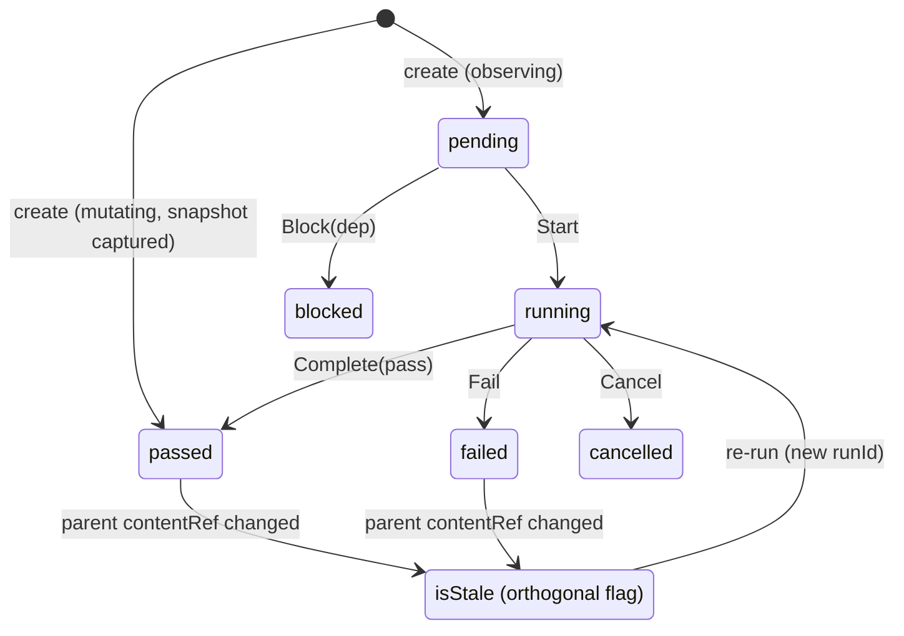

### 7.4 Reconciling untracked mutations

Competitors universally miss bash-side mutations (`rm`/`mv`, codegen, non-edit-tool writes), so their timelines silently lie about true state. Spork closes this with a `DriftDetector` that hashes the working tree (honoring exclusion lists for `node_modules`, build output, and nested `.git`, debounced on agent-turn boundaries) against the head node's `contentRef`, and on drift materializes an explicit **Snapshot node** (Jujutsu-style auto-snapshot) so *all* codebase changes map to a node — satisfying the hard requirement. The trade-off is drift-hashing cost on large repos and graph clutter from consecutive auto-snapshots, mitigated by exclusion lists and UI collapsing of consecutive Snapshot nodes.

## 8. Validation, Testing & Quality Gates

This component turns Spork's three checking node types — Validation/Testing, Stress-Test, and Deterministic Sanity/Pattern-Check — into first-class, durable, comparable artifacts, and uses their results as programmable **gates** that govern what can be merged, submitted, or auto-branched. It is exercised directly by the action toolbar (Validate, Create DT, Submit DT) and surfaced in the Node-Details panel.

### 8.1 CheckSpec vs CheckNode, and one Runner SPI

The central modeling decision separates a reusable, version-controlled `CheckSpec` (the *what/how to run*) from an immutable `CheckNode` (one *execution* of a spec against a specific parent state). Every execution is keyed by the tuple **`(checkSpecId@version, inputTreeHash, runnerImageDigest)`**. Because each parent state resolves to a content-addressable tree hash, a `CheckNode` is deterministically tied to its input — which is exactly what makes results diffable across nodes and cacheable across branches. Identical `(spec, inputHash, runnerImage)` tuples are deduped against a content-addressed result cache, so a sanity check that ran on a subtree shared by two branches is not re-executed. This directly answers the research warning that the DAG "must be cache-friendly and avoid recomputing at every node." The subtlety is cache-key soundness: a `CheckSpec` must honestly declare the inputs it reads, or under-declaration yields a stale green (a trust-killing false pass) while over-declaration drives the hit rate to zero.

The three shipped check types are not bespoke pipelines; they are built-in adapters behind a single `Runner` SPI, so storage, diffing, baselining, gating, and caching are implemented once:

```
interface Runner {
  describe(): RunnerCapabilities
  prepare(ctx: SandboxContext, spec: CheckSpec): PreparedRun
  run(prepared, signal): RawRunOutput
  normalize(raw, spec): ResultEnvelope   // the load-bearing contract
  collectArtifacts(raw): ArtifactManifest
}
```

| Runner | Tooling | Result emphasis |
|--------|---------|-----------------|
| TestRunner | jest / pytest / go-test (parses junit-xml) | pass/fail/skip per unit, coverage |
| StressRunner | k6 / locust / wrk + fuzzers | p50/p99 latency, throughput, peak mem, fuzz corpus |
| SanityRunner | eslint / ruff / prettier / dependency-cruiser / arch rules | violations `{ruleId, file, line, fixable}`; hermetic |

A user-defined check kind (a mutation-test or a11y-audit node) is just a new Runner adapter plus a result schema, and instantly inherits diffing, baselining, and gates — satisfying the "define new node types" requirement. The hard, load-bearing surface is the normalized `ResultEnvelope`: it must express tests *and* perf *and* lint (`outcome`, per-unit results, typed `metrics[]` with a direction, `violations[]`, `artifactManifest`) without leaking type specifics into the core — exactly where the research locates the real engineering cost ("the hard problem is not connectivity but normalization").

### 8.2 Execution, isolation, and the auto-run loop

Checks execute through the Runner SPI inside an isolated sandbox **materialized from the parent tree** (reflink/copy-on-write checkout or git worktree), never against the user's live working directory — running against the live dir is non-hermetic and lets untracked bash mutations corrupt results. Deterministic Sanity checks carry a hermeticity contract: no network, read-only base, pinned tool versions. Validation and Stress checks declare resource needs (ports, DBs, Docker, GPUs) so the scheduler can serialize conflicting siblings, honoring the product's own hedge that "parallel testing of two branches is not always possible." Full clones per check are rejected (worktree storage balloons by several multiples of repo size — see §11.2), so CoW reflinks are the default with a hardlink fallback where the filesystem lacks reflink support.

Cheap, hermetic deterministic checks **auto-run after every agentic edit**: `onEditNodeCommitted(editNodeId)` schedules every sanity `CheckSpec` whose `declaredInputs` intersect the node's changed paths — change-scoped and debounced so the IDE stays responsive. Heavier validation and stress checks run on demand or by policy. Results split into a small queryable `ResultEnvelope` (kept in the DAG store for fast Node-Details rendering and diffing) and bulky blob-addressed artifacts (logs, coverage, perf traces, fuzz corpora) that are lazily loaded and content-addressed for cross-branch dedup. GC is reachability-aware so it never deletes an artifact a pinned baseline still references.

### 8.3 Gates, baselines, and flaky-test handling

Gates are declarative `GatePolicy` objects evaluated by an engine that writes an immutable `GateVerdict` onto a node or a transition (merge / promote-branch / submit-dt / create-dt). Declarative policy is auditable and branch-scoped, unlike imperative hooks scattered through agent code, and the same policy can guard different transitions. A rule is a structured predicate over the latest result envelopes — e.g. `all(kind=='sanity').outcome=='passed' AND metric('p99_latency_ms').deltaVsBaseline <= 0.10` — with severity `block | warn` and an `onFlaky` strategy. Overrides are permitted but are themselves recorded as an audit node, so a failing gate is never silently bypassed; otherwise gates become theater.

Regression comparison runs against explicit **baselines**: a correctness baseline pins an expected-pass set, a perf baseline pins a metric distribution with tolerances. The `Diff` engine compares any two `CheckNode`s of the same spec to surface newly-failing, newly-passing, regressed, and fixed units, plus metric deltas — a capability linear-history competitors cannot cheaply replicate.

Because false-blocking on flakes (or false-greening) destroys trust faster than anything, flaky handling is first-class. Per-unit outcome history across the DAG feeds a `flakinessScore` weighted toward outcome flips on *unchanged relevant inputs* — Spork can distinguish "failed on a state whose relevant files never changed" (likely flake) from "failed after a relevant edit" (likely regression), signal that linear tools lack. Gates support bounded auto-retry with quorum and can quarantine a unit (excluded from gates, still recorded). The risk to manage is that a genuine concurrency bug can masquerade as a flake and get retried-into-green or dumped into an ever-growing quarantine, so quarantine lists are surfaced and time-boxed.

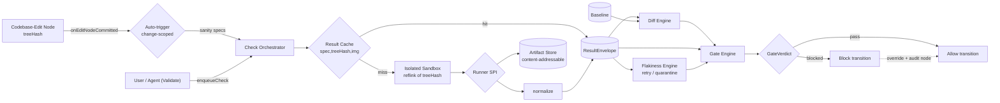

## 9. Extensibility & Custom Node SDK

The Extensibility & Custom Node SDK lets third parties and power users define new node types beyond the four built-ins. A Spork "node type" is richer than a VS Code command or a single MCP tool: it bundles (a) a declarative **manifest** describing identity, typed ports, capabilities, and UI contributions; (b) an **executor** that runs when the node is materialized against a parent codebase state; and (c) **UI contributions** (icon, color, legend entry, detail-panel renderer, toolbar actions). Built-in types are registered through this same registry, guaranteeing the extension API is first-class rather than an afterthought.

### 9.1 The two-plane split and the tiered executor model

The core stance is a two-plane split. The **data/execution plane** (manifest + executor + capability broker) is the source of truth and must be deterministic, sandboxed, and replayable, because every node's output becomes a durable, restorable DAG artifact — an executor is effectively a pure-ish function `output = f(parent_snapshot_hash, normalized_inputs, executor_version, capability_grants)`. The **UI plane** is a separate, untrusted-by-default contribution surface rendered in a sandboxed webview that communicates only by `postMessage`; a malicious detail-panel renderer cannot reach the filesystem or model keys.

Executors span a wide cost/trust spectrum, so the SDK offers a tiered backend chosen per node type:

| Tier | Backend | Best for | Sandbox property |
|------|---------|----------|------------------|
| Default | WASM Component Model (WASI Preview 2) | Sanity/pattern checks, parsers, light tests | Deterministic, capability-based, no ambient FS/network, portable |
| Escape hatch | OCI container / subprocess | Test runners, fuzzers, load generators needing a real toolchain | Mounts only the CoW snapshot; namespaces/seatbelt isolation |
| Thin | MCP server | Pure orchestration (call a model, hit an API, read a tool) | Inherits the ~9.6k-server MCP ecosystem |

WASM is the default because deterministic checks must be replayable and portable across every contributor's machine; containers are the gated escape hatch for native tooling that cannot compile to WASM; MCP lets authors reuse a standard they already target. The cost is three host-binding surfaces and authors having to pick the right tier — mitigated by a `spork node init` scaffolder that defaults sensibly. The container tier reintroduces the parallel-execution resource problems (shared ports, Docker daemon, storage blow-up) the research flags, so it is capability-gated and concurrency-limited.

### 9.2 Capabilities, replayable derivations, and typed ports

The security spine is a **deny-by-default, capability-based permission model** with a fixed typed vocabulary, brokered and audited at runtime. Executors get **zero ambient authority**: the manifest declares exactly which capabilities it needs, the user reviews and grants them at install, and every privileged call is mediated by a host broker that enforces scope and appends an `AuditEntry` to the node. This is deliberately stricter than VS Code's trust-on-install model, where one malicious extension exfiltrates code and keys.

| Capability | Scope example | Why it is dangerous |
|------------|---------------|---------------------|
| `snapshot.read` / `snapshot.write` | path globs | All writes flow through `snapshot.write` against a CoW copy — closes the bash/rm/mv untracked-mutation gap |
| `process.spawn` | container/subprocess tier only | Could mutate the real checkout if not jailed |
| `net.connect` | host allowlist | Exfiltration vector |
| `model.invoke` | `{maxTokens, providersAllowed}` | Spends the user's tokens; broker enforces a per-node budget |
| `nodes.readOutputs` | `{nodeTypes, lineageOnly}` | Lets a node pull prior-discussion context for handoff |
| `secrets.get` | named secrets | High-value credentials |

Two Spork-specific constraints shape execution. First, **results are content-addressed, replayable derivations**: re-running an identical node is either a cache hit (skipped) or yields a byte-identical artifact, which is the only way the "click a node, see the exact state" promise survives across restore and branch fan-out. A node that secretly reads wall-clock, network, or randomness can poison the cache, so non-deterministic types must self-declare `impure` to opt out of caching and always re-run; the WASM tier denies clock/random/network by default, and a periodic replay-and-compare audit re-runs sampled deterministic nodes and quarantines mismatches. Second, **all filesystem mutation flows only through `snapshot.write` against a copy-on-write working tree**, never the user's real checkout — directly closing the untracked-mutation gap that Cline, Aider, and Cursor all suffer.

Nodes chain (Edit → Sanity → Validation → Stress), so each type declares **typed, semver-versioned input/output ports** validated at the edges. A JSON-Schema port system, plus a special `snapshotRef` port kind carrying a content-addressed tree hash, lets the UI offer only valid attachments, lets the agent reason about which prior-node context it needs, and makes artifacts comparable across branches (two Validation nodes emitting the same `TestReport` schema can be diffed). Changing an output schema is therefore a breaking change requiring a major version; the marketplace runs CI schema-compat checks, and every `DagNode` stores its `typeVersion` so the UI can render mixed versions. A raw/`any` escape port exists for prototyping and is flagged lower-trust.

### 9.3 Authoring, distribution, and trust

Authoring runs through a `spork node` CLI: `init --tier wasm|container|mcp --template sanity|test|stress` scaffolds manifest, executor, and detail panel; `build` compiles to a component/OCI image and writes a lockfile plus SBOM; `test --against <snapshotFixture>` runs in a local sandbox with mock grants and asserts determinism by re-running and comparing the derivation key; `sign` and `publish` ship it.

Distribution is a **signed marketplace with a three-rung trust ladder**, learning from VS Code's open-marketplace supply-chain incidents and MCP server sprawl. The reproducible `.spork-node` package (manifest + executor artifact + UI bundle + lockfile + SBOM + signature) lets Spork verify integrity and surface every capability request before install.

| Tier | Signing | Capability grant policy |
|------|---------|--------------------------|
| Verified Publisher | Signed, vetted publisher | May pre-clear low-risk capabilities |
| Community | Signed | Capabilities always require manual review |
| Local-Dev | Unsigned | Sandboxed, explicit per-run prompts |

Plain MCP servers can register as thin node types, maximizing day-one catalog breadth. A revocation kill-switch handles a compromised published type: affected `DagNode`s are flagged `revoked-provenance` and their cached artifacts retained-and-flagged rather than deleted, so historical branches stay reproducible while the provenance warning is visible. The residual risks are the ones inherent to any code marketplace touching a user's codebase and model keys — supply-chain compromise via a hijacked publisher key, permission fatigue from fine-grained grants (mitigated by per-template capability bundles and required human-readable rationales), and cost-attribution disputes from `model.invoke` (mitigated by hard broker-enforced per-node token budgets surfaced on each node).


## 10. Snapshot & State-Tracking Engine

The Snapshot & State-Tracking Engine is the persistence substrate beneath Spork's branching DAG. It captures the EXACT codebase state at every node, attributes every change — agent edits, human edits, bash mutations such as `rm`/`mv`, non-git files, and unsaved editor buffers — to a specific node, and makes any node restorable and branchable locally and near-instantly. It is the layer that makes the product promise "click a node, see the exact state" literally true, and it is where Spork closes the single most damaging gap shared by every incumbent: bash-side and non-edit-tool mutations that linear checkpoint stacks silently fail to track.

### 10.1 Three-Layer Architecture

The engine is organized into three cooperating layers, deliberately separated the way Git separates objects from refs and Jujutsu separates the commit graph from the operation log.

1. **Content layer (immutable, content-addressable).** A dedicated "shadow" object store modeled on Git's blob/tree/commit graph, keyed by BLAKE3 rather than SHA-1. Blobs hold file bytes; Trees are canonically serialized directory manifests (sorted by name) so identical subtrees dedup to one hash; a Snapshot object (Git's commit analogue) binds a `rootTree` to the codebase state a node points to. BLAKE3 is chosen over SHA-1/SHA-256 because it is tree-hashable (parallelizable, fast on large files) and collision-safe, removing Git's SHA-1 baggage. This store is a sidecar in `.spork/`, NOT the user's `.git`, so Spork can snapshot ignored files, partial states, and editor buffers that have no business in team history without ever risking the real repo.

2. **Timeline layer (append-only operation log).** Borrowed directly from Jujutsu, an append-only op-log journals every DAG mutation — `snapshot`, `createNode`, `branch`, `restore`, `reattribute`, `gc`, `gitExport`. The op-log is the single serialization point, so parallel branch agents writing snapshots never corrupt the graph; they append ops that are linearized. This makes the engine's OWN operations undoable, turns "restore + branch" into pure metadata moves, and directly fixes Windsurf's irreversible-revert and Cline's linear-rollback weaknesses — a bad restore is just another op you undo.

3. **Materialization layer (copy-on-write working trees).** Per-branch working copies are reconstructed from the CAS using filesystem CoW cloning — APFS `clonefile`, Btrfs/XFS/ZFS reflink, Windows ReFS block clone — so checkout is O(changed bytes), not O(repo). Worktrees are the industry-standard isolation primitive (Cursor 2.0, Claude Code, Conductor); CoW makes them near-instant and storage-cheap.

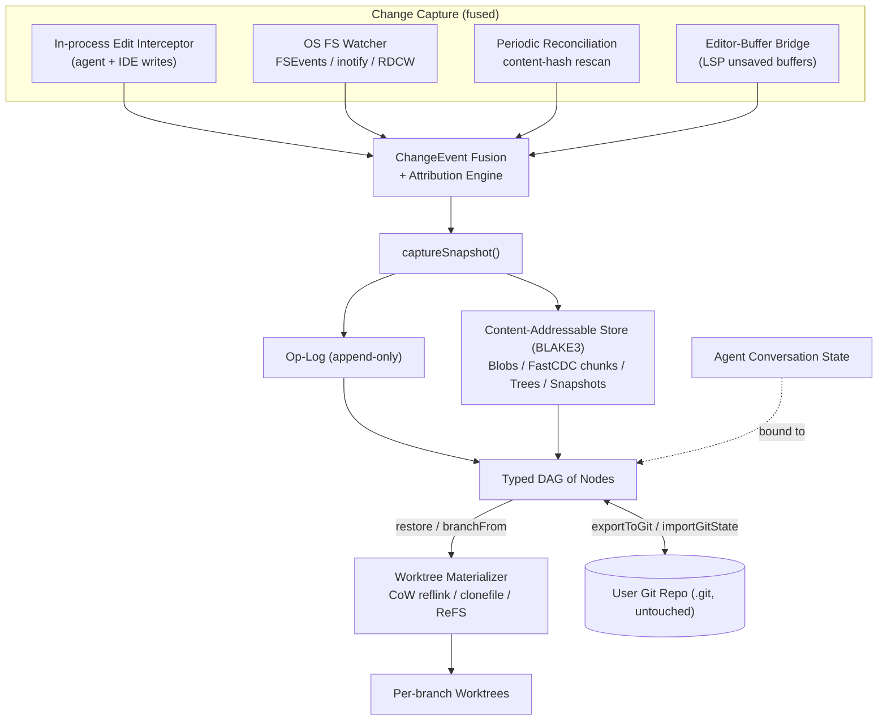

### 10.2 Closing the Untracked-Mutation Gap

The headline differentiator is that no snapshot is a guess. Spork fuses **three change-capture sources** into one authoritative per-node snapshot instead of trusting edit-tool deltas alone:

- An **in-process edit interceptor** gives precise, low-latency attribution for agent/IDE writes (we know the exact node and turn that caused them).
- An **OS filesystem watcher** (FSEvents/inotify/ReadDirectoryChangesW) plus a **periodic content-hash reconciliation rescan** catches everything the interceptor cannot see — bash commands, external editors, build scripts, out-of-band git operations. The rescan is the mandatory backstop because watchers are notoriously lossy under load, on network/virtual filesystems, and during rename storms (FSEvents coalescing, inotify queue overflow).
- An **editor-buffer bridge** (LSP/IDE plugin) flushes UNSAVED buffers so a node reflects what the human is actually looking at, not just what is on disk.

This directly answers the requirement that ALL codebase changes map to a node. The cost is a reconciliation discipline: when an interceptor write and a concurrent FS event touch the same path, a precedence model resolves them, and pure-FS changes with no active agent turn are attributed heuristically (time-window plus active-focus correlation), with an `AttributionRecord` the user can correct.

### 10.3 Transactional Restore Across Code and Conversation

Research shows chat-only recovery yields 8–13% task correctness versus ~100% for semantics-aware (filesystem + conversation) checkpointing. The engine therefore binds each Codebase-Edit snapshot to its agent-conversation slice via a `ConversationPointer`, and `restore(nodeId)` is transactional across BOTH under the **atomic dual-restore guard**: it checks out the snapshot (CoW), repositions the op-log pointer, and rehydrates the bound conversation together under a single lock, failing closed (rolling back) if the snapshot and conversation refs diverge. Restore is non-destructive — forward nodes remain, since restore is itself an op, not an overwrite.

### 10.4 Scaling, Large Binaries, and Git Coexistence

Naive per-node snapshotting of `node_modules`, build artifacts, and media is the documented large-repo performance cliff. Spork mitigates with the hardening Cline learned the hard way — exclusion lists, gitignore-aware walking, nested-`.git` renaming, snapshot-on-quiescence debouncing — plus **FastCDC content-defined chunking** for large/binary blobs so a 2GB asset that changes in one region re-stores only the changed chunks. Size/entropy detection avoids wasting CPU deltifying incompressible data, and external-blob offloading keeps the hot object store small.

| Concern | Mechanism | Trade-off accepted |
|---|---|---|
| Structural dedup | BLAKE3 content-addressed blobs/trees | Re-implement a slice of git plumbing (pack/gc/diff) |
| Sub-file dedup of large assets | FastCDC chunking + zstd | CPU at capture, reassembly cost at materialize |
| Instant branch/restore | CoW reflink / clonefile / ReFS | Filesystem-dependent; hardlink/copy fallback on ext4/NTFS |
| Out-of-band capture | FS watcher + reconciliation rescan | Rescan cost on huge repos; heuristic attribution |
| Crash consistency | Write-objects-then-op ordering + orphan GC | Two coordinated stores; dangling-ref risk if violated |
| Cold-capture throughput | Parallel (rayon) per-file hash/chunk + single batched fsync per bulk capture | Bulk new objects land in a packfile, not loose files |

**Cold-capture fast path and its durability contract.** A first (cold) capture of a large tree is dominated by two costs: serial per-file hashing, and one `fsync` per new object. The content store removes both without touching object identity. (1) *Parallel hashing*: the tree walk reads, FastCDC-chunks, and BLAKE3-hashes files across all cores with `rayon`; because every object id is a pure function of its bytes and a directory's tree entries are re-sorted by name, parallelism only reorders computation — a given input always yields the byte-identical snapshot hash it did before. (2) *Single durability barrier*: a `put_tree`/`put_snapshot` buffers the new objects it produces and commits them with one `put_batch` (folded into a single fsynced packfile) instead of N fsynced loose files; small/incremental puts stay loose. The durability contract is unchanged and explicit: **when `put_tree`/`put_snapshot` returns, every new object it reported is durable on disk**, preserving the write-objects-then-op ordering F1 depends on. Crash safety is preserved by construction — objects are content-addressed and immutable, the pack is observed only whole (atomic rename after fsync), so a crash mid-bulk leaves the store with the batch either fully present or absent, never half-written and never a dangling/corrupt reference; a discarded partial batch is just missing objects, re-created idempotently on retry or reclaimed as orphans by GC. Reads are unaffected (`get`/`has` transparently find objects whether loose or packed). This is additive (C3) behind the frozen `StorageBackend` seam — `put_batch` carries a default that simply loops `put`, so every existing backend keeps working unchanged.

Git coexistence is bidirectional but non-invasive. `GitContext` records the user's HEAD/index/dirty-state as metadata on each node without modifying `.git`; `importGitState()` ingests manual git operations so the DAG stays aligned, and `exportToGit(nodeId)` projects any node into a real commit/branch on demand for team handoff. Garbage collection is reachability-aware mark-sweep over reference counts honoring pinned nodes and the op-log window, so reclaiming orphans never deletes a restorable state — a reachability bug here would be silent data loss, so GC is conservative by default.

### 10.5 Shared Asset & Dependency Store

Per-node snapshots must stay small and exact, but real projects carry heavy, *derived* trees — `node_modules`, `venv`/`site-packages`, `target/`, build outputs, ML model weights, datasets, media. Snapshotting these per node, per branch, would re-incur the large-repo cliff (§10.4) and balloon the object store. Spork's policy is therefore **deps-excluded-by-default**: dependency and artifact directories are excluded from per-node snapshots by default via the already-frozen `ignore_profile` (the same exclusion machinery §10.4 uses). What *is* snapshotted is the **lockfiles/manifests** (`package-lock.json`, `poetry.lock`, `Cargo.lock`, …), which live in the node. The heavy/derived trees are reconstructed **read-only** into a sandbox from a project-global, **content-addressed, platform-keyed, offline-safe** asset cache, materialized via reflink/clonefile/symlink — never copied per branch, never per-node-stored.

Two asset classes share one store:

| Class | Cache key | Materialization | Mutability seen by agent |
|---|---|---|---|
| **Reconstructable deps** | `(ecosystem, lockfile-hash, platform/arch)` | reflink/clonefile/symlink, read-only | non-editable (resolved from lockfile) |
| **Opaque artifacts** (ML weights, datasets, media) | `content_hash` (large blob, content-addressed) | referenced by handle, materialized read-only, deduped once globally | non-editable |

For reconstructable deps the cache stores the **resolved package artifacts content-addressed**, so reconstruction is offline-safe and immune to registry yanks — once a `(ecosystem, lockfile-hash, platform)` set is cached, the same bytes re-materialize without a network round-trip. Opaque artifacts are deduped once globally and surfaced in the tree as non-editable. The agent is told which paths are **common/read-only vs editable source** via the repo map / a `workspaceManifest`, so it never wastes a turn trying to edit a vendored dependency.

The correctness invariant from §10.1 — *click any node → exact working tree* — stays literally true because the dependency layer is **deterministically materialized** from the cache by `(lockfile-hash + platform key)`; restoring on another machine re-materializes from the cache, or re-resolves the lockfile if the cache is absent. The asset cache has its own **reachability GC** (consistent with §10.4) keyed by live lockfiles/pins, so a dependency set is reclaimed only when no live node references its lockfile-hash.

This is a no-domino-safe (C2) decision: whether deps are excluded-and-reconstructed *changes snapshot identity* via `ignore_profile_hash`, which is part of the Snapshot object (§6.1). That hash is **frozen at Foundation (F0)**, so the deps-excluded policy is a v1 decision locked in F0, and the `AssetStore` trait is frozen in F0 with one v1 implementation shipping later (see PLAN §4.10, §9). Heavy/derived trees never enter the content store, so this is additive (C3) and design-consistent (C4) with the §10.1 three-layer model.

---

## 11. Execution, Isolation & Parallel Branches

This component is Spork's runtime substrate: it materializes any DAG node's exact codebase state into an isolated, runnable workspace, executes the work that defines the node (agent edits, validation tests, stress tests, deterministic checks), captures the result back into the timeline, and tears the workspace down. It is the bridge between the persistent typed-node DAG (the "what happened") and live processes on real hardware (the "make it happen now"). It honors the product's explicit hedge — "parallel testing of two branches is not always possible for every codebase" — by making that constraint a first-class, modeled scheduling decision rather than a silent source of flaky results.

### 11.1 Tiered Isolation

Isolation strength and cost are inversely related, so forcing one backend everywhere is wrong. The engine offers a tiered ladder, selected per node by an isolation policy, with the cheapest tier as default.

| Tier | Backend | Isolation | Use case | Cost |
|---|---|---|---|---|
| Worktree-on-CoW | git worktree over APFS clonefile / reflink / ZFS clone | Shares host kernel, ports, Docker, DB | Trusted edits, unit/validation tests, sanity checks (default) | Near-instant, storage-light |
| Container | OCI / devcontainer.json | Dependency + network + filesystem isolation, reproducible toolchain | Test runners needing a real toolchain (jest, pytest) | Moderate; Docker daemon is itself a shared singleton |
| microVM | Firecracker / Cloud Hypervisor (~125ms boot) | Hardware-virt, full kernel + syscall isolation | Untrusted agent-run code, resource-bounded stress/fuzz | Heaviest; needs a Linux host |

A clean `IsolationBackend` interface (`provision`/`exec`/`capturePath`/`teardown`) keeps Executors agnostic to which tier they run in. The platform reality is honest: Firecracker is Linux/KVM-only, so on the primary arm64 macOS target microVMs ride a lightweight Linux VM host (Lima/Colima/krunkit), a platform-divergent path; the worktree-on-`clonefile` tier works natively but gives the weakest isolation. CoW availability is filesystem-dependent, so the engine degrades gracefully to hardlink-or-copy on ext4-without-reflink.

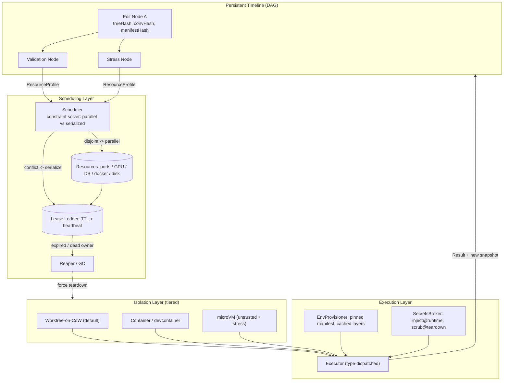

### 11.2 Resource-Aware Scheduling: Parallel vs Serialized

This is the component's hardest and most differentiating problem. Parallel branches are NOT free: worktrees share databases, the Docker daemon, and fixed ports, causing race conditions and flaky results, and storage balloons. As an illustrative back-of-envelope figure (a single-source anecdote, not a measured benchmark), one 2 GB repo was reported to generate ~9.8 GB of worktrees in 20 minutes of parallel-branch work; the order of magnitude — not the exact number — is what motivates CoW-by-default and disjoint-resource admission, and A.5 carries the measured budgets this design is actually held to. The scheduler models scarce resources as typed, capacity-bounded, lease-acquired objects:

- **Exclusive singletons** — a specific GPU, a primary DB, a license-bound service.
- **Pooled** — host ports, allocated and rewritten into env templates so most conflicts vanish automatically.
- **Fungible budgets** — CPU, RAM, disk.

Each test/stress node carries a `ResourceProfile` declaring what it needs. `Scheduler.admit(candidates)` becomes a constraint-solving admission decision: siblings whose resource sets are disjoint (or whose resources are declared safely shareable) run in PARALLEL; otherwise they are SERIALIZED, and the DAG UI surfaces a queued-with-reason state ("conflict on `db:postgres-primary`") so the wait is honest, not mysterious. Unknown stateful services default to exclusive — conservative, to prevent silent cross-branch contamination, which is exactly the "almost right but not quite" trust-killer. The chief risk is mis-declaration: under-declaring shared state causes real races; over-declaring causes needless serialization. Mitigations are auto-port-allocation, per-branch ephemeral DB provisioning (e.g. `CREATE DATABASE ... TEMPLATE`), and inference of profiles from `docker-compose`/`devcontainer.json`/test config plus runtime learning on a first serialized run.

### 11.3 Lifecycle, Reproducibility, and Secrets

Three cross-cutting concerns are enforced at every layer:

- **Lease-based teardown.** Every workspace and resource is acquired under a TTL **lease**; a crash-safe **reaper** reclaims anything whose lease expired or whose owning process died (via a durable lease ledger), guaranteeing teardown even on IDE crash. Long-running stress tests renew via heartbeat so the reaper does not kill them prematurely.
- **Reproducible environments.** A declarative, content-addressed `EnvManifest` pins toolchain versions, lockfile hashes, and base-image digests, and is hashed into node identity — two nodes with the same manifest hash are guaranteed environment-identical, which is what makes cross-branch result comparison meaningful. Layered base-image and read-only package caches keep materialization fast. Strict manifests apply to the container/microVM tiers; a "best-effort inherit-host" mode serves the worktree tier where reproducibility pays off less.
- **Secrets.** Credentials are referenced by handle, fetched from an OS keychain/vault at execution time, mounted via tmpfs/env, and scrubbed on teardown. They are NEVER written into the content-addressable store: snapshots are immutable and shareable for handoff, so a leaked key would be permanent. The correct trade-off is that snapshots are not fully self-contained — restoring on another machine re-resolves secret handles.

### 11.4 State Binding and Known Boundaries

Execution sits atop the same jj-style whole-working-copy auto-snapshot as Section 10, so every result is tied to a content-addressed `inputTreeHash` and the `TimelineStore.commitNode` step binds code state and conversation state in one transactional 2-phase commit. Spork deliberately does NOT do execution-replay time-travel (rr/Pernosco carry 10–20x record overhead); its time-travel is the cheap snapshot kind. CRIU-style process-state capture is offered only as an opt-in for long-running stateful test nodes.

The honest boundary of the model is that restore moves *code + conversation* (§10.3), not the world. Three classes of state are explicitly out of restore's reach:

- **(a) External / irreversible side effects** — a row written to a shared DB, a pushed remote branch, an outbound API call, paid-API spend — cannot be undone by restore. Mitigations: **ephemeral per-branch DBs** (§11.2's `CREATE DATABASE … TEMPLATE` provisioning), a `net.connect` **egress allowlist** (§15.2), and a per-node **effects log** — now promoted from "future direction" to a **declared additive seam** (frozen as a seam in F0, v1 recorder in F4; see PLAN §9, §12) that records external effects so restore can warn *truthfully* that they are irreversible rather than implying it undid them.
- **(b) Running stateful processes / dev-servers** are not rehydrated by restore — restore is code + conversation only (this is the bound behind §18.3 Open Question 5).
- **(c) Secrets must never enter snapshots**, because nodes are exportable as handoff docs; a leaked key in an immutable, shareable node would be permanent (cross-ref §15.4).

Keeping these named — rather than implying perfect reversibility — is what keeps the "any point is restorable" mental model truthful at system boundaries.


## 12. Model Provider Abstraction & Fast Switching

Spork connects to Claude, OpenAI, GitHub Copilot CLI, and local servers (Ollama, LM Studio, vLLM) and makes model choice a **first-class, per-node property of the DAG timeline** rather than a global session setting. The 2025–2026 landscape has commoditized multi-provider routing (LiteLLM, OpenRouter, Vercel AI SDK), so the genuinely hard problem is not connectivity but **normalization** — tool-call schemas, streaming event framing, error taxonomies, and cache-control semantics differ subtly per provider. Spork's differentiation is therefore not the adapter plumbing but per-node selection, DAG-aware routing, cache-preserving prompt layout, and auditable cost attribution.

### 12.1 Layered Architecture

The provider layer is five cooperating components behind an owned hexagonal port, so the underlying engine can be swapped without touching the agent loop.

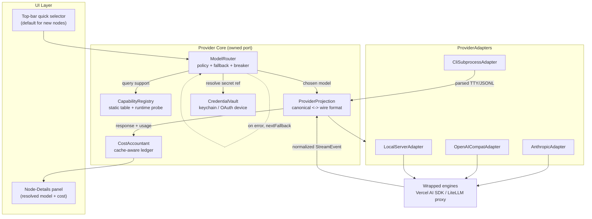

The **ProviderAdapter** is the single canonical request/response/streaming/tool-call shape. Four implementations cover the four backend kinds: `AnthropicAdapter` (native `cache_control` markers), `OpenAICompatAdapter` (OpenAI, OpenRouter, vLLM), `LocalServerAdapter` (Ollama/LM Studio), and `CliSubprocessAdapter`. Copilot CLI and other CLI-only agents that expose no clean HTTP API are deliberately *not* forced into the HTTP shape; they are wrapped as a distinct subprocess adapter that parses TTY/JSONL output, because their auth is tied to an interactive session and their streaming framing is version-specific and brittle.

> **Transport seam & the agent-run path (P6 realization).** The adapter does the *mapping* (canonical ⇄ wire); a separate **`Transport`** port (crate `spork-transport`) does the *I/O* that delivers `to_wire(...)`'s request and feeds the reply to `from_wire(...)`, so the agent loop never hard-codes a channel. P6 ships two real, fully-offline-testable transports — a **subprocess** transport (the CLI adapter's stdin/stdout JSONL) and a **plaintext-HTTP** transport (localhost Ollama/LM Studio/vLLM/LiteLLM). A **TLS** transport for first-party cloud is an explicit, documented out-of-scope that lands as a *new* `Transport` impl behind the same port (it needs a TLS dep and cannot be exercised offline) — not a stub. The agent-turn loop itself (resolve → render → carry → parse → price, with the router's fallback chain on transport failure) is `spork-agent::run_turn`; the daemon's read-only `node.agentRun` command runs it and **attaches** the answer as a `Family::Context` node by a dotted `DERIVED_FROM` edge, recording the model + `CostRecord` (the read-only *attach* half of §6.6; the code-mutating *fork*-on-divergence half needs the P8 executors). Model invocation is `model.invoke`-gated, deny-by-default (§15.x).

### 12.2 Build vs. Reuse

We **wrap a proven gateway/SDK rather than build normalization from scratch** — the Vercel AI SDK runs in a managed Node.js sidecar process that the Rust daemon supervises (the daemon cannot host a TypeScript SDK in-process, so the provider layer lives in a daemon-owned sidecar), with an embedded LiteLLM-style proxy or native Rust clients for headless/CLI and team self-host. Provider breadth is now table stakes; the maintenance treadmill of tracking drifting provider APIs is exactly what these libraries already absorb. The cost of reuse is **feature lag** (a new Claude cache tier may not be exposed immediately) and a lowest-common-denominator risk; both are mitigated by a per-adapter **raw-passthrough escape hatch**. A hosted aggregator (OpenRouter) is supported as one optional provider but rejected as the *sole* path, because routing all traffic through a third party conflicts with Spork's local-first/privacy wedge and adds a data-egress concern.

### 12.3 Per-Node Selection and Fast Switching

Each DAG node stores a declarative `ModelSelector` (`pinned` to a provider+model, or `policy` referencing a `RoutingPolicy`, with `inheritFromParent`). The **top-bar quick selector edits only the default for new nodes**; existing nodes keep their resolved binding. This lets a deterministic Sanity-Check node pin a cheap local model while an Edit node uses a frontier model — operationalizing the research finding that sending only ~14–26% of work to the strong model retains ~95% of quality at 45–85% lower cost, now at *node granularity*.

| Node type | Typical selector | Rationale |
|---|---|---|
| Codebase-Edit | frontier (Claude/GPT) | Hardest reasoning, multi-file edits |
| Validation/Test | cheap or cached | Result interpretation, not generation |
| Stress-Test | cheap/local | Mostly orchestration |
| Sanity/Pattern-Check | local (`local_only`) | Deterministic; near-zero model context |

**Hot-swap mid-session** is modeled as a *transactional turn under a new model within the same node*, bound to the node's checkpoint so code-state and conversation-state restore stay consistent (semantics-aware checkpointing yields ~100% restore correctness vs. 8–13% for chat-only). The key enabler is a **ProviderProjection** layer over a single canonical transcript: prior turns are stored provider-agnostically and re-rendered into the target provider's wire format on each request (tool_call id schemes, role conventions, system-prompt placement, and content-block typing all differ). Provider-specific artifacts that do not map across vendors — Claude extended-thinking blocks, OpenAI reasoning tokens — are stored as opaque, provider-tagged `OpaqueProviderBlock`s and **dropped on cross-provider projection with an explicit `lossyProjection` warning recorded on the turn**, since a chain-of-thought the next turn depended on cannot be faithfully carried across a swap.

### 12.4 Capability Negotiation

Despite superficial OpenAI-API convergence, support for parallel tool calls, structured/JSON output, vision, streaming-tool-calls, and prompt caching varies per model and even per local-server version. The **CapabilityRegistry** is seeded from a static `CapabilitySet` table (treated as a hint, not truth) and refined by a one-time, cached runtime probe keyed by model+endpoint+version. The router queries it *before* choosing a strategy — e.g. falling back to a JSON-in-prompt tool protocol (`toolCalling: 'json_emulated'`) for an Ollama model lacking native tool-calling. Probing adds a one-time first-use latency, accepted as the cost of avoiding silent edit-time failures.

### 12.5 Credentials, Cost, and Cache Economics

The **CredentialVault** abstracts the OS keychain (macOS Keychain / Windows Credential Manager / libsecret) with pluggable external stores (Vault, Doppler) and OAuth device-flow for subscription/CLI providers. **Plaintext keys are never written to Spork config or the DAG** — credentials are referenced by opaque `vaultRef` and resolved only inside the daemon (and the daemon-owned provider sidecar that holds the wrapped SDK), never the renderer, which is mandatory because nodes are restorable, branchable, and exportable as handoff docs; a key embedded in a node would leak on export. Headless/CI runs fall back to process-scoped env-var injection that is never persisted, and OAuth refresh failures route as an auth fallback rather than a hard crash.

Every request emits a `UsageRecord` attributed to its node, branch, and session. Cost math is **cache-aware** — Anthropic cache *reads* bill at 0.1x input and *writes* at 1.25x/2x, a 10x swing that naïve accounting gets wildly wrong:

```
cost = inputUncached·in + cacheRead·(0.1·in) + cacheWrite·(1.25–2·in) + output·out
```

Because cache is provider- and prefix-scoped, per-node selection and branch forks **fragment provider-side prompt caches**, eroding the ~80% saving incumbents rely on. The CostAccountant and projection layer therefore preserve stable prefixes and provider-native cache breakpoints across turns and sibling branches; whether a child should *inherit* the parent's resolved model (cache-friendly) or re-resolve its policy (fresher routing, cache-hostile) is a live product decision, with inheritance the proposed default.

### 12.6 Key Risks

**Normalization drift** corrupts agent loops via lost tool_call ids or truncated streams; mitigated by per-adapter contract tests against live and recorded fixtures plus the raw-passthrough hatch. **Local-model capability gaps** push Spork's privacy-conscious users toward exactly the weaker models whose `json_emulated` tool protocols raise the "almost-right" failure rate. **Provider ToS risk** is real: routing consumer-subscription tokens (Copilot/Claude/OpenAI) through a programmatic abstraction may trip anti-automation defenses, which is one reason Copilot CLI may ultimately be treated as an external agent rather than a model provider.

---

## 13. Context Management & Handoff System

The Context Management & Handoff System (CMHS) decides **what a model sees at every agent turn** and **how knowledge is carried across the branching DAG**. Because Spork's wedge is that history is a persistent, typed, branchable graph, context is not a flat scrollback — it is **compiled from DAG ancestry**. The design thesis, grounded in the market shift, is that managed retrieval is losing to agentic exploration (Anthropic removed vector search from Claude Code in May 2025; Cursor, Windsurf, Cline, and Devin followed), so CMHS treats retrieval as a **tool the agent calls under a budget**, not a fixed RAG pre-fill.

### 13.1 The Six Layers

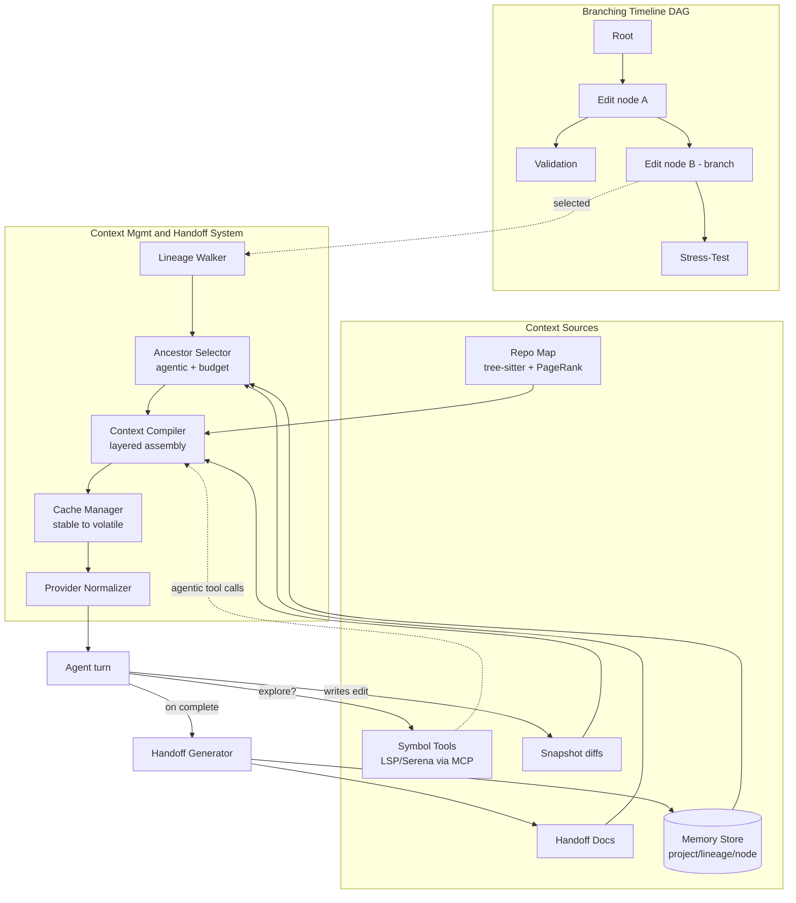

A **Context Compiler** walks a node's ancestor lineage and assembles a layered, cache-aligned prompt within a token budget. An **Ancestor-Selection** policy chooses which prior discussion nodes to include verbatim, summarize, or drop. A **Handoff generator** distills parent→child lineage into a durable AGENTS.md/CLAUDE.md-style artifact. A **Memory Store** (project/lineage/node scoped) plus a tree-sitter repo map with PageRank ranking and LSP/Serena symbol tools (exposed via MCP) support agentic exploration. A **Cache Manager** lays out the prompt as stable→volatile prefixes. A **provider-normalization shim** maps the one compiled artifact onto Claude, OpenAI, Copilot CLI, and Ollama.

### 13.2 Cache-Aligned, On-Demand Compilation

Context is **compiled from DAG ancestry on demand, ordered stable→volatile and hash-addressed for reuse**, rather than appended to a per-conversation scrollback. Layers are ordered by volatility — system prompt, project memory, and repo map form the stable prefix; the current diff and latest user message form the volatile suffix — and the stable prefix is keyed by a content hash (`prefix_hash`) so sibling branches and successive turns reuse the same warm provider cache. This is existential: Claude cache reads bill at 0.1x input, and Claude Code reportedly hits ~92% cache-hit rate and ~81% cost reduction. A naïve per-node recompilation that reorders the prefix on every request **silently destroys cache hits** and the economics with them. Compaction summaries are deliberately placed *after* the stable prefix so triggering compaction never invalidates the cached prefix.

| Layer (`ContextLayer.kind`) | Volatility rank | Cacheable |
|---|---|---|
| system / project_memory | 0 (most stable) | yes |
| repo_map | 1 | yes |
| handoff / ancestor_summary | 2 | yes |
| ancestor_verbatim | 3 | partial |
| current_diff / tool_results | 4 | no |
| user_msg | 5 (most volatile) | no |

### 13.3 Agentic-First, Budget-Bounded Retrieval

Retrieval is a set of **tools the agent calls** — `exploreRepo` (repo map, `find_symbol`, `find_referencing_symbols`, grep) and `loadAncestorContext` — each decrementing a per-node-type `exploration_budget_tokens`. Following call chains beats similarity-matched snippets because code changes every commit, but **unbounded exploration burns ~15x tokens and triggers context rot** (Chroma 2025: degradation at every length increment, a 30%+ accuracy drop for mid-context information). Each node type therefore carries a `ContextPolicy`: Edit nodes get a large hybrid budget; Validation/Stress get managed, `handoff_only` ancestors; deterministic Sanity-Check nodes get near-zero model context. The tuning hazard is sharp — too tight starves the agent (worse than RAG), too loose burns tokens and rots context — so policies degrade gracefully (request-more vs. compact vs. fail) rather than silently truncating.

### 13.4 Transactional Code+Conversation Binding

Every node's **code state** (a content-addressed snapshot hash from the shadow-git/jj op-log) is bound to its **conversation/context state**, and `restoreContext` performs a transactional dual restore under the **atomic dual-restore guard** that **fails closed (rolling back under a single lock) if the snapshot and conversation refs diverge**. This is grounded in the research finding that chat-only recovery yields 8–13% correctness versus ~100% for semantics-aware checkpointing. Using the op-log also closes the known competitor gap where bash-side `rm`/`mv` and other non-edit-tool mutations are untracked — if a restored node's context describes stale code, every downstream turn builds on a false premise.

### 13.5 Handoff Documents

A durable, **regenerable** `HandoffDocument` is auto-generated at node completion and branch points, distilling parent→child lineage into a compact artifact: summary, key decisions, files touched with rationale, open threads, constraints, and test state. It is the cheapest defense against context rot on deep branches — a fresh agent starts cold without replaying ancestor transcripts — and doubles as a lineage-scoped memory entry and an exportable AGENTS.md. Handoff is the **primary input to the `handoff_only` ancestor strategy**, but distillation is lossy: a confident-but-wrong handoff propagates false premises (the 66% "almost-right" failure mode). This is mitigated by retaining the verbatim parent diff plus constraints, making handoffs regenerable when an ancestor is later edited, and giving the agent `loadAncestorContext` as an escape hatch to pull more lineage on demand.

### 13.6 Memory, Repo Map, and Auditability

The **Memory Store** is three-tier — project (stable facts), lineage (carried down a branch), and node (ephemeral notes) — with provenance, TTL, usage decay, and pinning to fight staleness and poisoning. Vector similarity is used **only for memory recall, never for code retrieval**. The **repo map** is tree-sitter-extracted, PageRank-ranked, recomputed incrementally on snapshot change, and bounded (Aider-style ~1k token default). Finally, because developer trust is collapsing (only ~29% trust AI output), assembly is **auditable**: every compile emits a `SelectionDecision` trace explaining why each ancestor was included, summarized, or dropped, surfaced in the Node-Details panel behind a single "expand context" affordance rather than a wall of budget knobs — power without overwhelm, and a defensible debuggability story when context is wrong.

### 13.7 Lineage & History Exploration (MCP)

The handoff documents (§13.5) and cache-aligned layering (§13.2) keep the *current* turn cheap, but an agent (or a human) often needs to reach back across the whole work-DAG — "where was this decision made," "what touched this file on this lineage," "show me the transcript of that node." Spork exposes this as a **first-class MCP server** over the conversation/work DAG, backed by the content-addressed transcripts (§10, §12.3) and the DAG projection (§6.1), **auto lineage-scoped** so a query never silently leaks sibling-branch context.

| Tool | Purpose |
|---|---|
| `search_history(pattern, scope=lineage\|branch\|project, kind=regex\|text\|structured)` | Search transcripts/DAG by pattern, scoped to lineage (default), branch, or project |
| `get_node_transcript(nodeId)` | Return the canonical transcript for a node |
| `walk_ancestors(nodeId)` | Walk the lineage chain for context provenance |
| `find_decisions(scope)` | Surface recorded decisions across a scope |
| `find_files_touched(scope)` | Enumerate files changed across a scope |
| `get_handoff(nodeId)` | Fetch the durable handoff document (§13.5) for a node |

It is **read-only and capability-gated** (`nodes.readOutputs`, lineage-only — see §15.2), and it does **not** duplicate history into per-sandbox files: it reads the single content-addressed store, and transcripts travel inside §19 bundles so search works offline. It is also the external **"drive Spork from Claude Code / Cursor" MCP surface** — the adoption wedge: another agent can search and pull Spork's structured history without re-implementing it.

This complements rather than competes with the KV-cache mechanisms: where §13.2 (cache layering) and §13.5 (handoff) keep the prefix stable and the cold-start cheap, the History MCP lets the agent pull lineage **on demand** instead of inlining root→parent history into every prompt — reducing KV-cache buildup while keeping the stable→volatile layering intact (PLAN §4.7).


## 14. User Experience & Frontend Architecture

Spork is a local-first desktop application whose primary surface is a **left-to-right, typed-node DAG canvas** that visualizes the entire task lifecycle (Codebase-Edit, Validation, Stress-Test, Sanity-Check, plus user-defined types). The DAG-as-primary-UI is the product's wedge — no incumbent treats history as a first-class branching graph — so canvas correctness, performance at scale, and layout stability are the existential frontend concerns.

### 14.1 Process Topology & Stack

The application splits into a long-lived **Spork Daemon** (Rust) that owns the DAG, the content-addressable snapshot store, git/worktree orchestration, model-provider routing, and node execution; and a thin, reactive **React renderer** that subscribes to daemon state and never touches the filesystem or provider APIs directly. We choose **Tauri (Rust core)** over Electron: the heavy work (CAS hashing, git plumbing, worktree creation, tree diffing) is native, the binary is 3-5x smaller, and Tauri's per-command capability allowlist is a stronger security default than Electron's broad Node integration. Splitting the daemon out of the window process means the DAG and in-flight tests survive window reloads/crashes and enable a future headless/CLI mode.

| Concern | Choice | Rationale |
|---|---|---|
| Shell | Tauri (Rust) | Footprint, native security model, efficient git/CAS core |
| Renderer | React 18 + TypeScript | Rich custom-node components, hiring depth |
| DAG canvas | React Flow (xyflow) | Custom node cards with handles, badges, mini-diffs, a11y |
| Layout | ELK.js "layered" in a Web Worker | Off-main-thread, incremental, stable positions |
| Client state | Zustand + TanStack Query | UI state vs. daemon-backed server state |
| Diff/code view | Monaco diff editor (CodeMirror fallback) | Rich diffs; lighter engine for huge changesets |
| IPC | tRPC-style typed commands + op-log event stream | One typed surface; ordered real-time updates |

The trade-off is Tauri's smaller ecosystem and cross-platform webview divergence (WKWebView / WebView2 / WebKitGTK); we keep all UI standards-based React so an Electron fallback stays mechanical if webview parity blocks us.

### 14.2 Five-Region Layout

The window mirrors the reference UI: a **top bar** (quick model selector that sets the default for new nodes, plus the action toolbar — View, Analyze, Recalibrate, Validate, Create DT, Submit DT, Create Process, Metadata); a **left navigator + legend** of node types and colors; the **center Graph Canvas**; a **right Node-Details panel** hosting the agent conversation, diff viewer, and typed results; and a **bottom status/run rail** streaming live test and agent output.

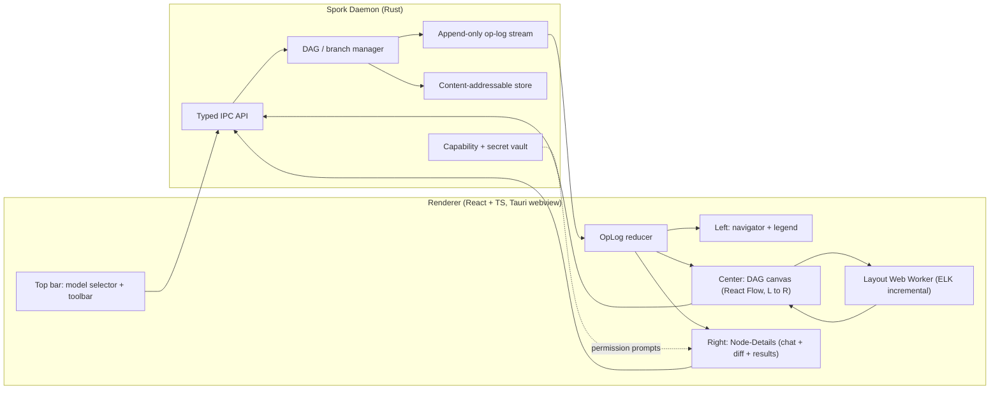

### 14.3 The Three-Layer DAG Pipeline

We never bind React Flow directly to raw daemon nodes. Instead a three-layer pipeline isolates change cadence: (1) the **daemon source-of-truth** (append-only op-log + CAS, jj-style); (2) a renderer **view-model** that is denormalized, virtualized, and layout-resolved; and (3) the **React Flow presentation**. This matters because layered (Sugiyama) crossing-minimization is NP-hard and even mature tools degrade past a few hundred complex nodes. The view-model lets us run layout off-thread with ELK in *interactive/incremental* mode so nodes do not jump as the graph grows, **virtualize** so only viewport-visible nodes mount, and **cache positions keyed by node hash** so unchanged subgraphs keep their coordinates. This keeps the canvas near 60fps on thousands of nodes — the make-or-break property for the DAG-as-primary-UI bet.

### 14.4 Real-Time Updates & Optimistic UI

Updates flow as a **unidirectional event stream**: the renderer tails the daemon's append-only op-log and feeds a pure reducer (`applyOpLogEvent`). The op-log carries only durable state transitions (node created, status changed, result recorded, branch forked, snapshot captured); **high-frequency ephemeral data** (agent chat tokens, test stdout) travels on lightweight side-channels keyed by node id, preventing a single stream from saturating the IPC bridge. User actions render optimistically with per-action correlation ids and roll back automatically on nack.

### 14.5 Selection, Diffs & Schema-Driven Node Types

"Click a node, see the exact state" is served **lazily from the CAS**: selecting a node loads only the changed-file list (parent-tree vs. node-tree diff) and fetches blob contents on demand as files open. This keeps selection O(changed files) and avoids materializing whole worktrees (the worktree storage balloon discussed in §11.2). Running external tools against a historical node requires an explicit, possibly slow **"Check out this node"** action — surfaced honestly rather than implied. The Node-Details panel, legend, and node card are all **schema-driven**: each type ships a `NodeTypeDescriptor` (color, icon, fields, result schema, allowed toolbar actions), so a new node type is *data, not a frontend release*, and the four built-ins use the same contract user-defined types use. Toolbar actions declare `enabledWhen(node)` so each type exposes only valid actions. A future sandboxed plugin API layers on the same descriptor contract for exotic custom UIs.

## 15. Security, Permissions & Privacy

Spork's trust posture is a competitive wedge: incumbents under-serve "no training on our code," BYO-key, and data residency. The architecture is local-first with privilege concentrated in the daemon.

### 15.1 Trust Boundaries

The renderer (React plus a large npm dependency tree) is the broadest attack surface, and **agent-generated code is inherently untrusted**. Therefore **all privileged operations — filesystem, git, model API keys, shell execution, network-to-providers — live exclusively in the daemon** behind a capability-scoped, typed IPC API. The renderer holds zero secrets and has no direct provider access; a compromised or buggy webview cannot exfiltrate keys or the codebase. Every privileged call is an auditable, permission-gated IPC command. UI contributions for custom node types render in a **separate sandboxed webview** with no execution-plane authority, communicating only via `postMessage`; privileged work re-enters through a node action and the capability broker.

### 15.2 Capability-Based Permissions

Executors (built-in and user-defined node-type runners) get **no ambient authority**. A manifest declares a fixed, typed capability vocabulary it needs, the user reviews and grants at install, and a runtime **capability broker** mints short-lived scoped tokens and is the *only* path to side effects.

| Capability | Scope example | Enforced by |
|---|---|---|
| `snapshot.read` / `snapshot.write` | path globs; writes go to a CoW working copy only | CAS broker |
| `process.spawn` | container/subprocess tier only | sandbox + namespaces/seatbelt |
| `net.connect` | host allowlist | broker egress filter |
| `model.invoke` | per-node token/USD budget, providers allowed | model broker |
| `nodes.readOutputs` | node-type allowlist, lineage-only | graph engine |
| `secrets.get` | named handles | CredentialVault |

Every privileged call appends an `AuditEntry` (capability, scope used, bytes, allow/deny) onto the node. To avoid permission fatigue we ship capability **bundles per node-type template**, require human-readable rationales in manifests, and allow trust-tier-based auto-clear only for low-risk capabilities — but consent flows remain a social-engineering surface we treat conservatively.

### 15.3 Sandboxed Execution & the Untracked-Mutation Closure

Executors run in **tiered sandboxes**: WASM (WASI Preview 2) for deterministic CPU-bound checks with no clock/random/network by default; OCI containers and namespaced/seatbelt subprocesses for native toolchains (test runners, fuzzers, stress generators). **Containers mount only the copy-on-write snapshot, never the host checkout**, so a `process.spawn`-granted runner cannot mutate the user's real working tree — closing the exact `rm`/`mv` untracked-mutation gap competitors leave open. Sandbox-bypass hardening per OS is an ongoing maintenance burden we explicitly own.

### 15.4 Credentials & Secrets

Credentials live in an abstracted **CredentialVault** backed by the OS keychain (macOS Keychain / Windows Credential Manager / libsecret), with pluggable external stores (Vault/Doppler) and **OAuth device-flow** for subscription/CLI providers (Copilot, Claude/OpenAI). **Plaintext keys are never written to config or the DAG**, and secrets are referenced by handle only. This is mandatory because nodes are restorable, branchable, and **exportable** as handoff documents — a key embedded in a node would leak permanently on export. Runtime secret injection mounts via env/tmpfs at execution time and scrubs on teardown; injected secrets are excluded from all snapshots and redacted from logs. Headless/CI runs fall back to process-scoped env injection, never persisted.

### 15.5 Privacy & Data Governance

Local-first means code, conversations, and snapshots stay on the user's machine by default. **Privacy classification** (`local_only` / `no_third_party_aggregator` / `any`) is enforced by the model router so a node marked private can never route to a cloud or aggregator provider. Because editor buffers and gitignored files (e.g. `.env`) can be snapshotted into the shadow store, we run **secret-scanning at capture** and apply an explicit, overridable exclusion policy. Network egress for `model.invoke` is per-node budget-capped and visibly cost-attributed, so a buggy or malicious node cannot silently burn tokens unbounded.

## 16. Technology Stack

| Layer | Technology | Rationale / alternative considered |
|---|---|---|
| Desktop shell | Tauri (Rust) | Footprint + security; alt: Electron (kept as mechanical fallback) |
| Renderer | React 18 + TypeScript, Zustand, TanStack Query | Rich nodes; UI vs. server-state split |
| Graph canvas | React Flow + ELK.js (Web Worker) | Custom node cards; stable incremental layout |
| Code/diff | Monaco diff editor, CodeMirror fallback | Rich diffs; light engine for huge files |
| Daemon core | Rust | Native CAS hashing, git plumbing, worktrees |
| Content store | Git-style CAS, BLAKE3 keys, loose objects + packfiles | Tree-hashable, parallel, collision-safe vs. SHA-1 |
| Timeline store | SQLite (WAL) event log + materialized projection | Embedded, transactional, single-writer + many readers |
| Large blobs | FastCDC content-defined chunking + offload | Sub-file dedup; avoids per-node re-store of big assets |
| Worktrees | CoW reflink (APFS clonefile / Btrfs / XFS / ZFS / ReFS) | Near-instant branch checkout; hardlink/copy fallback |
| Shared assets | Content-addressed, platform-keyed dependency/artifact cache + reflink/symlink read-only materialization | Dedup heavy deps once globally; exact, offline-safe reconstruction |
| Isolation | WASM (WASI P2) → OCI container → microVM (Firecracker; Lima/Colima host on macOS) | Tiered cost/trust ladder |
| Model access | Vercel AI SDK in a daemon-supervised Node.js sidecar + embedded LiteLLM-style proxy / native Rust clients for headless | Reuse normalization; owned `ProviderAdapter` port |
| IPC | tRPC-style typed commands + op-log event stream | Typed surface, ordered real-time |
| Repo context | tree-sitter repo map (PageRank) + LSP/Serena symbol tools via MCP | Agentic exploration over frozen RAG |

**Build-vs-reuse stance:** the genuinely hard problem is *normalization* (tool-call dialects, streaming framing, cache semantics, error taxonomies), which proven libraries already maintain against drifting APIs. Spork wraps them behind owned ports so our differentiation stays in per-node selection, DAG-aware routing, cost attribution, and the typed-node timeline — not adapter plumbing. We deliberately use the *cheap snapshot* kind of time-travel and **exclude execution-replay** (rr/Pernosco, 10-20x overhead). Persistence follows the proven hybrid: SQLite for the log/projection/metadata (small, queryable), CAS for code bytes (mature packing/gc), with strict **write-objects-then-log** ordering and orphan-object GC for dual-store crash consistency.

## 17. MVP Scope & Phased Roadmap

Differentiation must be on **workflow and trust** — the DAG timeline, deterministic checks, branch/restore, parallel experiments — not raw model quality, because the category is capital-intensive and brutally concentrated. The roadmap front-loads the wedge and the hard reliability gaps, defers collaboration and the marketplace.

### Phase 0 — Snapshot & Timeline Core (foundational)
The non-negotiable substrate: content-addressable CAS, the SQLite append-only event log with materialized projection, the typed Node envelope + payload, and the three-source change-capture pipeline (edit interceptor + FS watcher + reconciliation rescan) that closes the untracked-`rm`/`mv` gap. Ships transactional code+conversation snapshots and non-destructive restore/branch. **Exit criterion:** any state restorable with ~100% fidelity; out-of-band bash mutations always map to a node.

### Phase 1 — Local MVP (the wedge, single-user)
The five-region UI on the L-to-R DAG canvas; the four built-in node types (Edit, Validation, Stress-Test, Sanity-Check) with auto-run deterministic checks after edits; click-a-node-see-exact-state via lazy CAS diff; worktree-on-CoW isolation; **multi-provider model switching** (Claude, OpenAI, Copilot CLI, Ollama) with per-node selection and cache-aware cost attribution; OS-keychain credential vault; git import/export adapter so team history stays clean. **Out of scope:** microVM tier, marketplace, multiplayer.

> **Build status & operationalization (added 2026-06-21).** The build spine (IMPLEMENTATION_PLAN.md) froze and proved every contract this MVP rests on (F0–P7), but **decomposed the spine by contract, not by user journey** — so the contracts shipped without a single phase wiring the journey end-to-end (a user who opens a real repo currently sees an empty canvas: no command/UI/daemon path mints the first node). This MVP is therefore (re-)owned by a dedicated milestone, **[IMPLEMENTATION_PLAN.md](IMPLEMENTATION_PLAN.md) §P7.5 "Local Trusted-Agent MVP"**, detailed task-by-task (backend + UI) in **[MVP_PLAN.md](MVP_PLAN.md)**. P7.5 is wiring-only over the already-frozen F4 seams — it changes nothing in this section's scope, it *delivers* it. Cloud-TLS providers and the untrusted-executor tier remain out of scope here as stated (they are P8 / additive post-MVP); the MVP's agent edits run only on the **trusted host-kernel worktree-on-CoW tier**.

### Phase 2 — Quality Gates, Parallelism & Context
Declarative GatePolicies + GateVerdicts (block Submit/merge on failing sanity, perf-regression vs. baseline); first-class flaky-test handling (scoring, bounded retry, quarantine); the resource-aware scheduler that decides parallel-vs-serialize per branch (honoring "parallel testing is not always possible"); the Context Compiler with cache-aligned stable→volatile prefixes, agentic exploration budgets, and auto-generated handoff documents.

### Phase 3 — Extensibility & Hardened Isolation
The declarative `NodeTypeDescriptor` registry and Custom Node SDK (`spork node init/build/test/sign`), WASM + container/microVM tiers with the capability broker, and the signed marketplace with a Verified/Community/Local-Dev trust ladder plus a revocation kill-switch.

### Phase 4 — Shared-Team Reconciliation & Cloud Spill (deferred)
The collaboration model is **resolved** (the sandbox is the unit of state, sharing, and reconciliation — see §19): this phase implements it, starting with the asynchronous, local-first-safe path — content-addressed node+sandbox-state bundle export/import that grafts a contributor's sub-DAG onto the shared project DAG, surfaced in one unified view with merge-as-grafting + 3-way snapshot reconciliation. Pluggable transport (local bundle, optional sync server / git remote / object store) and transparent spill of non-co-runnable branches to a remote pool (requires strict env manifests) follow. Live co-editing/CRDT presence and stateful-runtime reconciliation are deferred deliberately so the local-first single-user model is not compromised by premature distributed-systems complexity.

## 18. Risks, Trade-offs & Open Questions

### 18.1 Top Risks

| Risk | Impact | Mitigation |
|---|---|---|
| **Large-repo snapshot cliff** | Laggy IDE on every edit; `node_modules`/nested-`.git` blowup | Exclusion lists, gitignore-aware walk, debounce-on-quiescence, FastCDC, CoW; ship Cline-proven hardening |
| **Watcher loss / mis-attribution** | A node's "exact state" silently diverges from disk; human edit blamed on agent | Content-hash reconciliation rescan + overflow detection; time-window/focus heuristics with user re-attribution |
| **Cache-hit collapse** | Per-node recompilation pays full input cost, destroying the ~80% caching economics | Stable volatility-ordered prefixes, `prefix_hash` dedup across siblings, compaction placed *after* the cached prefix |
| **DAG layout instability** | Nodes jump as the graph grows; canvas unreadable past N nodes | Off-thread ELK incremental layout, viewport virtualization, hash-keyed position cache |
| **Parallel-branch resource exhaustion** | Shared ports/DBs/Docker races; multi-x worktree storage balloon (see §11.2) | Constraint scheduler with disjoint-resource admission, auto-port allocation, lease + reaper GC, honest `canRunParallel` |
| **Supply-chain / custom-runner blast radius** | Marketplace code touches codebase + keys | Signing + SBOM + capability review + sandbox + revocation kill-switch |
| **Cache poisoning by impure executors** | A "deterministic" check that reads clock/net returns a stale green on restore | WASM denies clock/random/net; periodic replay-and-compare audit quarantines mismatches |

### 18.2 Key Trade-offs

- **Sidecar CAS vs. real git commits.** Keeping the DAG in `.spork/` lets every micro-edit be a node without polluting team history, at the cost of re-implementing a slice of git plumbing (gc, packing, ignore semantics) and reconciling eventual divergence via the import/export adapter.
- **Event-sourcing dual representation.** The append-only log gives a tamper-evident audit trail and non-destructive restore, but forces projection-rebuild logic, projection checkpoints to bound replay cost, and schema-versioned events.
- **Declarative node types vs. arbitrary code.** Manifests keep the core closed-to-modification and shareable, but constrain genuinely novel execution to the (rarer, reviewed) runner extension point.
- **Lossy cross-provider hot-swap.** A single canonical transcript enables fast model switching, but provider-specific reasoning/thinking blocks cannot round-trip and are dropped with a recorded warning.
- **Tauri vs. Electron.** Smaller/safer binary against a smaller ecosystem and cross-platform webview divergence; mitigated by standards-based React.

### 18.3 Open Questions

1. **Snapshot granularity** — **RESOLVED (locked v1):** the v1 default is **per-mutating-node** (one snapshot per Edit/Snapshot/Merge), frozen at Foundation (F0) as part of the frozen-foundation list; finer per-tool-call / per-file-write granularity would multiply objects and worsen the large-repo cliff (§10.4) and is deferred. Tunability remains additive (C3).
2. **Git authority** — is the Spork object format a lossless git superset (so teams could treat `.spork/` as authoritative), or is git strictly an import/export boundary?
3. **Default isolation tier per built-in type** — and should agent-run untrusted code always escalate to container/microVM regardless of node type?
4. **Sibling-branch context** — included by default (cross-pollinate ideas, fragment cache) or isolated (clean experiments, preserve cache)?
5. **Restore transactionality scope** — **RESOLVED (locked v1):** restore moves **code + conversation** only (§10.3, §11.4); running dev-servers and external service state are explicitly out of bounds, with the per-node **effects log** declared as an additive seam (frozen as a seam in F0, v1 recorder in F4) so restore *warns truthfully* about irreversible external effects rather than promising to undo them (§11.4).
6. **Branch model inheritance** — does a forked child inherit the parent's resolved model (cache-friendly) or re-resolve policy (fresher routing, cache-hostile)?
7. **GC retention** — do abandoned branches expire (time/size) or persist forever, and who certifies a node is safe to GC when handoff docs may reference it?
8. **Layout authority long-term** — renderer Web Worker (optimistic local UX) vs. daemon (deterministic shared layout for future collaboration), or a hybrid.
9. **Revocation semantics** — when a published node type is revoked for malware, do we delete its cached artifacts (losing historical-branch reproducibility) or retain-and-flag?
10. **Local-vs-team gate reconciliation** — **RESOLVED in principle** by the sandbox-as-unit-of-state decision (see §19): the sandbox is the unit of state, sharing, and reconciliation, so shared-team is the same local-first machinery at a wider scope — contributors exchange content-addressed node+sandbox-state bundles that graft onto one shared project DAG, and GateVerdicts/baselines travel *with* the snapshot they were computed against rather than being re-derived from server CI. The residual detail (mapping local GateVerdicts onto external Git status checks at an optional sync boundary) is now an integration concern under §19, not an open architectural tension.
11. **Dependency inclusion in snapshots** — **RESOLVED (locked v1):** dependency/artifact directories (`node_modules`, `venv`, `target/`, build outputs, model weights, datasets, media) are **excluded by default** via the F0-frozen `ignore_profile`; only lockfiles/manifests are snapshotted, and heavy/derived trees are **reconstructed read-only from a content-addressed, platform-keyed, offline-safe asset cache** (§10.5). The deps-excluded policy and the `AssetStore` trait are frozen in F0 (snapshot identity carries `ignore_profile_hash`, §6.1); the v1 `AssetStore` implementation ships later (PLAN §4.10, §9).


## 19. Collaboration Model: Local-First with Shared Sandbox Reconciliation

This section resolves the local-first-vs-shared-team tension that earlier sections flagged as open (§1.4, §3.2 N6, §17 Phase 4, §18.3 Open Question 10, and Consistency Note C-7). The resolving decision is a single sentence: **the sandbox is the unit of state, sharing, and reconciliation.** Everything Spork already does for one developer on one machine — content-addressed snapshots, the typed work-DAG, transactional restore, gates, handoff — is the *same* machinery used for a team; team collaboration is that machinery applied at a wider scope, not a separate distributed system bolted on.

### 19.1 The sandbox as the unit of state

Every node owns (or attaches to) a content-addressed, immutable sandbox state — a snapshot binding a `root_tree_hash` plus the conversation/context refs that produced it (§6, §10). Because that state is content-addressed and immutable, it is *intrinsically* shareable: a snapshot identified by its BLAKE3 hash means the same bytes on every machine, dedups for free, and can never be silently mutated after the fact. The sandbox is therefore the natural quantum of exchange. We do not share "a diff," "a branch," or "a chat" as the primitive — we share a sandbox state, the typed node that owns it, and the DAG edges that place it in lineage. This is what makes team merge a *graph* operation rather than a textual one.

### 19.2 Local-first by default

Spork is fully functional offline on a single machine with no server in the loop: the daemon owns the op-log, CAS object store, model routing, and execution entirely under `.spork/` (§5.2), and nothing leaves the machine unless the user explicitly exports or syncs (§15.5). This is non-negotiable — nothing below may require a server, cloud account, or network for the single-user experience. Shared-team is **opt-in and additive**; turning it off returns a pristine local-first product with no degraded paths.

### 19.3 The path to shared-team: content-addressed bundles grafting onto a shared DAG

A Project is its DAG. Each contributor works locally on their own sub-graph — a fan of branches, edits, checks, and handoff nodes. To collaborate, a contributor exports a **bundle**: the content-addressed objects (blobs/trees/snapshots) and the typed nodes + edges for their sub-graph that the recipient lacks, plus the refs naming the sub-graph's tips. Because objects are content-addressed, the bundle is a set-difference against the recipient's object store (Git's "have/want" negotiation, generalized to typed nodes and sandbox states), so only genuinely new bytes travel.

On import, the bundle **grafts** onto the recipient's copy of the shared project DAG: new nodes attach by their declared parent edges, shared ancestors dedup to identical hashes already present, and both contributors' work appears in **one unified DAG view** — not two repos side by side, not a fork reconciled out-of-band, but a single graph in which each node carries its `created_by` attribution (§6.2). This unified view is the headline experience: a reviewer scrubs one timeline and sees a teammate's edit, validation, and handoff nodes interleaved with their own, each clickable-to-exact-state.

### 19.4 Merge as subgraph grafting plus 3-way snapshot reconciliation

Grafting makes two sub-DAGs coexist; producing a *combined* working state is still an explicit, recorded Merge (§6.5) — Spork never auto-merges, because silent merges produce the "almost-right" bugs that are the top developer frustration. The merge is computed exactly as the local case already specifies: a **three-way reconciliation against the nearest common ancestor snapshot**, which is cheap to find because the grafted DAG shares that ancestor by hash. Content addressing does the heavy lifting:

- Unchanged subtrees on both sides resolve to the *same tree hash* and are skipped entirely — reconciliation is `O(divergent subtree)`, not `O(repo)`.
- Only blobs/trees that actually diverged enter the three-way file merge; the result becomes a new snapshot owned by a Merge node with ≥2 parents and a stored `conflictResolution` payload.
- Conflicts surface in the existing Monaco three-way diff (base / ours / theirs, per A.4); the Merge node is created only once every conflict has a stored resolution, so it is always materializable.
- Observing-node results (validation/stress/sanity) do **not** merge — they are marked stale against the new merged snapshot and re-run (A.4), and the `merge` gate evaluates post-merge results so a gate never certifies state that does not exist.

Conversation transcripts have no clean three-way analogue, so conversation merge is append-style: a synthetic transcript (common prefix + generated merge-summary + both tails with provenance tags) flagged as merged context (A.4).

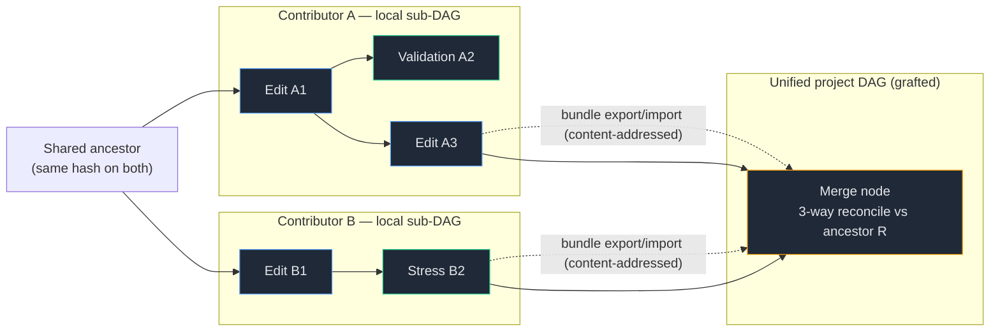

### 19.5 Pluggable transport

Because the unit of exchange is a content-addressed bundle, *how* the bundle moves is an orthogonal, swappable concern — local-first is never coupled to any one channel:

- **Local bundle file** — export a `.spork-bundle` and hand it over any way (USB, attachment, shared drive). Zero infrastructure; the baseline that keeps the system server-free.
- **Optional sync server** — a thin relay that stores and forwards bundles and refs for teams that want push/pull and presence; it sees content-addressed objects, not necessarily plaintext (encryption-at-rest and client-side encryption are open options), and is never on the critical path for local work.
- **Git remote** — bundles project to/from real Git commits via the existing `exportToGit`/`importGitState` adapter (§10.4), so a team can use their existing remote as the transport and keep ordinary Git history clean alongside the richer Spork DAG.
- **Object store** — an S3-compatible bucket as a dumb content-addressed backend, ideal for CI and large-snapshot offload.

All four implement the same have/want + graft contract, so a project can move between them without reformatting state.

### 19.6 What stays genuinely hard (honest open items)

The decision resolves the *architecture* of collaboration; it does not pretend the hard distributed-systems problems vanish:

- **Live co-editing.** Asynchronous bundle exchange is the v1 model. Real-time multiplayer cursors/presence over a CRDT layer remains deferred (§3.2 N6); the op-log is designed to admit it later, but concurrent fine-grained edits to the *same* in-flight node are out of scope for now.
- **Stateful-service / runtime reconciliation.** Snapshots capture the working copy, not the rows in a shared dev DB, a running dev-server's memory, or external API side effects (§11.4). Grafting two sandboxes cannot reconcile divergent *runtime* state; restore/merge warns at these system boundaries rather than promising to undo them.
- **Large snapshot transfer.** Content addressing dedups aggressively, but a first sync of a large monorepo or big binary assets still moves real bytes. FastCDC chunking (§10.4) and object-store offload mitigate, and the measured budgets that bound this live in A.5, but bandwidth and first-clone cost are a real cost the design owns rather than wishes away.

These are scoped, named, and deferred — not silent. The load-bearing claim of this section is narrower and defensible: because the sandbox is content-addressed and immutable, *asynchronous* shared-team is the same local-first machinery at a wider scope, and merging is subgraph grafting + 3-way snapshot reconciliation surfaced in the diff view.

## Appendix A — Addenda, Deeper Dives & Consistency Notes

This appendix closes the highest-priority gaps left by Sections 1–18 and reconciles cross-section drift. It does not restate the main body; it specifies the engineering surfaces that the body names but leaves unspecified (IPC/schema contracts, GC, drift attribution, merge semantics, NFRs, and the self-test/observability story), and it ends with a Consistency Notes subsection enumerating contradictions to reconcile before sign-off.

### A.1 IPC Contract & Core Schemas (closes the "typed surface, no signatures" gap)

The body repeatedly invokes a "tRPC-style typed IPC API" (§5.1, §5.5, §14.1) and "JSON-schema-validated payloads" (§6.2, §7.2) but never names a command or a field. Without a frozen contract, the renderer/daemon split, the op-log event stream, and the schema-versioning discipline (§7.2) cannot be implemented or tested independently. The following is the minimum normative surface for Phase 0–1.

**Command channel (request/response, correlation-id'd).** Mutations return an `opId`; the resulting state arrives over the event stream, not the response, so optimistic UI (§5.5, §14.4) has a single reconciliation path.

| Command | Args (essential) | Returns | Emits event(s) |
|---|---|---|---|
| `node.create` | `{kind, parentIds[], payload, modelSelector?}` | `{opId, nodeId}` | `NODE_CREATED`, `EDGE_ADDED` |
| `node.restore` | `{nodeId}` | `{opId}` | `RESTORE_PERFORMED`, `REF_MOVED` |
| `branch.fork` | `{fromNodeId, name}` | `{opId, refId}` | `BRANCH_FORKED`, `REF_CREATED` |
| `branch.merge` | `{intoRef, fromNodeId, resolution?}` | `{opId, nodeId\|conflictSet}` | `MERGE_PERFORMED` \| `MERGE_BLOCKED` |
| `node.runCheck` | `{specId, targetNodeId, force?}` | `{opId, runId}` | `CHECK_SCHEDULED`, `RESULT_RECORDED` |
| `node.diff` | `{nodeId, againstNodeId?}` | `{changedPaths[], stats}` | — (read) |
| `blob.read` | `{treeHash, path}` | `{bytes, contentHash}` | — (read, lazy) |
| `op.undo` / `op.redo` | `{opId?}` | `{opId}` | `OP_UNDONE` / `OP_REDONE` |
| `gc.run` | `{dryRun}` | `{reclaimable[], bytes}` | `GC_PERFORMED` |

**Event-log entry (the hash-chained source of truth, §6.1).** Each event is `{event_id: ULID, seq: u64, type, schema_version: u16, payload, prev_event_hash, this_event_hash, actor}`. `this_event_hash = H(prev_event_hash ‖ canonical(payload) ‖ seq)`. The chosen hash **must** be stated once and used everywhere — see Consistency Note C-3 on the SHA-256/BLAKE3 split in the §6.1 ERD.

**NodeEnvelope (normative union of §6.2 and §7.2).** The body gives two overlapping envelope field lists; the merged authoritative set is:

```
NodeEnvelope {
  id: ULID                  // time-sortable
  kind: NodeKind            // discriminator, registry-resolved
  family: 'mutating'|'observing'|'context'
  ownsSnapshot: bool        // derived from registry; rejected at registration if it disagrees with payload
  parentIds: ULID[]; childIds: ULID[]
  branchId: RefId
  status: Lifecycle         // see A.6 / C-1
  isStale: bool; staleSince?: ts; staleReason?: str
  snapshotHash?: Blake3     // present iff ownsSnapshot
  model?: ModelRef; cost?: CostRecord
  lineageHash: Hash         // for handoff dedup / cache keys
  payloadSchemaVersion: u16
  opLogId: ULID
}
```

### A.2 Garbage Collection & Retention (closes Open Question 7 and the unspecified "reachability-aware mark-sweep")

GC is named as reachability-aware mark-sweep in §6.4, §8.2, §10.4, and §11, and is flagged as the silent-data-loss risk, yet no roots, no liveness window, and no retention policy are defined. Open Question 7 ("do abandoned branches expire?") is the policy half; the mechanism half is also missing. Specification:

**Roots (an object is live if reachable from ANY of):**
1. Any `Ref` (HEAD, `branch/*`, tags).
2. Any node still in the materialized projection (including detached nodes with no ref — restore targets).
3. Any event inside the **op-log replay window** (the journal back to the last projection checkpoint, so undo/redo stays sound).
4. Any **pinned** node or pinned baseline (§8.3 protects a passing baseline from run-cap eviction; GC must honor the same pin).
5. Any `ResultArtifact` referenced by a non-evicted run, and any artifact a pinned baseline references.

**Retention policy (resolves OQ7 with a default):** abandoned branches do **not** expire by wall-clock by default (the wedge is durable history); instead retention is **budget-driven** — a configurable `.spork/` size ceiling triggers eviction of the *least-recently-restored, unpinned, non-baseline* branch tips first, with the op-log replay window and all pins always protected. Time-based expiry is opt-in. A node is "safe to GC" only when no ref, no pin, no live handoff document, and no replay-window event references it — answering OQ7's "who certifies."

**Two-store crash safety during GC.** Because objects and the log are separate stores (§5.2), GC must run **mark (read projection+log) → sweep objects → only then prune projection rows**, never the reverse, mirroring the write-objects-then-log invariant. A crash mid-sweep leaves orphans (reclaimed next run), never dangling references.

### A.3 Drift Attribution Algorithm (closes the "precedence model / heuristic" hand-wave)

§10.2 and §7.4 promise that out-of-band mutations are attributed correctly but specify only "a precedence model resolves them" and "time-window plus active-focus correlation." This is the trust-critical path (a human edit blamed on the agent is the §18 mis-attribution risk), so the resolution order is made explicit:

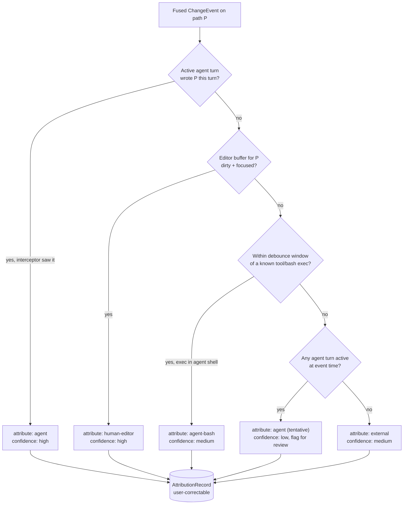

**Precedence:** in-process interceptor evidence outranks FS-watcher evidence for the same path within the same turn (the interceptor is authoritative on *who*; the watcher is authoritative on *whether something changed*). Every low-confidence attribution sets a UI review flag rather than silently committing — this is the honest-fidelity stance §10.2 commits to. The reconciliation rescan (§10.1) only ever *adds* a drift Snapshot node; it never rewrites an existing high-confidence `AttributionRecord`.

### A.4 Merge Semantics, Conflict UI & Observing-Node Carry-over (deepens §6.5)

§6.5 establishes the merge principle (explicit, never auto, three-way against nearest common ancestor) but leaves three operational questions open that block implementation.

**Conflict surfacing.** A `branch.merge` that hits unresolvable hunks returns a `conflictSet` rather than creating a node; the UI presents a per-file three-way view (base / ours / theirs) in the existing Monaco diff surface (§14.1). The Merge node is only created once every conflict has a stored resolution, so a Merge node is *always* in a clean, materializable state — preserving "click a node, see exact state."

**Conversation merge (made concrete).** §6.5 says conversation merge is "append-style." Specifically: the merged Edit node's conversation ref points to a **synthetic transcript** = ancestor-common-prefix + a generated merge-summary block + both branch tails marked with provenance tags. It is explicitly flagged `lossyProjection`-adjacent: the agent is told this is a merged context, not a linear one.

**Observing-node carry-over.** Validation/Stress/Sanity results do **not** merge. On merge, every observing child of either parent is marked `isStale` against the new merged snapshot and re-scheduled per its `autorun` policy. This is consistent with §7.3 staleness and §8 re-run semantics, and prevents a merged node from inheriting a green that was never computed against the merged tree.

**Gate interaction.** A merge is a gated transition (§8.3): the `GatePolicy` for `merge` evaluates against the *post-merge* re-run results, never the pre-merge parent results — otherwise the gate certifies state that does not exist.

### A.5 Non-Functional Requirements & Performance Budgets (closes the unquantified "near-instant / 60fps / ~100%" claims)

The body makes many performance promises as adjectives ("near-instant" checkout, "near 60fps on thousands of nodes," "~100% fidelity," "~125ms boot") without target numbers, a reference repo, or a measurement method. These are turned into testable budgets so Phase exit criteria (§17) are falsifiable.

| Dimension | Target (budget) | Reference workload | Method |
|---|---|---|---|
| Snapshot capture (incremental) | p95 < 300 ms | 50k-file repo, ≤ 20 changed files, exclusion lists on | bench harness on CoW FS |
| Node restore (CoW) | p95 < 500 ms code + conversation | same repo | wall-clock incl. conversation rehydrate |
| Click-node → diff visible | p95 < 150 ms | changed-file list only, blobs lazy (§14.5) | renderer trace |
| Canvas frame rate | ≥ 55 fps sustained, ≥ 1k visible-region nodes | virtualized viewport | rAF sampling |
| Layout settle after node add | < 100 ms incremental, no position jump > 0 px for unchanged subtree | ELK interactive mode | hash-keyed position assertion |
| Drift rescan (full) | < 5 s background, non-blocking | 50k-file repo | off-turn scheduling |
| Event append throughput | ≥ 2k events/s through serializing writer | parallel-branch runners | writer-actor bench |

"~100% restore fidelity" (§17 exit criterion) is defined operationally as: **byte-identical working tree** for all non-excluded paths AND a conversation ref that rehydrates without divergence; any excluded-path content is reported, not silently dropped (the §10.2 honesty requirement). The reference workload must be fixed (a named fixture repo) so the Phase-0 exit criterion is reproducible rather than aspirational.

### A.6 Self-Testing, Crash Recovery & Observability (closes the missing "how is Spork itself validated" gap)

A system whose entire value proposition is correctness of state must specify how *it* is verified — the body specifies how user code is checked but is silent on the daemon's own quality bar.

**Property/fuzz testing of the engine.** The append-only log + projection design admits strong invariants that should be property-tested: (1) replaying the full log reproduces the projection bit-for-bit (event-sourcing soundness, §6.1); (2) `restore` then `branch` is metadata-only and never mutates the CAS; (3) GC never removes an object reachable from any root in A.2; (4) for any random op sequence, `undo`∘`do` is identity on the projection. A model-based test that drives random `node.create`/`fork`/`restore`/`merge`/`gc` sequences and checks these invariants is the primary safety net.

**Crash-recovery matrix.** The two-store ordering (§5.2, §10.4) must be validated by fault injection at each window: crash after object fsync but before log commit (→ orphan, GC reclaims); crash mid-projection-rebuild (→ rebuild is idempotent from checkpoint + log); crash mid-CoW-checkout (→ workspace lease reaper, §11.3, reclaims). Each is a named recovery test, not an assumption.

**Local observability.** Because the product is local-first/no-egress (§15.5), telemetry is local by default: a structured daemon log, an in-app "engine health" view (object-store size, orphan count, projection-checkpoint lag, lease ledger), and an opt-in anonymized crash report. This also gives users a way to see the §18 risks (storage balloon, watcher loss) before they bite.

### A.7 Consistency Notes

The following contradictions and under-specifications should be reconciled before the document is considered final. None are fatal to the architecture; all are localized wording or enumeration drift.

- **C-1 (Lifecycle token omits `cancelled`).** **RESOLVED.** §7.3's `effectiveStatus` enumeration now includes a `cancelled` token (rendered grey/struck), defined as terminal-and-non-stale, so there is no `cancelled_stale` and every lifecycle state has a UI token.

- **C-2 (Built-in node-type count: four vs. seven).** **RESOLVED.** Import has been demoted from a first-class kind to "a Snapshot node with `origin = import`," consistent with §6.2's `origin(auto_drift|manual|import)` field. The §7.1 table and prose now fold Import into Snapshot, so the built-in mutating kinds are just Codebase-Edit, Snapshot, and Merge across §1.3/§4.2/§6.2/§7.1.

- **C-3 (Three hash algorithms, never reconciled).** **RESOLVED.** The §6.1 ERD now uses `blake3` for every hash Spork computes — `SNAPSHOT.hash`, `root_tree_hash`, `NODE.snapshot_hash`/`lineage_hash`, and the event-chain `EVENT.prev_event_hash` (changed from `sha256`). The lone `sha1` on `SNAPSHOT.git_parent_commit` is retained and explicitly labeled (in §6.1 prose and an ERD comment) as an imported Git object id, not a Spork-computed hash. The event-log entry note in A.1 below should be read as BLAKE3.

- **C-4 (Host runtime: Rust daemon vs. "TypeScript/Electron host").** **RESOLVED** via option (a): the provider/normalization layer now runs in a **managed Node.js sidecar process supervised by the Rust daemon** (or via native Rust provider clients), and §5.4, §12.2, and §16's stack table say so. The "TypeScript/Electron host" / "Vercel AI SDK in-process" phrasing has been removed since Electron is not the chosen shell, and §12.5's credential note now reads "resolved only inside the daemon and the daemon-owned provider sidecar."

- **C-5 (Restore guard described as two mechanisms).** **RESOLVED.** §6.4, §10.3, and §13.4 now all name one mechanism — the **atomic dual-restore guard** — described consistently as a single-lock, fail-closed (rolling back on divergence) restore across code and conversation, so reviewers no longer read two guards where there is one.

- **C-6 (Parallel-branch storage figure reused as both motivation and proof).** **RESOLVED.** The "2 GB repo → ~9.8 GB of worktrees in 20 minutes" datum is now stated **once**, in §11.2, explicitly flagged as an illustrative single-source/back-of-envelope figure (order-of-magnitude, not a benchmark). §1.4, §5.3, §8.2, §14.5, and §18 were softened to "worktree storage balloons by several multiples of repo size" and cross-reference §11.2; the design's load-bearing numbers are the measured budgets in A.5, not the anecdote.

- **C-7 (Local-first vs. shared-team flagged as an unresolved tension).** **RESOLVED** by the product decision that **the sandbox is the unit of state, sharing, and reconciliation** (new §19). Spork is local-first by default; shared-team is the *same* machinery at a wider scope — contributors exchange content-addressed node + sandbox-state bundles for their sub-graphs, which graft onto one shared project DAG so both contributors' work appears in a single unified view, with merge as subgraph grafting + 3-way snapshot reconciliation. The previously-open framings (§1.4 "standing risk," N6/Phase 4 "deferred," §18.3 Open Question 10 "local-vs-team gate reconciliation") now point to §19; transport is pluggable (local bundle, optional sync server / git remote / object store) so local-first is never compromised.

No contradictions were found in the core data-model invariants (transactional restore, no-untracked-mutation, cache-friendliness), the two-layer content/timeline split, the capability/permission model, or the phased roadmap; these are internally consistent across §§4–19.
