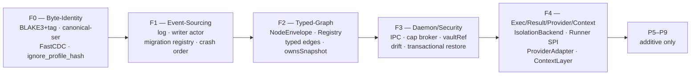
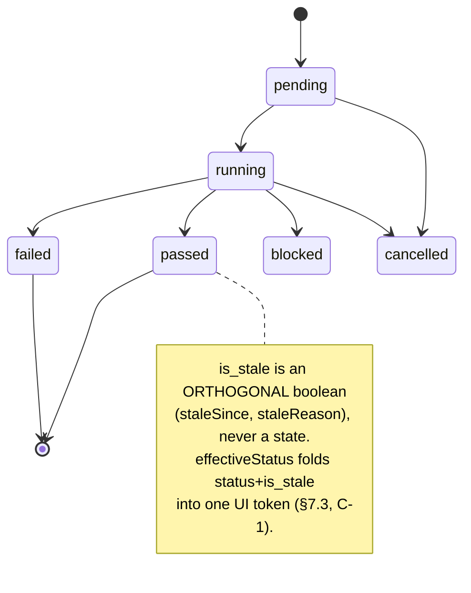
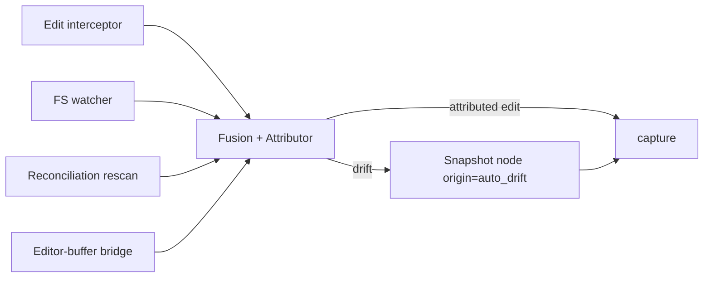
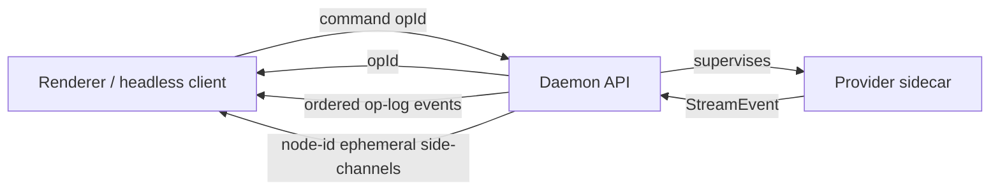
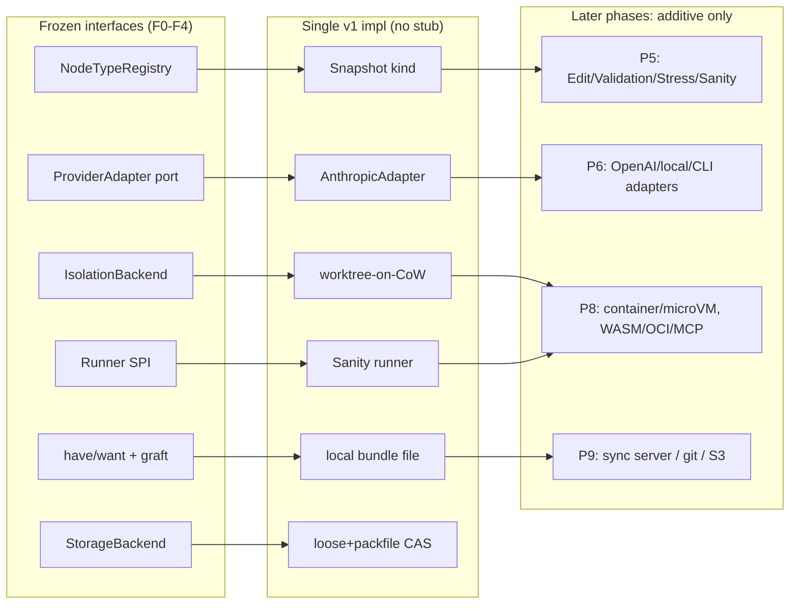
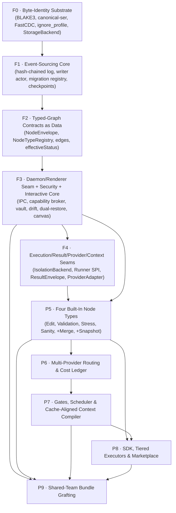
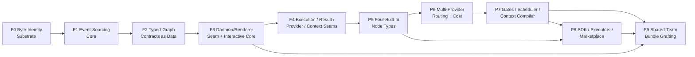

# Spork — Agent-Centric IDE
## Implementation Plan

| | |
|---|---|
| **Working codename** | Spork |
| **Document** | Implementation Plan |
| **Status** | Draft for review |
| **Version** | 0.1 |
| **Date** | 2026-06-20 |
| **Companion docs** | [DESIGN.md](DESIGN.md) (authoritative spec) · [MARKET_STUDY.md](MARKET_STUDY.md) |

> **This plan is governed by five hard constraints** (full statement in §2–§3):
> - **C1 — No stubs.** Every phase ships a *narrower but complete* capability. No placeholder/TODO code is ever reserved for a later phase to fill in. A CI gate forbids `unimplemented!`/empty seams in shipped paths (§8.3).
> - **C2 — No domino.** Every load-bearing decision (object identity, hashing, the event schema, the node-type contract, the provider interface, the sandbox abstraction, the IPC contract, schema versioning) is **frozen in the foundation phases F0–F4 with its extensibility seam** *before* any feature depends on it. No later phase can force a redesign of an earlier one.
> - **C3 — Extensible & additive.** Node types, providers, sandbox tiers, transports, storage backends, check kinds, and context strategies are all *plugin-shaped from day one*: adding one is a new implementation behind an existing interface, never a core edit (§5).
> - **C4 — Design-consistent.** Every primitive traces to a `DESIGN.md` section and may refine but never contradict it.
> - **C5 — Evolution-safe.** Every persisted schema is versioned with a forward-migration path from the first commit (§4.2).
>
> **Build order at a glance:** five contract-freezing foundation phases — **F0** Byte-Identity Substrate · **F1** Event-Sourcing Core · **F2** Typed-Graph Contracts · **F3** Daemon/Renderer Seam + Interactive Core · **F4** Execution/Result/Provider/Context Seams — then five purely-additive feature phases — **P5** Built-In Node Types · **P6** Multi-Provider Routing · **P7** Gates/Scheduler/Context Compiler · **P8** SDK/Tiered Executors/Marketplace · **P9** Shared-Team Bundle Grafting. Each is a working, demoable slice (§6).

---

## Table of Contents

1. Purpose & How to Read This Plan
2. Guiding Principles
3. The No-Domino Strategy
4. Foundational Primitives & Schemas
   - Part A: Substrate & Graph
   - Part B: Engines & Contracts
5. Extension-Point Catalog
6. Build Sequence — Dependency-Ordered Phases (F0–F4, P5–P9)
7. Cross-Cutting Concerns Built From Day One
8. Definition of Done & Vertical-Slice Discipline
9. Domino-Risk Register
10. Milestones & Sequencing Summary
11. Deferred Items & Why Deferral Is Safe
12. Edge Cases & Boundaries Tracked

---


## 1. Purpose & How to Read This Plan

This document is the implementation plan for **Spork** — an agent-centric IDE built around a persistent, project-level **branching timeline DAG** of typed work nodes, each carrying a content-addressed, restorable sandbox of the codebase (DESIGN.md §1, §4, §6). It is the bridge between the authoritative design (`DESIGN.md`) and the code: it commits the design's *what* to a concrete, ordered, falsifiable *how*, refining every place the design left a load-bearing decision underspecified, and never contradicting it.

### 1.1 What this plan is — and is not

This plan does **not** restate the design. Where the design establishes a primitive, a schema, or an invariant, this plan cites it (e.g. "implements DESIGN.md §6.1") and specifies the build mechanics — the trait boundary, the on-disk byte layout, the migration registry, the test that proves it. Every primitive, schema, and decision traces to a `DESIGN.md` section (constraint **C4 — Design-Consistent**). Where the design is *underspecified in a way that would cascade* (the fifteen items in the design contract's `underspecified` list and the design's own Open Questions §18.3), this plan **pins a default now**, refining the design rather than deferring the choice into a later phase where changing it would force a redesign.

### 1.2 The five hard constraints, restated as the lens for every section

| # | Constraint | Operational meaning in this plan |
|---|---|---|
| **C1** | **No stubs** | Every phase ships a narrower-but-complete vertical slice — one real implementation behind each seam, fuzz/crash-tested and demoable over the real IPC. No placeholder, no `todo!()`, no "filled in later." |
| **C2** | **No domino** | Load-bearing decisions are frozen in foundation phases **with** their extensibility seams, so no later phase can force a redesign of an earlier one. |
| **C3** | **Extensible & additive** | Node types, providers, sandbox tiers, bundle transports, storage backends are plugin-shaped from day one — a new one is a new implementation behind an existing interface, never a core edit. |
| **C4** | **Design-consistent** | Every schema/decision cites its `DESIGN.md` section and must not contradict it. |
| **C5** | **Evolution-safe** | Every persisted schema is versioned with a forward-migration path **from the first commit**. |

### 1.3 The phase structure at a glance

The build is **five frozen-foundation phases (F0–F4)** that each freeze a coherent set of load-bearing contracts with exactly one production-grade implementation behind each seam, followed by **five strictly-additive feature phases (P5–P9)** that only add implementations behind already-frozen seams.

| Phase | Name | Freezes (one impl behind each seam) |
|---|---|---|
| **F0** | Byte-Identity Substrate | BLAKE3 + generation tag, canonical serialization, FastCDC, `ignore_profile_hash`, `StorageBackend` (§6.1, §10.4) |
| **F1** | Event-Sourcing Core | Event log, single writer actor, projection-as-pure-function, migration registry, crash ordering (§5.2, §6.1, A.1) |
| **F2** | Typed-Graph Contracts as Data | `NodeEnvelope`, `NodeTypeRegistry`/`NodeTypeDescriptor`, typed edges, `effectiveStatus` (§6.2, §6.3, §6.5, §7) |
| **F3** | Daemon/Renderer Seam, Security & Interactive Core | Typed IPC, capability broker, `CredentialVault`, drift capture, transactional restore, DAG canvas (§5.5, §10, §14, §15) |
| **F4** | Execution / Result / Provider / Context Seams | `IsolationBackend`, Runner SPI + `ResultEnvelope`, `ProviderAdapter` + canonical transcript, `ContextLayer` ranks (§8, §11, §12, §13) |
| **P5–P9** | Built-ins, multi-provider, gates+context, SDK+marketplace, collaboration | New implementations behind F0–F4 seams only — additive, never core edits |

### 1.4 How to read each phase entry

Each F/P section is structured identically so a reader can audit the no-stub and no-domino guarantees directly: **Goal**, **Deliverables** (each a complete capability), **Freezes-before** (the contracts this phase locks for all downstream phases), **Definition of Done** (falsifiable, tied to the A.5 budgets — snapshot p95 < 300 ms, restore p95 < 500 ms, click→diff p95 < 150 ms, ≥55 fps on ≥1k nodes, ≥2k events/s), **Demoable** (one end-to-end demo over the same IPC the product uses), and an explicit **No-Stub Guarantee**. Read §3 (The No-Domino Strategy) first if you only read one thing: it is the structural argument that this ordering cannot cascade.

---

## 2. Guiding Principles

These principles are the design's `§3.3` guiding principles made operational for the build. They are the tie-breakers: when a phase boundary, a schema choice, or a seam shape is ambiguous, the decision that best satisfies these principles wins.

### 2.1 The log is the source of truth; everything else is a projection

The append-only, hash-chained **Event Log** is the single source of truth; nodes, edges, and refs are a materialized projection rebuildable bit-for-bit by replay (DESIGN.md §6.1, §3.3, invariant: *"Replaying the full log reproduces the projection exactly"* §A.6). **No subsystem writes the projection directly** — the lone write path is the single serializing writer actor (§5.2). This is principle-one because nearly every downstream capability (non-destructive restore, undo/redo, time-travel, collaboration-by-graft) is *only* sound if the projection is a pure function of the log.

### 2.2 Append-only over mutable

A bad restore, merge, or experiment is **another node you branch away from**, never a destructive mutation (DESIGN.md §3.3, §6.4). Restore and branch are *events*; forward history survives. `branchFrom` copies no code until checkout (§10.1). This principle forbids any in-place rewrite of stored events or immutable objects — schema growth is handled by versioned migration-on-read (§2.6), never by editing history.

### 2.3 Dogfood the extension point

Built-in node types, runners, and providers register through the **same** public registries and ports that third-party extensions use (DESIGN.md §3.3, §6.5, §7.1, §9.1; goal G6). A built-in is never a special-cased enum branch. This is the structural guarantee that the extension API is real before P8 opens it to third parties — if the four built-ins (Edit, Validation, Stress, Sanity) flow through `NodeTypeRegistry.register()` from F2/P5, opening the SDK in P8 is a pure addition (C3), not a retrofit of every built-in.

### 2.4 Be honest about scope

"Exact state" is honest about its exclusion list (`ignore_profile_hash` is part of snapshot identity, §6.1); "parallel" is gated by disjoint `ResourceProfile`s and otherwise serialized-with-a-reason (§11.2, N4); restore **fails closed** rather than silently wrong (§10.3, G4). The build never promises fidelity or parallelism it cannot prove. Every Definition of Done is a falsifiable budget against the named fixture repo (§A.5).

### 2.5 Freeze contracts, ship one implementation

Every load-bearing decision is frozen **with its extensibility seam** in a foundation phase, behind exactly one production-grade implementation (C1 + C2 + C3 jointly). One isolation tier (worktree-on-CoW), one runner (Sanity), one provider (Anthropic) ship first — but each sits behind a frozen interface so the next tier/runner/provider is a new file, not a core edit. *Narrow but complete*, never a hollow shell.

### 2.6 Evolution-safe by construction

Every persisted schema carries a version from the first commit and has a forward-migration path (DESIGN.md §6.1, §7.2, §9.2; C5):

- Events carry `schema_version: u16`; a **per-`(event type, schema_version)` migration registry** upgrades old events at replay/checkpoint time, never editing stored events.
- Nodes carry `payloadSchemaVersion: u16`, upgraded **lazily on read**.
- Node types/ports carry semver `typeVersion`; descriptor versions are **retained, not replaced**, so a node created under a superseded version still resolves.
- `ResultEnvelope`, `EnvManifest`, `GateVerdict`, `AttributionRecord`, the Merge `conflictResolution` payload, and the synthetic merged-transcript each carry **their own** schema version.

### 2.7 Security is a boundary, not a feature

The renderer holds **zero secrets** and never touches the filesystem, git, shell, or provider APIs directly; all privileged operations flow through the daemon behind a capability-scoped IPC (DESIGN.md §5.5, §15.1). Executors have **zero ambient authority** (deny-by-default capabilities, every privileged call audited, §9.2, §15.2). Secrets are referenced only by opaque `vaultRef`, resolved only inside the daemon — because nodes are restorable, branchable, and exportable, an embedded key would leak permanently on export (§15.4, G10). This is a foundation-phase boundary (F3), not a hardening pass.

---

## 3. The No-Domino Strategy

Constraint **C2** is the spine of this plan: the build order must *structurally* guarantee that no later phase forces a redesign of an earlier one. This section explains the mechanism — not as a promise, but as four enforced rules grounded in the cascade analysis, which catalogues twelve load-bearing decisions whose blast radius spans the entire system.

### 3.1 The frozen-foundation set

The cascade analysis identifies decisions whose change is *"not a migration — it is a re-derivation of identity for every object ever stored."* Every such decision is frozen in F0–F4 **before** any feature depends on it, each behind exactly one implementation. The freeze schedule maps each cascade-prone decision to the earliest phase that can prove it in running code:



The frozen contracts, with the cascade each one prevents (DESIGN.md citations inline):

| Frozen contract | Phase | Cascade it prevents | DESIGN.md |
|---|---|---|---|
| BLAKE3 sole computed hash + generation tag | F0 | Re-derivation of every object id; divergent bundles across machines | §6.1, §16, C-3 |
| Canonical serialization + `serialization_version` | F0 | Any encoding change invalidates **every** prior hash | §6.1, A.1 |
| `ignore_profile_hash` baked into snapshot identity | F0 | Snapshot identity instability | §6.1, §10.2, §10.4 |
| Event log + single writer + projection-as-pure-function | F1 | Replay no longer reproduces projection; restore-as-event collapses | §5.2, §6.1, A.6 |
| Per-`(type,version)` migration registry | F1 | First payload-shape change breaks bit-for-bit replay (C5) | §6.1, §7.2 |
| `NodeEnvelope` (hot fields as columns) + `ownsSnapshot` enforced at registration | F2 | Generic restore/layout/handoff grow per-kind switches | §6.2, §7.2, A.1 |
| `NodeTypeRegistry`/`NodeTypeDescriptor` used by built-ins | F2 | P8 must re-thread every built-in through descriptors | §6.5, §7.1, §9.1 |
| Typed IPC (opId+event) + capability broker + `vaultRef` | F3 | Two reconciliation paths; permanent secret leak | §5.5, §15.1, §15.4 |
| `IsolationBackend` + `ResourceProfile` + lease ledger | F4 | Executors target worktrees directly; scheduler retrofit | §5.3, §11.1, §11.2 |
| Runner SPI + versioned `ResultEnvelope` + `inputDigest` | F4 | Result-store re-key; every gate predicate breaks | §8.1, §7.3 |
| `ProviderAdapter` + canonical transcript + `ContextLayer` ranks | F4 | New provider = core edit + history rewrite; cache collapse | §5.4, §12.3, §13.2 |

### 3.2 The abstraction seams locked first

A frozen *decision* is not enough; the cascade analysis shows the domino is avoided only when the matching **seam** (trait / interface / versioned enum) exists from day one — *"Where a future need is known, build the SEAM for it now, even if only one implementation exists at first"* (C2). Each seam ships with one implementation but admits the rest additively (C3):

```rust
// F0 — content store is pluggable; FastCDC/object-store offload are additive impls
// ObjId = (HashTag, Hash) — the generation tag is part of the address, NOT optional.
// It is the entire no-domino mechanism for hash-algorithm evolution (D-1/D-2): a future
// algorithm co-exists as a new generation rather than re-deriving any existing id.
// Signature is unified with the canonical F0 spec in §6.5 and §4 Part A.
trait StorageBackend {
    fn put(&self, tag: HashTag, kind: ObjKind, bytes: &[u8]) -> ObjId; // ObjId = (tag, hash)
    fn get(&self, id: ObjId) -> Option<Bytes>;
    fn has(&self, id: ObjId) -> bool;                                  // for bundle have/want
}

// F2 — registry-derived ownsSnapshot; restore/layout/handoff dispatch on the FLAG, never on kind
trait NodeTypeRegistry {
    fn register(&self, d: NodeTypeDescriptor) -> Result<(), RegErr>; // rejects ownsSnapshot/contentRef mismatch
    fn resolve(&self, kind: NodeKind) -> Option<NodeTypeDescriptor>; // retains superseded typeVersions
    fn list(&self) -> Vec<NodeTypeDescriptor>;                       // drives data-driven legend/details/card
}

// F4 — every check kind normalizes into ONE ResultEnvelope; new runners inherit diff/baseline/gate/cache
trait Runner {
    fn describe(&self) -> RunnerCapabilities;
    fn prepare(&self, ctx: &SandboxContext, spec: &CheckSpec) -> PreparedRun;
    fn run(&self, p: PreparedRun, signal: CancelSignal) -> RawRunOutput;
    fn normalize(&self, raw: RawRunOutput, spec: &CheckSpec) -> ResultEnvelope; // load-bearing surface
    fn collect_artifacts(&self, raw: &RawRunOutput) -> ArtifactManifest;
}

// F4 — sandbox tiers; container/microVM are additive backends, executors stay tier-agnostic
trait IsolationBackend { fn provision(&self) -> Workspace; fn exec(&self, w:&Workspace, cmd:Cmd) -> ExecOut;
                         fn capture_path(&self, w:&Workspace) -> Blake3; fn teardown(self, w:Workspace); }

// F4 — providers behind ONE canonical shape; a 5th provider is a new impl, not a history rewrite
trait ProviderAdapter { fn request(&self, canonical: ChatRequest) -> Stream<StreamEvent>;
                        fn normalize(&self, wire: WireResponse) -> CanonicalTurn; } // raw-passthrough hatch per adapter
```

The cascade analysis's *abstraction-seams-to-lock-early* set — content-store, `ownsSnapshot` flag, conversation-ref-as-first-class-object, Runner SPI/`ResultEnvelope`, semver ports, capability broker, `CredentialVault`, bundle have/want+graft, git import/export adapter, and the DAG view-model layer — are exactly these seams. Each prevents a specific *"adding one becomes a core edit"* failure.

### 3.3 Schema versioning from commit one

Every persisted schema is versioned and forward-migratable from the first commit (C5; invariant §6.1, §7.2, §9.2). The mechanism is uniform and was the gap the cascade analysis flagged as *"never specified … a C5 violation the first time an event type's payload shape changes."* This plan specifies it:

```text
Event { event_id: ULID, seq: u64, type, schema_version: u16,
        payload, prev_event_hash: Blake3,
        this_event_hash = H(prev_event_hash ‖ canonical(payload) ‖ seq), actor }
        # canonical(...) and H=BLAKE3 are FROZEN in F0; serialization_version is stored

MigrationRegistry: map (event_type, schema_version) -> fn(payload) -> payload@v+1
  • applied at REPLAY/CHECKPOINT time, walking each old event up to current
  • stored events are NEVER edited (append-only, §2.2)
  • payloadSchemaVersion upgrades LAZILY on read
  • ResultEnvelope / EnvManifest / GateVerdict / AttributionRecord / conflictResolution
    / synthetic-transcript each carry their OWN schema_version + migration chain
```

Because the projection is a pure function of the log (§2.1), the disaster path — *"replay no longer reproduces the projection"* — is closed: dropping and rebuilding the projection under a new engine version is always safe, since old events flow through the migration registry on the way in. F1's Definition of Done proves this directly: *bump an event's `schema_version`, replay old events through the registry, get an identical projection with no stored-event rewrite.*

### 3.4 The additive-only rule for later phases

After F4, **no phase reopens a frozen contract.** P5–P9 may only: (a) register a new `NodeTypeDescriptor`, (b) add a `Runner`, (c) add a `ProviderAdapter`, (d) add an `IsolationBackend`, (e) add a bundle transport, (f) add a `GatePolicy` predicate or `ContextLayer` at a declared volatility rank. Each is *a new implementation behind an existing interface* (C3). The plan makes this auditable: every P5–P9 deliverable in the build spine cites the foundation phase that froze the seam it plugs into, and carries a **No-Stub Guarantee** stating it is "purely additive because built-ins have used these exact registries/ports since F2–F4."

The hardest test of this rule is collaboration (P9), the cascade analysis's canonical domino — *"If created_by, content-addressed bundle export, and snapshot-attached verdicts are not built into the Phase-0/1 schema, P9 becomes a separate distributed system."* This plan defuses it by freezing the collaboration-load-bearing seams **early**: content-addressing + the generation tag (F0), `created_by` attribution + the graft-ready op-log (F1/F2), the versioned synthetic-transcript and `conflictResolution` schemas (F4), and `GateVerdict`-travels-with-snapshot (P7). P9 therefore adds only the bundle have/want+graft contract and four pluggable transports — the same content-addressed, event-sourced machinery proven single-user since F0, applied at wider scope (DESIGN.md §19.1, C-7).

### 3.5 Open questions pinned, not deferred

The cascade analysis warns that several design Open Questions (§18.3) *"cannot be deferred safely"* because a late answer either way forces a core change. This plan pins each at the exact phase that first depends on it, recorded **as data/policy** so a later change is configuration, not a redesign:

| Open Question | Pinned default | Phase | DESIGN.md |
|---|---|---|---|
| Q1 Snapshot granularity | per-mutating-node incremental capture (+ tunability seam) | F0 | §18.3 Q1, A.5 |
| Q2 Git authority | strict import/export boundary; node identity never couples to git ids | F0 | §18.3 Q2 |
| Q3 Default isolation tier | per-built-in policy; untrusted agent code escalates | F4 | §18.3 Q3 |
| Q5 Restore scope | code + conversation only; shaped (empty) effects-log seam | F4 | §18.3 Q5 |
| Q6 Branch model inheritance | child inherits parent's resolved model (cache-friendly) | F4 | §18.3 Q6 |
| Q4 Sibling-branch context | isolated by default (preserve cache, clean experiments) | P7 | §18.3 Q4 |
| Q7 GC retention + handoff roots | budget-driven; live handoff docs are GC roots | F1/F4 | §18.3 Q7, A.2 |
| Q8 Layout authority | parked behind the F3 view-model seam | F3 | §18.3 Q8 |
| Q9 Revocation | retain-and-flag via F2-reserved `revoked-provenance` field | P8 | §18.3 Q9 |

Each pin refines the design (it never contradicts a stated decision) and is stored as a versioned field or policy, so the no-domino guarantee holds even when a default is later revisited.


## 4. Foundational Primitives & Schemas (Part A: Substrate & Graph)

This section freezes the load-bearing identity, serialization, event-sourcing, and node-type contracts that **every** later phase builds on. These are the F0–F2 freeze boundaries of the canonical build spine. Each contract ships with exactly one production-grade implementation behind an explicit seam — **no stubs** (C1) — and each is shaped so later work is purely additive — **no domino** (C2). Where the design is underspecified in a way that would cascade, we pin it now, refining (never contradicting) DESIGN.md.

### 4.1 Content-Addressed Object Store (BLAKE3) + On-Disk Layout

Implements DESIGN.md §6.1, §10.1, §10.4, §16; Consistency Note C-3. The content layer is Git's object model keyed by **BLAKE3** — the *single* hash Spork computes for blob, tree, snapshot, lineage, `prefix_hash`, and the event-chain. The lone non-BLAKE3 id is `Snapshot.git_parent_commit` (an imported Git sha1, never Spork-computed; §6.1, C-3).

**Three object kinds.** `Blob` (file bytes, FastCDC-chunked; §10.4), `Tree` (canonically name-sorted directory manifest; identical subtrees dedup; §6.1), `Snapshot` (commit analogue binding `root_tree_hash`, `git_parent_commit`, `ignore_profile_hash`, and creation metadata; §6.1).

**Self-describing header (the no-domino seam for hashing).** Every object and the store header carry an explicit `(hash_algo, format_generation)` tag and a `serialization_version`. The store **rejects unknown generations**. BLAKE3 is the sole v1 implementation, but a future algorithm becomes a *new tagged generation co-existing* with BLAKE3 objects — never an in-place re-derivation of identity (C2/C5). A late algorithm swap would otherwise diverge two machines that exchanged bundles irrecoverably; the tag makes the swap additive.

**FastCDC from day one (§10.4).** Large blobs are content-defined-chunked so a one-region change in a 2 GB asset re-stores only changed chunks. Chunking is part of the v1 blob model so adding it later can never change a blob id. Size/entropy detection skips deltifying incompressible data.

**`ignore_profile_hash` is frozen now (§6.1, §10.2, §10.4).** Exclusion sets (`node_modules`, build dirs, nested `.git`) are baked into snapshot identity, so the canonical ignore-profile format and its BLAKE3 hash are pinned in F0; otherwise snapshot identity is unstable.

**StorageBackend seam (C3).** The store sits behind a `StorageBackend` trait with one impl now; FastCDC offload, external-blob, and S3-style object-store transports are additive impls.

```rust
trait StorageBackend {                       // DESIGN.md §5.2, §16, §19.5
    fn put(&self, obj: ObjectGeneration, bytes: &[u8]) -> Result<Blake3>;
    fn get(&self, hash: Blake3) -> Result<Vec<u8>>;
    fn has(&self, hash: Blake3) -> bool;
    fn header(&self) -> StoreHeader;          // { hash_algo, format_generation, serialization_version }
}
enum ObjectKind { Blob, Tree, Snapshot }     // DESIGN.md §6.1
struct Snapshot {
    hash: Blake3, root_tree_hash: Blake3,
    git_parent_commit: Option<Sha1>,         // imported Git id ONLY (C-3)
    ignore_profile_hash: Blake3,             // exclusion set that produced it
    created_at: Timestamp, created_by: ActorRef,
}
```

On disk: `.spork/objects/` holds loose objects + packfiles (Git-style; §10.4) under a generation-tagged layout; `.spork/db/` holds the SQLite WAL log + projection. The sidecar never touches the user's `.git` (§4.5, §10.4). **Frozen decisions (F0):** snapshot granularity = **per-mutating-node incremental capture** with a documented tunability seam (resolves OQ1; budgets in A.5 imply this); Git authority = **strict import/export boundary** so node identity never couples to Git commit ids (resolves OQ2 direction).

### 4.2 Append-Only, Hash-Chained Event Log + Schema-Versioning / Migration Harness

Implements DESIGN.md §5.2, §6.1, §A.1, §A.6. The event log is the **single source of truth**; nodes/edges/refs are a projection that is a **pure function of the log** and rebuildable bit-for-bit (the §A.6 soundness invariant). Exactly one **serializing writer actor** owns the only write path and batches appends, so parallel-branch runners never bottleneck or corrupt the log (§5.2). The projection is *droppable and rebuildable* — nothing may write it directly.

**Event entry (frozen F1; §A.1).**

```rust
struct Event {                               // DESIGN.md §6.1, §A.1
    event_id: Ulid, seq: u64,
    r#type: EventType,                       // versioned discriminated set
    schema_version: u16,                     // forward-migration key (C5)
    payload: CanonicalJson,
    prev_event_hash: Blake3,
    this_event_hash: Blake3,                 // = H(prev_event_hash ‖ canonical(payload) ‖ seq)
    actor: ActorRef,
}
enum EventType {                             // additive variants ONLY
    NodeCreated, EdgeAdded, RestorePerformed, RefMoved, BranchForked,
    RefCreated, MergePerformed, MergeBlocked, CheckScheduled,
    ResultRecorded, OpUndone, OpRedone, GcPerformed,
    // future variants append here; old reducers ignore unknown types
}
```

**Canonical serialization is frozen in F0 (closes the unspecified-canonicalization gap).** `canonical(payload)` is an exact byte encoding — sorted UTF-8 keys, no insignificant whitespace, integers only / no floats in hashed payloads, explicit number rules — tagged with `serialization_version`. Published byte-exact **test vectors** make it reproducible across machines. Any later change to canonicalization would invalidate *every* prior hash, so it must be frozen at commit one; a future encoding is a new versioned function on a new object generation, never a rewrite (C5).

**Migration harness (the C5 mechanism; closes the unspecified forward-migration gap).** A **migration registry keyed by `(EventType, schema_version)`** is applied at replay/checkpoint time and **never edits stored events**. Node payloads use **lazy-upgrade-on-read** keyed by `payloadSchemaVersion` (eager rewrite would mutate immutable history). Growing any schema is a registered migration, not a cascade.

```rust
trait EventMigration {                       // DESIGN.md §6.1, §7.2 (C5)
    fn applies_to(&self) -> (EventType, u16); // (type, from_version)
    fn upgrade(&self, payload: CanonicalJson) -> CanonicalJson; // -> from_version + 1
}
```

**Crash ordering (frozen F1; §5.2, §10.4, §A.2).** Content objects are written and `fsync`'d **before** the referencing event commits in SQLite (write-objects-then-log). GC runs **mark → sweep objects → prune projection rows**, never the reverse. A crash leaves reclaimable orphans, never dangling references. **Quantified seams:** projection-checkpoint cadence and op-log replay-window length are pinned in F1, bounding replay cost and defining the GC liveness window (§A.2). Tampering with any stored event is detected via the hash chain. SQLite runs WAL mode (single writer, many readers); blob bytes never live in SQLite (§5.2, §16).

### 4.3 Core DAG Model — Node Envelope, Edge Types, Identity, Snapshot Pointer

Implements DESIGN.md §6.2, §6.3, §7.2, §A.1. The **uniform `NodeEnvelope` + discriminated payload** is chosen over a flat nullable mega-struct and over table-per-kind, so graph engine, ELK layout, restore, and handoff stay generic over `kind` only (§7.2). **Hot fields** (`status`, `is_stale`, `snapshot_hash`, test-pass counts) are promoted to indexed columns, **not** queried inside JSON (§6.2) — this is pre-decided in F2 so hot-field promotion never becomes a later schema cascade.

```rust
struct NodeEnvelope {                         // DESIGN.md §6.2, §7.2, §A.1
    id: Ulid,                                 // time-sortable identity
    kind: NodeKind,                           // discriminator, registry-resolved
    family: Family,                           // Mutating | Observing | Context
    owns_snapshot: bool,                      // derived from registry; rejected if it disagrees w/ payload
    parent_ids: Vec<Ulid>, child_ids: Vec<Ulid>,
    branch_id: RefId,
    status: Lifecycle,
    is_stale: bool, stale_since: Option<Timestamp>, stale_reason: Option<String>,
    snapshot_hash: Option<Blake3>,            // present IFF owns_snapshot
    model: Option<ModelRef>, cost: Option<CostRecord>,
    lineage_hash: Blake3,                      // handoff dedup / cache keys
    payload_schema_version: u16,
    op_log_id: Ulid,
    created_by: ActorRef,                      // collaboration seam, frozen now (§19.3)
}
enum Family { Mutating, Observing, Context }  // DESIGN.md §6.2, §7.1
```

**SQLite DDL (projection; hot fields as columns).**

```sql
-- DESIGN.md §6.2, §7.2: hot fields indexed, payload as validated JSON
CREATE TABLE node (
  id              TEXT PRIMARY KEY,           -- ULID
  kind            TEXT NOT NULL,              -- registry-resolved discriminator
  family          TEXT NOT NULL CHECK (family IN ('mutating','observing','context')),
  owns_snapshot   INTEGER NOT NULL,
  branch_id       TEXT NOT NULL,
  status          TEXT NOT NULL,             -- pending|running|passed|failed|blocked|cancelled
  is_stale        INTEGER NOT NULL DEFAULT 0,
  stale_since     INTEGER, stale_reason TEXT,
  snapshot_hash   TEXT,                       -- NULL unless owns_snapshot
  lineage_hash    TEXT NOT NULL,
  payload_schema_version INTEGER NOT NULL,
  payload_json    TEXT NOT NULL,              -- JSON-schema validated per kind
  op_log_id       TEXT NOT NULL, created_by TEXT NOT NULL,
  CHECK ( (owns_snapshot = 1) = (snapshot_hash IS NOT NULL) )   -- invariant enforced in DDL
);
CREATE INDEX node_status ON node(status, is_stale);
CREATE INDEX node_branch ON node(branch_id);

CREATE TABLE edge (                           -- DESIGN.md §6.3
  type          TEXT NOT NULL CHECK (type IN
                  ('PARENT_CHILD','BRANCH','DERIVED_FROM','VALIDATES','CHECKS','STRESSES','MERGE_PARENT')),
  from_node_id  TEXT NOT NULL REFERENCES node(id),
  to_node_id    TEXT NOT NULL REFERENCES node(id),
  PRIMARY KEY (type, from_node_id, to_node_id)
);  -- acyclicity enforced on insert via ancestor check against the projection

CREATE TABLE ref (                            -- DESIGN.md §6.3, §A.2 (GC roots)
  name      TEXT PRIMARY KEY,                 -- HEAD, branch/*, tags/*
  node_id   TEXT NOT NULL REFERENCES node(id) -- a ref move is itself an event
);
```

**Edges (frozen F2; §6.3).** Typed and directional, **enforced acyclic on insert** via an ancestor check against the projection — the graph is always a DAG. `PARENT_CHILD` (lineage), `BRANCH` (fork marker; `fork` copies no code until checkout), `DERIVED_FROM` (handoff/context provenance), `VALIDATES`/`CHECKS`/`STRESSES` (observing node → Edit), `MERGE_PARENT` (≥2 parents of a Merge). **Refs** are mutable GC roots; ref moves are events (§A.2). **`effectiveStatus`** folds `status + is_stale` into one UI token `{green, green_stale, red, red_stale, running, pending, blocked, cancelled}`; `cancelled` is terminal-and-non-stale (§7.3, C-1). Staleness is an **orthogonal boolean, never a sixth state** (§4.3, §7.3).

### 4.4 The Node-Type Contract (Extensibility Keystone) + Lifecycle State Machine

Implements DESIGN.md §4.4, §6.5, §7.1, §9.1, §9.2, §14.5. The `NodeTypeRegistry` is the single registration contract used by **both built-ins and third-party types** — we dogfood the extension point (§7.1). `register()` **rejects** any descriptor that claims `ownsSnapshot` but produces no `contentRef` (§7.2). All fields are reserved now (including `revoked-provenance` for OQ9's retain-and-flag and semver-versioned typed ports) so the public SDK in a later phase is a pure addition behind an existing interface — **no domino** (C2/C3). Built-ins register through this exact registry; a Phase-1 hardcoded enum would force re-threading every generic consumer later.

```jsonc
// NodeTypeDescriptor manifest — JSON-Schema sketch (DESIGN.md §6.5, §7.1, §9.1, §9.2, §14.5)
{
  "$id": "spork:node-type-descriptor/v1",
  "type": "object",
  "required": ["typeId","family","ownsSnapshot","payloadSchema","allowedEdgeTypes","typeVersion"],
  "properties": {
    "typeId":       { "type": "string" },
    "displayName":  { "type": "string" },
    "legendColor":  { "type": "string" }, "icon": { "type": "string" },
    "family":       { "enum": ["mutating","observing","context"] },
    "ownsSnapshot": { "type": "boolean" },          // MUST agree with payload at registration
    "payloadSchema":{ "$ref": "json-schema" },      // discriminated, versioned
    "resultSchema": { "$ref": "json-schema" },      // observing only
    "allowedEdgeTypes": { "type": "array", "items": { "$ref": "spork:edge-type" } },
    "ports": {                                       // typed, semver-versioned I/O contract
      "type": "array",
      "items": { "required": ["name","direction","schema","portVersion"],
                 "properties": { "direction": { "enum": ["in","out"] },
                                 "kind": { "enum": ["json","snapshotRef"] },  // snapshotRef = content-addressed tree hash
                                 "portVersion": { "type": "string" } } }       // semver
    },
    "runner":       { "$ref": "spork:runner-spi-ref" },     // optional sandboxed executor (tier, version)
    "stalenessRule":{ "$ref": "spork:staleness-rule" },
    "capabilitiesRequired": { "type": "array", "items": { "$ref": "spork:capability" } },
    "uiContributions": { "type": "object" },               // detail-panel renderer, toolbar enabledWhen
    "typeVersion":  { "type": "string" },                  // semver; retained, not replaced
    "revokedProvenance": { "type": "boolean", "default": false }  // RESERVED for OQ9 retain-and-flag
  }
}
```

**Typed-payload contract (per family; §7.1, C-2).** Each `kind` validates its payload against `payloadSchema` and is versioned by `payloadSchemaVersion`:

| Family | Built-in kinds | `ownsSnapshot` | Payload core (verbatim §7.1) |
|---|---|---|---|
| Mutating | Codebase-Edit | yes | `contentRef`, `conversationRef`, `diffSummary`, `toolCalls[]` |
| Mutating | Snapshot (drift/import) | yes | `contentRef`, `origin(auto_drift\|manual\|import)`, `driftSource`, `importSource?` |
| Mutating | Merge | yes (≥2 parents) | `contentRef`, `baseRef`, `conflictResolution{}` |
| Observing | Validation/Test | no | `targetNodeId`, `runnerRef`, `config`, `inputDigest` |
| Observing | Stress-Test | no | `targetNodeId`, `profile{kind,duration,concurrency,seed}` |
| Observing | Sanity/Pattern-Check | no | `targetNodeId`, `checks[]`, `autorun` |
| Context | Plan / Conversation | no | `steps[]`,`derivedFrom` / `transcriptRef`,`contextSources[]` |

Import is **not** a separate kind — it is a Snapshot with `origin=import` (C-2). **Mixed-version retention (frozen F2; §9.2):** descriptor versions are *retained, not replaced*, so a node created under a now-superseded `typeVersion` still resolves for staleness, edges, and restore.

**Lifecycle state machine (§4.3, §7.3).** Status and staleness are orthogonal axes; `is_stale` is set by walking `child_ids` on any mutating-ancestor change *without recomputing outcomes*.



**No-stub / no-domino guarantee.** F2 ships a complete, dogfoodable type system with one real built-in descriptor (Snapshot) registered through the public registry, `ownsSnapshot`/`contentRef` enforcement, acyclic edges, lazy payload upgrade, and mixed-version resolution. It is narrow but final: later phases add implementations behind these frozen seams and never reopen the envelope, registry, port, edge, or versioning contracts (C1–C5).


## 4. Foundational Primitives & Schemas (Part B: Engines & Contracts)

Part A froze the static substrate — BLAKE3 content identity, the canonical-serialization function, the event log, the typed-graph contracts. Part B specifies the *engines* that drive that substrate and the *contracts* between processes. Each subsection ships exactly one production-grade implementation behind a frozen seam (C1), with the extensibility points (additional sandbox tiers, providers, transports) reserved as traits with one concrete impl now (C3). Nothing here may bypass the event log: every state transition is an event (DESIGN.md §6.1, §10.1).

### 4.5 Snapshot & change-attribution engine

This engine realizes G1–G4: total change capture, exact-state fidelity, non-destructive restore/branch, and transactional code+conversation restore (DESIGN.md §10). It is the layer that closes the untracked-bash-mutation gap — the single biggest reliability hole in every incumbent (DESIGN.md §2.3, §10.2).

**Working-copy materialization.** A node is materialized by resolving its `snapshotHash → root_tree_hash` and CoW-cloning blobs into a worktree (DESIGN.md §10.1). `branchFrom` is metadata-only — a new `Ref`, zero bytes copied until checkout (DESIGN.md §6.3, §10.3 invariant).

```rust
/// Captures and restores content-addressed working-copy state. DESIGN.md §10.1, §10.3.
pub trait SnapshotEngine {
    /// Hash the working tree (exclusion-filtered) and write objects BEFORE the
    /// referencing event commits (write-objects-then-log, DESIGN.md §5.2, A.2).
    fn capture(&self, root: &Path, ignore: &IgnoreProfile) -> Result<SnapshotRef>;
    /// Materialize a tree via reflink/clonefile; hardlink/copy fallback. O(changed bytes).
    fn materialize(&self, snap: SnapshotRef, dest: &Path) -> Result<MaterializedTree>;
    /// Metadata-only fork: new Ref, no checkout (DESIGN.md §6.3, §10.3).
    fn branch_from(&self, node: NodeId, name: &str) -> Result<RefId>;
    /// Atomic dual-restore guard: code + conversation + op-log pointer under ONE
    /// lock; fail-closed (rollback) on divergence (DESIGN.md §6.4, §10.3, C-5).
    fn restore(&self, node: NodeId) -> Result<RestoreOutcome>;
    fn diff(&self, a: SnapshotRef, b: Option<SnapshotRef>) -> Result<TreeDiff>;
}
```

**FS watcher + edit-interceptor reconciliation.** Three sources fuse into one authoritative `ChangeEvent` stream, debounced on the agent-turn boundary (DESIGN.md §10.1–§10.2): an in-process **edit interceptor** (precise *who*), an **OS FS watcher** (FSEvents/inotify/RDCW — authoritative on *whether*), a **mandatory periodic content-hash reconciliation rescan** (the lossy-watcher backstop — DESIGN.md §10.2, "watchers are notoriously lossy"), and an **editor-buffer/LSP bridge** for unsaved buffers. The rescan **only adds** drift `Snapshot` nodes (`origin = auto_drift`); it never rewrites a high-confidence record (DESIGN.md §A.3 precedence). Per Open Question 1 (DESIGN.md §18.3 Q1), snapshot granularity is pinned to **per-mutating-node incremental capture**, the granularity the A.5 budgets (snapshot p95 < 300 ms) assume; a `SnapshotGranularity` config seam allows future per-tool-call capture without re-defining node boundaries.

```rust
pub trait ChangeSource {                 // interceptor | watcher | rescan | buffer-bridge
    fn poll(&mut self) -> Vec<ChangeEvent>;
    fn kind(&self) -> ChangeSourceKind;
}
/// Fuses sources and applies the A.3 precedence ladder.
pub trait Attributor {
    /// interceptor outranks watcher for same (path, turn); low confidence sets review flag.
    fn attribute(&self, ev: &ChangeEvent, ctx: &TurnContext) -> AttributionRecord;
}
```

The `AttributionRecord` is versioned from the first commit (C5) so new sources/confidence levels stay readable (DESIGN.md §A.3):

| field | type | note |
|---|---|---|
| `schema_version` | `u16` | forward-migration registry (DESIGN.md §6.1) |
| `path` | `str` | |
| `attribution` | `agent\|agent-bash\|human-editor\|external\|agent-tentative` | versioned enum |
| `confidence` | `high\|medium\|low` | |
| `review_flag` | `bool` | set on low confidence (DESIGN.md §A.3) |
| `user_correctable` | `bool` | rescan never rewrites a high-confidence record |



**No-stub / no-domino guarantee:** the conversation-ref slot and the effects-log seam (Open Question 5 — restore scope = code+conversation only, DESIGN.md §11.4, §18.3 Q5) are *shaped now* even though only one producer exists, so multi-provider (4.6) and merge schemas write into an already-frozen `RestoreOutcome` contract. Restore is an event, not a mutation; forward history survives (DESIGN.md §6.4 invariant).

### 4.6 Provider interface

Model connectivity is a thin swappable adapter behind an owned hexagonal `ProviderAdapter` port (DESIGN.md §5.4, §12.1). The hard problem is *normalization*, not connectivity, so we wrap proven engines (Vercel AI SDK) in a **daemon-supervised Node.js sidecar** rather than reinvent them (DESIGN.md §12.2, §16, C-4). Adding a provider is a new adapter behind the port — never a core edit (C3).

```rust
/// One canonical chat/streaming/tool-call shape. DESIGN.md §12.1.
pub trait ProviderAdapter: Send + Sync {
    fn describe(&self) -> CapabilitySet;          // refined by cached runtime probe
    async fn stream(&self, req: CanonicalRequest) -> BoxStream<StreamEvent>;
    /// Per-adapter raw-passthrough escape hatch absorbs feature lag (DESIGN.md §12.2).
    async fn raw(&self, blob: serde_json::Value) -> Result<serde_json::Value>;
}
/// Resolves ModelSelector; queries CapabilityRegistry BEFORE strategy choice;
/// enforces privacy classification (DESIGN.md §12.4, §15.5).
pub trait ModelRouter {
    fn resolve(&self, sel: &ModelSelector, privacy: PrivacyClass) -> Result<ResolvedModel>;
    fn next_fallback(&self, failed: &ResolvedModel) -> Option<ResolvedModel>; // breaker
}
```

Both ports ship one complete v1 implementation in F4 — `AnthropicAdapter` behind `ProviderAdapter`, and a single-provider `ModelRouter` that resolves every `ModelSelector` to Anthropic while already enforcing the `PrivacyClass` check and exposing the `next_fallback` breaker (neither is an empty seam); P6 adds the OpenAI-compat/local/CLI adapters and the multi-provider routing/fallback logic behind these same ports (C2/C3). The sidecar is capability-negotiated and **daemon-supervised**: the daemon owns its lifecycle, and `vaultRef`s resolve *only inside* the sidecar/daemon, never the renderer (DESIGN.md §12.5, §15.4, G10). The canonical transcript (frozen, versioned) is the single source of truth; `ProviderProjection` re-renders it to wire format per request, dropping `OpaqueProviderBlock`s cross-provider with a recorded `lossyProjection` warning (DESIGN.md §12.3). Branch model inheritance defaults to **inherit-parent** (cache-friendly — Open Question 6, DESIGN.md §18.3 Q6).

```typescript
// Frozen canonical transcript — the producer for transactional dual-restore. DESIGN.md §10.3, §12.3.
export interface CanonicalTranscript {
  schemaVersion: number;                 // forward migration (C5)
  turns: CanonicalTurn[];
}
export interface CanonicalTurn {
  role: "system" | "user" | "assistant" | "tool";
  content: ContentBlock[];               // text | tool_call | tool_result
  toolCallId?: string;                   // mapped per-provider by ProviderProjection
  opaque?: OpaqueProviderBlock[];        // provider-tagged; dropped cross-provider, lossyProjection
}
export interface CapabilitySet {
  modelKey: string;                      // model+endpoint+version (probe cache key)
  parallelToolCalls: boolean; structuredOutput: boolean; vision: boolean;
  promptCaching: boolean;
  toolCalling: "native" | "json_emulated"; // local-model fallback (DESIGN.md §12.4)
  source: "static-hint" | "runtime-probe";
}
```

Cost is cache-aware and attributed per originating node, turning the timeline into an auditable ledger (DESIGN.md §5.4, §12.5): `cost = inputUncached·in + cacheRead·(0.1·in) + cacheWrite·(1.25–2·in) + output·out`.

### 4.7 Context-assembly primitives

Context is **compiled from DAG lineage**, never a flat scrollback (DESIGN.md §13.1). The pipeline is Lineage Walker → Ancestor Selector (agentic, budget-bounded) → Context Compiler (layered) → Cache Manager → Provider Normalizer (DESIGN.md §13.1). Retrieval is a budgeted *tool* the agent calls, not frozen RAG (DESIGN.md §13.3, N5); vector similarity is used **only** for memory recall (DESIGN.md §13.6).

```rust
pub trait ContextCompiler {
    /// Walk ancestry, select per ContextPolicy, layer stable→volatile, emit a
    /// prefix_hash-keyed prompt + an auditable SelectionDecision trace. DESIGN.md §13.2, §13.6.
    fn compile(&self, node: NodeId, policy: &ContextPolicy) -> Result<CompiledContext>;
}
pub trait HandoffGenerator {
    /// Regenerable, lineage-scoped; a live handoff doc is a GC root (DESIGN.md §13.5, §A.2).
    fn generate(&self, node: NodeId) -> Result<HandoffDocument>;
}
pub trait HistoryIndex {
    /// Search the conversation/work DAG — regex|text|structured, lineage-scoped — over the
    /// single content-addressed transcript store; no per-sandbox duplication (DESIGN.md §13.7).
    fn search(&self, q: HistoryQuery) -> Result<Vec<HistoryHit>>;
    fn transcript(&self, node: NodeId) -> Result<CanonicalTranscript>;
}
```

**Lineage & History MCP surface (DESIGN.md §13.7).** `HistoryIndex` backs a **first-class, read-only MCP server** exposing the conversation/work DAG for search — tools `search_history(pattern, scope=lineage|branch|project, kind=regex|text|structured)`, `get_node_transcript(nodeId)`, `walk_ancestors(nodeId)`, `find_decisions(scope)`, `find_files_touched(scope)`, `get_handoff(nodeId)` — capability-gated (`nodes.readOutputs`, lineage-only) and auto lineage-scoped. It reads the **single** content-addressed transcript store (never duplicating history into per-sandbox files); transcripts travel inside P9 bundles so search works offline. It is also the external "drive Spork from Claude Code/Cursor" MCP surface (the adoption wedge), and it reduces KV-cache buildup — the agent pulls history **on demand** instead of inlining root→parent history, complementing the cache-aligned stable→volatile layering (§4.7 ranks) and handoff docs.

**State (freeze/ship schedule).** The underlying content-addressed `CanonicalTranscript` is **frozen in F4** (§4.6); the daemon query surface (`node.diff`/`blob.read`) exists from **F3** (§4.9). The v1 `HistoryIndex` + the read-only Lineage/History MCP server ship in **P7** alongside the richer Context Compiler; structured/graph queries are additive later. History-MCP tools are additive — a new tool is a new entry, no core edit. It introduces **no** schema change (it reads existing transcripts), so no new domino-register row is required beyond this note.

These traits are **not empty seams** at F4: F4 ships one complete v1 `ContextCompiler` — a single-turn, layered assembler that orders the F4 canonical transcript stable→volatile by the frozen `ContextLayer` volatility ranks and keys the stable prefix by `prefix_hash` (the minimum the F4 Anthropic chat turn genuinely requires for cache-aligned layout), plus a v1 `HandoffGenerator` producing a regenerable single-node `HandoffDocument`. P7 then adds the *richer additive* behavior behind these same traits — full lineage walking, agentic budget-bounded ancestor selection, memory store, and repo-map — never reopening the trait or the `ContextLayer` rank set (C2/C3). The load-bearing invariant is **stable→volatile layer ordering keyed by `prefix_hash`**, preserving provider KV/prompt-cache hits (~80% saving) across siblings and turns; reordering silently destroys it (DESIGN.md §5.4, §12.5, §13.2, §18 cache-hit-collapse risk). Compaction summaries go **after** the cached prefix. Each `ContextLayer.kind` carries an explicit volatility rank so new layers slot in additively (C3):

| `ContextLayer.kind` | volatility | cacheable |
|---|---|---|
| `system` / `project_memory` | 0 | yes |
| `repo_map` | 1 | yes |
| `handoff` / `ancestor_summary` | 2 | yes |
| `ancestor_verbatim` | 3 | partial |
| `current_diff` / `tool_results` | 4 | no |
| `user_msg` | 5 | no |

```typescript
export interface ContextPolicy {           // per node-type; degrade never silently truncates
  schemaVersion: number;
  explorationBudgetTokens: number;
  ancestorStrategy: "verbatim" | "summarize" | "handoff_only" | "drop";
  degrade: "request-more" | "compact" | "fail";   // DESIGN.md §13.3
}
export interface HandoffDocument {
  schemaVersion: number; summary: string; keyDecisions: string[];
  filesTouched: { path: string; rationale: string }[];
  openThreads: string[]; constraints: string[]; testState: string;
  lineageHash: string; regenerable: true;          // DESIGN.md §13.5
}
```

Defaults (DESIGN.md §13.3): Edit gets a large hybrid budget; Validation/Stress get `handoff_only`; Sanity gets near-zero model context. Sibling-branch context defaults to **isolated** (clean experiments, preserve cache — Open Question 4, DESIGN.md §18.3 Q4).

### 4.8 Execution/sandbox abstraction + resource-scheduler interface

Materializing a node into a runnable workspace uses a **tiered isolation ladder** selected per node by policy (DESIGN.md §5.3, §11.1). One interface, four additive tiers (C3); worktree-on-CoW is the only v1 implementation, the others register behind the same seam (C2 — no later executor rewrite).

```rust
/// Tiers: process | worktree-on-CoW (default) | container | microVM. DESIGN.md §11.1.
pub trait IsolationBackend {
    fn tier(&self) -> SandboxTier;
    fn provision(&self, snap: SnapshotRef, env: &EnvManifest) -> Result<Workspace>;
    fn exec(&self, ws: &Workspace, cmd: PreparedRun, sig: CancelToken) -> Result<RawRunOutput>;
    fn capture_path(&self, ws: &Workspace, p: &Path) -> Result<SnapshotRef>;
    fn teardown(&self, ws: Workspace) -> Result<()>;     // lease-driven; reaper-safe
}
/// Constraint-based admission: disjoint ResourceProfiles → parallel, else serialize
/// WITH a reason; unknown stateful services default to exclusive. DESIGN.md §11.2, N4.
pub trait Scheduler {
    fn admit(&self, candidates: Vec<Admission>) -> AdmissionPlan; // Parallel | Serialized{reason}
}
```

All filesystem mutation flows through `snapshot.write` against a CoW copy, **never** the user's real checkout — this is what closes the untracked-mutation gap at the execution layer (DESIGN.md §9.2, §15.3). The `Scheduler` seam is **not an empty trait** at F4: F4 ships one complete, production-grade v1 implementation — a **serial-admission scheduler** that admits at most one candidate at a time and serializes the rest with an explicit reason (the conservative `unknown stateful services default to exclusive` rule of DESIGN.md §11.2), correct-by-construction for the single-runner F4 slice (no-stub, C1). `ResourceProfile` and the durable `Lease` ledger are frozen now so the full constraint-solving admission (disjoint-resource parallelism, auto-port allocation, ephemeral DB provisioning) lands in P7 as a *richer additive implementation behind this same trait* — never a node-admission redesign (C2):

```rust
pub struct ResourceProfile {              // DESIGN.md §11.2
    pub exclusive: Vec<ResourceId>,       // GPU, primary DB, license-bound service
    pub pooled: Vec<PooledNeed>,          // host ports (auto-allocated + env-rewritten)
    pub fungible: Budget,                 // CPU / RAM / disk
}
pub struct Lease {                        // crash-safe reaper reclaims expired/dead-owner. §11.3, A.6
    pub id: LeaseId, pub owner: ProcId, pub ttl: Duration, pub heartbeat: Instant, pub durable: bool,
}
```

`EnvManifest` (pinned toolchains, lockfile hashes, base-image digests) is content-addressed with frozen canonical serialization and hashed into node identity, so two nodes with the same manifest hash are environment-identical — the precondition for meaningful cross-branch result comparison (DESIGN.md §11.3). Strict for container/microVM; best-effort inherit-host for worktree. Per Open Question 3 (DESIGN.md §18.3 Q3), the default tier per built-in node type is pinned as **policy data** (worktree for trusted edits/unit checks; container/microVM escalation for agent-run untrusted code), so security posture is configuration, not a future code branch.

### 4.9 Daemon API / IPC contract

The daemon owns the timeline, snapshot store, routing, and execution; the renderer is thin and holds **zero secrets** (DESIGN.md §5.5, §15.1). The contract is a typed tRPC-style command channel plus a dual-channel event stream — frozen so a headless client and the renderer drive the *same* IPC (C2).

**Reconciliation rule (frozen):** mutations return an `opId`; resulting state arrives **only** via the ordered event stream, giving optimistic UI a single reconciliation path (DESIGN.md §5.5, §14.4, §A.1). High-frequency ephemeral data (chat tokens, test stdout) rides side-channels keyed by node id so volume never stalls the graph (DESIGN.md §5.5, §A.1).



```typescript
// Typed command channel — mutations return opId; state arrives via events. DESIGN.md §A.1.
export interface SporkCommands {
  "node.create": (a: { kind: string; parentIds: Ulid[]; payload: unknown; modelSelector?: ModelSelector }) => { opId: Ulid; nodeId: Ulid };
  "node.restore": (a: { nodeId: Ulid }) => { opId: Ulid };
  "branch.fork": (a: { fromNodeId: Ulid; name: string }) => { opId: Ulid; refId: string };
  "branch.merge": (a: { intoRef: string; fromNodeId: Ulid; resolution?: ConflictResolution }) => { opId: Ulid; nodeId?: Ulid; conflictSet?: ConflictSet };
  "node.runCheck": (a: { specId: string; targetNodeId: Ulid; force?: boolean }) => { opId: Ulid; runId: Ulid };
  "node.diff": (a: { nodeId: Ulid; againstNodeId?: Ulid }) => { changedPaths: string[]; stats: DiffStat };
  "blob.read": (a: { treeHash: string; path: string }) => { bytes: Uint8Array; contentHash: string };
  "op.undo": (a: { opId?: Ulid }) => { opId: Ulid };
  "op.redo": (a: { opId?: Ulid }) => { opId: Ulid };
  "gc.run": (a: { dryRun: boolean }) => { reclaimable: string[]; bytes: number };
}

// Durable ordered stream — additive enum; unknown variants are ignored by old reducers (C5).
export type OpLogEvent =
  | { type: "NODE_CREATED"; seq: number; nodeId: Ulid; schemaVersion: number }
  | { type: "EDGE_ADDED"; seq: number; from: Ulid; to: Ulid; edge: string }
  | { type: "RESTORE_PERFORMED"; seq: number; nodeId: Ulid }
  | { type: "REF_MOVED"; seq: number; ref: string; to: Ulid }
  | { type: "BRANCH_FORKED" | "REF_CREATED"; seq: number; ref: string }
  | { type: "MERGE_PERFORMED" | "MERGE_BLOCKED"; seq: number; nodeId?: Ulid }
  | { type: "CHECK_SCHEDULED" | "RESULT_RECORDED"; seq: number; runId: Ulid }
  | { type: "OP_UNDONE" | "OP_REDONE" | "GC_PERFORMED"; seq: number };

// Ephemeral side-channel — off the ordered stream. DESIGN.md §5.5, §14.4.
export interface EphemeralFrame { nodeId: Ulid; channel: "chat_tokens" | "run_stdout"; data: string; }
```

Every privileged call passes the **deny-by-default capability broker** (fixed typed vocabulary `snapshot.read/write`, `process.spawn`, `net.connect`, `model.invoke`, `nodes.readOutputs`, `secrets.get`) with a versioned scope grammar (path globs, host allowlists, `model.invoke` token/USD budgets), appending an `AuditEntry` per call (DESIGN.md §9.2, §15.2). New commands are additive table entries and new events additive enum variants the reducer ignores if unknown (C5), so the contract grows without breaking either half — and the renderer never touches the filesystem, shell, git, or provider keys directly (DESIGN.md §5.5, §15.1 invariant).

### 4.10 Shared Asset & Dependency Store

Implements DESIGN.md §10.5. Dependency/artifact directories (`node_modules`, `venv`/`site-packages`, `target/`, build outputs, ML model weights, datasets, media) are **excluded from per-node snapshots by default** via the already-frozen `ignore_profile` (§4.1, §4.5). What *is* snapshotted is the lockfiles/manifests (`package-lock.json`, `poetry.lock`, `Cargo.lock`, etc.), which live in the node. Heavy/derived trees are reconstructed **read-only** into a sandbox from a project-global, **content-addressed, platform-keyed, offline-safe** asset cache, materialized via reflink/clonefile/symlink — never copied per branch, never per-node-stored.

**Two asset classes.** (a) *Reconstructable deps* — cache key = `(ecosystem, lockfile-hash, platform/arch)`; the cache stores the **resolved** package artifacts content-addressed, so reconstruction is offline-safe and immune to registry yanks. (b) *Opaque artifacts* (ML weights/datasets/media) — content-addressed large blobs in the shared store, referenced by handle, materialized read-only, deduped once globally; the agent sees them in the tree as non-editable. The agent is told which paths are common/read-only vs editable source, surfaced via the repo map / a `workspaceManifest`.

**Correctness invariants.** "Click any node → exact working tree" stays literally true because the dependency layer is **deterministically materialized** from the cache (lockfile-hash + platform key); restoring on another machine re-materializes from the cache (or re-resolves if absent). The asset cache has its own reachability GC keyed by live lockfiles/pins.

**No-domino note.** Whether deps are excluded-and-reconstructed changes snapshot identity via `ignore_profile_hash`, which is frozen in F0 (§4.1) — so the deps-excluded policy is a **v1 decision locked in F0**; the `AssetStore` trait is frozen in F0 with one v1 implementation shipping later.

```rust
// One v1 impl; new ecosystems are additive resolvers behind the trait (C3). DESIGN.md §10.5.
trait AssetStore {
    fn ensure(&self, key: AssetKey) -> Result<AssetRef>;
    fn materialize(&self, key: AssetKey, dest: &Path) -> Result<()>;   // reflink/clonefile/symlink, read-only
    fn gc(&self, live: &[AssetKey]) -> Result<Reclaimed>;              // reachability keyed by live lockfiles/pins
}
struct AssetKey {
    kind: AssetKind,            // Deps{ecosystem, lockfile_hash, platform} | Opaque{content_hash}
    schema_version: u16,        // forward-migration (C5)
}
enum AssetKind {
    Deps { ecosystem: String, lockfile_hash: Blake3, platform: PlatformTag },
    Opaque { content_hash: Blake3 },
}
```

**State (freeze/ship schedule).** The `ignore_profile` policy + the `AssetStore` trait + the deps-excluded decision are **frozen in F0**. The v1 `AssetStore` (one ecosystem — e.g. npm — plus opaque-blob handling) ships in **F4**, plugged into `IsolationBackend.provision` (materialize source via CoW + deps read-only from `AssetStore`, §4.8). `pip`/`venv`, `cargo`, `go`, and opaque-artifact UX are **additive in P5/P8** — a new ecosystem is a new resolver behind `AssetStore`, no core edit.


## 5. Extension-Point Catalog

Spork's "closed to modification, open to extension" stance (DESIGN.md §6.5, G6) is realized as a fixed set of **registries, ports, and interfaces** frozen in the foundation phases (F0–F4), each shipping with exactly one implementation. Every capability the product grows — a new node kind, provider, sandbox tier, check runner, transport, or storage backend — is a *new implementation behind one of these seams*, never an edit to engine code. The no-core-edit guarantee rests on one structural fact established across F0–F4: every generic consumer (graph engine, layout, restore, handoff, gate evaluator, cost ledger, renderer) dispatches on **registry-resolved data** (the `NodeEnvelope`, the `NodeTypeDescriptor`, the `ResultEnvelope`, the volatility rank) — never a hard-coded `kind`/provider/tier enum. Built-ins register through the *same* public registries third parties use (DESIGN.md §3.3, §6.5, §9.1), so the seam is exercised from day one and a new entry is structurally indistinguishable from a built-in.

### 5.1 Catalog Table

| # | Seam | Contract / interface | Frozen in | A new implementation provides | No-core-edit proof |
|---|---|---|---|---|---|
| 1 | **Node types** | `NodeTypeRegistry.register(NodeTypeDescriptor)` (§6.5, §7.1, §9.1) | F2 | A declarative `NodeTypeDescriptor`: id, family, `ownsSnapshot`, payload JSON-Schema, result schema, allowed edges, semver typed ports, staleness rule, capabilities, UI contributions, `typeVersion` | Legend/details/card/restore are data-driven off the descriptor; built-in Snapshot kind registers via the same call (F2 DoD) |
| 2 | **Providers** | `ProviderAdapter` hexagonal port (§5.4, §12.1, §12.2) | F4 | Canonical chat/stream/tool-call request↔response mapping; optional raw-passthrough hatch | Router/projection operate on the canonical transcript; a 5th adapter is config, with no stored-history migration (P6 DoD) |
| 3 | **Sandbox tiers** | `IsolationBackend{provision,exec,capturePath,teardown}` (§5.3, §11.1) | F4 | Provision/exec against a CoW materialization; `capturePath`; teardown | Executors are tier-agnostic; container/microVM land in P8 with no executor edit |
| 4 | **Bundle transports** | have/want + graft contract over content-addressed objects (§19.3, §19.5) | P9 (seams F0/F2) | Move a `.spork-bundle` set-difference; resolve graft refs | Content-addressing + `created_by` frozen in F0/F2; four transports share one contract (P9 DoD) |
| 5 | **Storage backends** | `StorageBackend` over Blob/Tree/Snapshot (§5.2, §10.4, §16) | F0 | CAS read/write/exists for content-addressed objects | Object id is BLAKE3 + generation tag, backend-independent; offload backends are additive impls |
| 6 | **Validation / check kinds** | `Runner` SPI emitting one `ResultEnvelope` (§8.1, §4.4) | F4 | `describe/prepare/run/normalize/collectArtifacts` + result schema | Diffing/baselining/gating/caching key off `ResultEnvelope`, not runner type (F4 DoD) |
| 7 | **Executor tiers** | `Executor = f(parent_snapshot_hash, inputs, version, grants)` (§9.1, §9.2) | F4 | WASM component / OCI image / MCP ref behind the executor contract | Caching keys off the derivation key; an `impure` self-declaration opts out — no scheduler edit |
| 8 | **Context strategies** | per-node-type `ContextPolicy` + ancestor strategy (§13.3) | F4 ranks / P7 compiler | Budget, ancestor strategy (`verbatim\|summarize\|handoff_only\|drop`), degrade strategy | Compiler honors `ContextLayer.kind` volatility ranks; a new layer slots at a declared rank additively |
| 9 | **Gate transitions / predicates** | `GatePolicy` over result envelopes (§8.3) | P7 | A structured predicate + transition + severity | Predicates reference the frozen `ResultEnvelope` + metric-id registry; same policy guards any transition |
| 10 | **UI node renderers** | UI contributions on the `NodeTypeDescriptor` (§9.1, §14.5, §15.1) | F2 schema / F3 host | A sandboxed webview renderer/icon/legend entry/toolbar action | Webview talks only by `postMessage`, zero execution-plane authority; layers on the same descriptor |
| 11 | **Capabilities** | fixed typed vocabulary + versioned scope grammar (§9.2, §15.2) | F3 | A new capability is an additive vocabulary entry + scope expression | Broker is deny-by-default; unknown capability = denied, not crash — additive enum |
| 12 | **Credential stores** | `CredentialVault` over `vaultRef` (§12.5, §15.4) | F3 | Keychain/Vault/Doppler/OAuth resolution of `vaultRef`→secret inside the daemon | Callers hold only opaque `vaultRef`; resolution backend is swappable behind the vault port |
| 13 | **Asset/dependency providers** | `AssetStore{ensure,materialize,gc}` over content-addressed, platform-keyed assets (§10.5, §4.10) | F0 (trait) / F4 (v1 impl) | A new-ecosystem resolver (`pip`/`venv`, `cargo`, `go`) or opaque-blob handler behind `AssetStore` | A new ecosystem is a new resolver behind `AssetStore`; deps excluded via `ignore_profile_hash` (frozen F0), so no core edit |

### 5.2 The five plugin-shaped substrates (C3)

The five substrates C3 names as "plugin-shaped from day one" are seams **1, 2, 3, 4, and 5** above. Each ships with exactly one v1 implementation behind a frozen interface (the no-stub discipline of C1: narrow but complete), and growing it is purely additive (C2).

```rust
// FROZEN F2 — the single node-type contract; built-ins and third parties both call register()
pub struct NodeTypeDescriptor {
    pub id: NodeKind,
    pub family: Family,                 // mutating | observing | context
    pub owns_snapshot: bool,            // register() rejects if it disagrees with payload (§7.2)
    pub payload_schema: JsonSchema,
    pub result_schema: Option<JsonSchema>,
    pub allowed_edges: Vec<EdgeType>,
    pub ports: Vec<TypedPort>,          // semver JSON-Schema + snapshotRef kind (§9.2)
    pub staleness_rule: StalenessRule,
    pub capabilities: Vec<CapabilitySpec>,
    pub ui: UiContributions,            // detail-panel renderer, icon, legend, toolbar (§14.5)
    pub type_version: SemVer,           // retained, not replaced (mixed-version resolution, §9.2)
    pub revoked_provenance: Option<RevocationFlag>, // RESERVED for P8 marketplace (§9.3)
}
```

**No-domino proof for node types (C2):** F2's DoD requires the built-in Snapshot kind to register through this exact call, with cycle and `ownsSnapshot` checks enforced at registration. Because layout, restore, handoff, and gates dispatch on `family` + `ownsSnapshot` and never on `kind`, P5 adds four product node types and P8 opens the public SDK as *new registrations only* — no built-in is re-threaded, the exact domino C2 forbids. `type_version` is retained not replaced, so a node created under v1 still resolves after a v2 descriptor lands.

```rust
// FROZEN F4 — the provider port; AnthropicAdapter is the only v1 impl
pub trait ProviderAdapter {
    fn to_wire(&self, t: &CanonicalTranscript) -> WireRequest;     // ProviderProjection (§12.3)
    fn from_wire(&self, r: WireResponse) -> CanonicalStreamEvents;
    fn raw_passthrough(&self) -> Option<&dyn RawHatch>;            // feature-lag escape (§12.2)
}
```

**No-domino proof for providers (C2):** the canonical, versioned transcript is frozen in F4 *before* P6 adds the OpenAI-compat, local, and CLI adapters. Provider-specific artifacts ride as `OpaqueProviderBlock`s dropped on cross-provider projection with a recorded `lossyProjection` warning — so a new provider never forces a transcript schema change. P6's DoD asserts a fifth OpenAI-compat endpoint is "a new adapter config with zero core edit and no stored-history migration."



### 5.3 Isolation tiers, executors, and runners (seams 3, 6, 7)

These three seams are layered but independently extensible: `IsolationBackend` (F4) abstracts *where* code runs, the `Executor` contract (F4) *how* a node computes, the `Runner` SPI (F4) *what* a check measures and normalizes.

```typescript
interface IsolationBackend {                 // FROZEN F4 — one impl: worktree-on-CoW
  provision(snapshotHash, envManifest): Promise<Sandbox>;  // CoW materialization, never live dir (§8.2)
  exec(sandbox, command, grants): Promise<ExecHandle>;     // capability-brokered (§15.2)
  capturePath(sandbox, path): Promise<TreeHash>;
  teardown(sandbox): Promise<void>;                        // lease-reclaimed by reaper (§11.3)
}
```

A new tier (container, microVM/Firecracker, Lima-Colima host on macOS) implements these four methods and declares its `EnvManifest` strictness (strict for container/microVM, best-effort inherit-host for worktree, §11.3). **No-core-edit proof:** executors are tier-agnostic by construction and the scheduler admits work by `ResourceProfile` (frozen F4) not by tier, so P8 lands container and microVM with no executor or scheduler edit. `EnvManifest` canonical serialization is frozen and hashed into node identity in F4, so a new tier produces comparable content-addressed environments rather than a node-identity change (closing the EnvManifest evolution risk).

The `Runner` SPI is the **load-bearing normalization seam**: a new check kind (mutation-test, a11y-audit) is a Runner adapter plus a result schema, *instantly inheriting diffing, baselining, gates, and caching* because all of those key off the one `ResultEnvelope`:

```typescript
interface ResultEnvelope {                   // FROZEN F4 — owns its own schema_version
  schemaVersion: u16;
  outcome: 'passed' | 'failed' | 'error' | 'skipped';
  units: UnitResult[];                       // per-unit pass/fail/skip (tests)
  metrics: Metric[];                         // { id (registry), value, direction: 'higher_better'|'lower_better' }
  violations: Violation[];                   // { ruleId, file, line, fixable } (lint)
  artifactManifest: BlobAddressedManifest;   // bulky logs/coverage/traces, lazy-loaded
  runId: ULID; inputDigest: Hash;
}
```

Tests, perf, and lint all round-trip through this one shape (F4 DoD: "no core code knowing the runner type"). Versioning it independently with a stable **metric-id registry** stops a renamed metric from silently breaking every `GatePolicy` predicate. The derivation key `H(parent contentRef + canonical config + runner version)` is itself versioned, key-version stored per artifact, so a formula change creates a new cache generation rather than poisoning the old one — no stale-green false pass.

### 5.4 Transports, storage, capabilities, and context (seams 4, 5, 8, 9, 11)

**Bundle transports (4).** All four collaboration channels — local bundle file, sync server, git remote, S3 object store — implement one have/want + graft contract over content-addressed objects (§19.5). The seams making this additive are frozen *long before* P9: content-addressing and the generation tag in F0, `created_by` on every node in F2, the graft-ready append-only op-log in F1, and `GateVerdict`/baseline travel-with-snapshot in P7. P9 adds *only* the bundle contract plus transports — not a separate distributed system (the C2 domino §19 was written to avoid).

**Storage backends (5).** `StorageBackend` (F0) sits under Blob/Tree/Snapshot. Because every object id is BLAKE3 plus a self-describing algorithm/generation tag in the object-store header (F0), FastCDC chunking, external-blob offload, and S3-compatible stores are additive implementations; a future hash algorithm becomes a new tagged generation co-existing with BLAKE3, never an in-place re-derivation of identity (C5).

**Capabilities (11).** The vocabulary `{snapshot.read/write, process.spawn, net.connect, model.invoke, nodes.readOutputs, secrets.get}` is fixed and the scope grammar (path globs, host allowlists, `model.invoke` budgets) is versioned in F3. A new privileged operation is an additive vocabulary entry; the deny-by-default broker treats any unrecognized capability as denied, not a crash, so manifests stay forward-compatible and adding one never relaxes an existing grant.

**Context strategies (8) and gate predicates (9).** `ContextLayer.kind` carries an explicit volatility rank (system/project_memory=0 … user_msg=5) frozen in F4, so a new context layer slots in at a declared rank without reordering the cached prefix — preserving the `prefix_hash` and the ~80% cache saving (§13.2). A new per-node-type `ContextPolicy` is additive data. `GatePolicy` predicates reference the frozen `ResultEnvelope` and metric-id registry, and one policy can guard any transition (merge, promote-branch, submit-dt, create-dt) — adding a transition is additive.

### 5.5 No-stub and evolution guarantees (C1, C5)

Every seam ships with **one complete, production-grade implementation** — never a placeholder reserved for a later phase (C1). F4's no-stub guarantee is explicit: one isolation tier, one runner, one provider, each final and tested, so P5–P9 add implementations behind existing interfaces rather than filling stubs. Every persisted contract behind a seam carries its own version with a forward-migration path from the first commit (C5): `NodeTypeDescriptor.typeVersion`, `payloadSchemaVersion` (lazy-upgrade-on-read), `ResultEnvelope.schemaVersion`, the derivation-key version, `EnvManifest` canonical serialization, and the versioned `AttributionRecord`, `conflictResolution`, and synthetic-transcript schemas. The reserved `revoked_provenance` field (F2) makes P8's marketplace revocation kill-switch (retain-and-flag, §9.3) an additive use of an already-reserved field, not a schema break — every seam grows without cascading.


## 6. Build Sequence — Dependency-Ordered Phases

Spork is built as a **strictly linear spine** of ten phases: five contract-freezing foundation phases (`F0`–`F4`) followed by five purely-additive feature phases (`P5`–`P9`, with the spine's last index landing collaboration). Each foundation phase freezes exactly one coherent band of load-bearing contracts (object identity, event-sourcing, the typed-graph-as-data, the daemon/security seam, and the execution/result/provider/context seams) and ships **one production-grade implementation behind every seam it freezes** — never a stub. Every later phase only *adds an implementation behind an already-frozen interface*; no phase ever returns to fill a placeholder (C1), and because the load-bearing decisions in the cascade analysis are frozen with their extensibility seams up front, no later phase can force a redesign of an earlier one (C2).

Every phase is independently demoable end-to-end over **the same typed IPC the shipping product uses** (frozen in `F3`), so the daemon/renderer seam and the `opId`+event reconciliation rule are exercised from `F0` via a headless CLI before a renderer exists.



This is the canonical spine; the ordering below is not reorderable, because each phase's *freeze-before* set is the precondition for the next.

---

### F0 — Byte-Identity Substrate

**Goal.** Freeze and prove in running code every content-identity decision so no object id is ever re-derived: BLAKE3 as the sole Spork-computed hash (with a self-describing generation tag), the exact canonical-serialization function, FastCDC chunking, `ignore_profile_hash`, and the `StorageBackend` seam — pinning snapshot granularity and the strict-Git-boundary direction up front. Implements **DESIGN.md §6.1, §10.1, §10.4, §16**.

**Scope (complete vertical slice).** A real, fuzz-tested content-addressed store that ingests a 50k-file repo, chunk-dedups large assets, and round-trips byte-identically — exercised end-to-end via a headless `spork-cas` CLI. Narrow (no log, no nodes, no UI) but identity-final.

**Components / files.**

| Path | Contents |
|---|---|
| `crates/spork-hash/` | BLAKE3 wrapper; `HashTag { algo: 'blake3', generation: u8 }` self-describing header |
| `crates/spork-canon/` | Frozen canonical-serialization encoder + `serialization_version`; published byte-exact test vectors |
| `crates/spork-cas/` | `Blob`/`Tree`/`Snapshot` objects; loose-objects + packfile layout; FastCDC chunker behind `StorageBackend` trait |
| `crates/spork-ignore/` | `ignore_profile` canonical format + `ignore_profile_hash` |
| `bin/spork-cas` | `put-tree` / `cat` / `chunk-stats` / `verify-roundtrip` CLI |

```rust
// crates/spork-cas — the one frozen storage seam (one impl now: loose+packfile)
pub trait StorageBackend {
    fn put(&self, tag: HashTag, kind: ObjKind, bytes: &[u8]) -> Result<Blake3>;
    fn get(&self, hash: Blake3) -> Result<Option<Vec<u8>>>; // rejects unknown generation
    fn has(&self, hash: Blake3) -> Result<bool>;            // powers have/want set-difference
}
// Snapshot identity (DESIGN.md §6.1) — git_parent_commit is the LONE sha1 (imported, never computed)
pub struct Snapshot { hash: Blake3, root_tree_hash: Blake3,
    git_parent_commit: Option<Sha1>, ignore_profile_hash: Blake3, meta: CreationMeta }
```

**dependsOn.** — (root).

**Must be frozen before it starts.** BLAKE3 as the sole v1 Spork-computed hash + the object-store algorithm/generation tag; the exact canonical-serialization byte encoding + `serialization_version` + the `this_event_hash` input-encoder contract; the `ignore_profile` canonical format + `ignore_profile_hash`; **snapshot granularity = per-mutating-node incremental capture** with a documented tunability seam (resolves Open Question 1; the A.5 budgets imply it); **Git authority = strict import/export boundary for v1**, node identity never coupling to Git commit ids (resolves Open Question 2 direction); the `StorageBackend` interface (one impl now; FastCDC/external-blob/object-store offload additive later).

**Definition of Done.** Putting a 50k-file tree, editing one file, and re-putting re-stores only changed chunks (verified by `chunk-stats`); identical content always dedups to the same BLAKE3 hash; canonicalization test vectors are byte-identical on two machines; an object written under an unknown generation tag is **rejected**; snapshot capture **p95 < 300 ms** on the named fixture repo (A.5); all fuzz/property tests pass.

**Demoable outcome.** Point `spork-cas` at a real 50k-file repo, capture a tree, change one byte in a 2 GB asset, re-capture, and watch `chunk-stats` show only the changed chunk re-stored while unchanged subtrees dedup to identical hashes.

**No-stub guarantee.** Ships a complete, fuzz-tested content store with a real CLI. Every identity decision is final and has exactly one real implementation behind `StorageBackend`; later phases add backends, never fill placeholders.

**designRefs.** DESIGN.md §6.1, §10.1, §10.4, §16, §18.3 Q1, §18.3 Q2, A.5, A.7 C-3.

---

### F1 — Event-Sourcing Core

**Goal.** Freeze and prove the source-of-truth contract: the append-only hash-chained Event Log behind a single serializing writer actor, the projection-as-pure-function with bit-for-bit replay, the per-`(type, version)` forward-migration registry, the checkpoint cadence and replay window, and the two-store crash ordering. Implements **DESIGN.md §5.2, §6.1, A.1, A.2, A.6**.

**Scope (complete vertical slice).** A crash-tested SQLite-WAL event log + droppable/rebuildable projection, exercised by a CLI that appends events, deletes the projection DB, and replays it back identically. Narrow (no node *semantics* yet) but log/migration/checkpoint/ordering contracts final.

**Components / files.**

```
crates/spork-log/        single serializing WRITER ACTOR — the ONLY write path
crates/spork-projection/ pure fn(log) -> projection; periodic checkpoints
crates/spork-migrate/    forward-migration registry keyed by (type, schema_version)
```

```sql
-- DESIGN.md §6.1 / A.1 — Event is the source of truth; projection is rebuildable
CREATE TABLE event (
  event_id     TEXT PRIMARY KEY,   -- ULID
  seq          INTEGER NOT NULL UNIQUE,
  type         TEXT    NOT NULL,    -- versioned discriminated set
  schema_version INTEGER NOT NULL, -- u16, per-event forward migration (C5)
  payload      BLOB    NOT NULL,    -- canonical(payload) via F0 encoder
  prev_event_hash BLOB NOT NULL,
  this_event_hash BLOB NOT NULL,   -- H(prev || canonical(payload) || seq)
  actor        TEXT    NOT NULL
) STRICT;                          -- WAL mode; single writer, many readers
```

```rust
// The C5 evolution mechanism — applied at replay/checkpoint, NEVER edits stored events
pub trait EventMigration { fn from_version(&self) -> u16; fn upgrade(&self, p: Json) -> Json; }
pub struct MigrationRegistry(HashMap<(EventType, u16), Box<dyn EventMigration>>);
```

**dependsOn.** F0 (objects must exist and be fsync-able before any referencing event).

**Must be frozen before it starts.** The Event schema and hash-chaining formula; the single-writer-actor as the only projection write path (projection is a pure function of the log); the per-event forward-migration mechanism + lazy-upgrade-on-read for payloads; projection-checkpoint cadence + op-log replay-window length (quantified, so GC liveness and undo/redo are deterministic — A.2); the **write-objects-then-log** crash ordering.

**Definition of Done.** Replaying the full log reproduces the projection bit-for-bit; deleting the projection DB and rebuilding yields an identical projection (A.6 soundness); tampering with any stored event is detected via the hash chain; bumping an event's `schema_version` reads old events back through the migration registry with **no stored-event rewrite**; the crash-injection matrix passes (crash after object fsync before log commit → reclaimable orphan, never a dangling reference); append throughput **≥ 2k events/s** through the writer actor (A.5).

**Demoable outcome.** Append a sequence of events through the writer actor, delete the projection database entirely, replay to rebuild it byte-identically, then bump an event schema version and watch old events replay correctly through the migration registry.

**No-stub guarantee.** A complete, crash-tested event-sourcing engine with a real migration registry. Every later mutation is an additive event variant that **cannot bypass the log** — the writer actor is the sole write path from day one (closes the "projection written directly" domino).

**designRefs.** DESIGN.md §5.2, §6.1, A.1, A.2, A.6, §18.2.

---

### F2 — Typed-Graph Contracts as Data

**Goal.** Freeze the type system *as data* before any concrete type exists: the `NodeEnvelope` (hot fields as indexed columns), registry-derived `ownsSnapshot` enforced at registration, the `NodeTypeDescriptor` with semver ports and a reserved revoked-provenance field, acyclic typed edges, refs as GC roots, mixed-version retention, and the `effectiveStatus` fold. Implements **DESIGN.md §6.2, §6.3, §6.5, §7.1, §7.2, §7.3, §9.1, §9.2, §14.5, A.1, A.7 C-1**.

**Scope (complete vertical slice).** A dogfoodable type system with **one** built-in (`Snapshot`, mutating) registered through the *public* registry, plus typed acyclic edges, refs, and the lifecycle fold — driven entirely through the `F3`-shaped command surface in headless mode.

**Components / files.**

```
crates/spork-graph/    NodeEnvelope (hot fields = indexed columns, NOT JSON)
crates/spork-registry/ NodeTypeRegistry.{register,resolve,list}
crates/spork-edges/    typed edges, acyclicity-on-insert, Refs as GC roots
crates/spork-status/   effectiveStatus fold (status + isStale -> one token)
```

```rust
// NodeEnvelope — the stable contract every generic consumer dispatches on (DESIGN.md A.1, §7.2)
pub struct NodeEnvelope {
    id: Ulid, kind: NodeKind, family: Family,   // mutating|observing|context
    owns_snapshot: bool,                         // registry-derived; rejected on contentRef mismatch
    parent_ids: Vec<Ulid>, child_ids: Vec<Ulid>, branch_id: RefId,
    status: Lifecycle, is_stale: bool, stale_since: Option<Ts>, stale_reason: Option<String>,
    snapshot_hash: Option<Blake3>,               // present iff owns_snapshot
    model: Option<ModelRef>, cost: Option<CostRecord>,
    lineage_hash: Blake3, payload_schema_version: u16, op_log_id: Ulid,
}
// status, is_stale, snapshot_hash, test-pass counts => INDEXED COLUMNS (never inside JSON payload)

pub struct NodeTypeDescriptor {       // built-ins register through the SAME registry as user types
    id: String, type_version: SemVer, family: Family, owns_snapshot: bool,
    payload_schema: JsonSchema, result_schema: Option<JsonSchema>,
    allowed_edges: Vec<EdgeType>,
    ports: Vec<Port>,                  // semver-versioned typed in/out incl. snapshotRef port kind
    staleness_rule: StalenessRule, capabilities_required: Vec<Capability>,
    ui_contributions: UiContribs, revoked_provenance: Option<RevocationFlag>, // RESERVED now
}
```

**dependsOn.** F1.

**Must be frozen before it starts.** The `NodeEnvelope` field set + column-vs-JSON split; the `NodeTypeDescriptor` schema, the `ownsSnapshot`-at-registration rule, and built-ins-use-the-same-registry; the typed-edge set + acyclicity-on-insert + refs-as-GC-roots; `payloadSchemaVersion` lazy-upgrade-on-read + mixed-descriptor-version retention; the reserved `revoked-provenance` descriptor field (resolves Open Question 9 direction).

**Definition of Done.** A descriptor claiming `ownsSnapshot` with no `contentRef` is **refused at registration**; an edge that would create a cycle is rejected against the projection (the graph is always a DAG); a node created under `typeVersion` v1 still resolves staleness/edges/restore after a v2 descriptor is registered (descriptors retained, not replaced); an older-payload node reads back via lazy upgrade with no history rewrite; `effectiveStatus` returns exactly one token for every `(status, isStale)` pair including `cancelled` (terminal-and-non-stale, no `cancelled_stale`).

**Demoable outcome.** Register a node-type descriptor through the public registry (the exact call a third party would use), create nodes and edges, watch `lineageHash` populate, see a cycle-creating edge rejected and a malformed (`ownsSnapshot`-without-`contentRef`) descriptor refused.

**No-stub guarantee.** A complete, dogfoodable type system with one real built-in descriptor registered through the public registry. `P8`'s public SDK adds an implementation behind this existing interface and never re-threads a built-in — the "Phase-1 built-ins as hardcoded enums" domino is structurally impossible.

**designRefs.** DESIGN.md §6.2, §6.3, §6.5, §7.1, §7.2, §7.3, §9.1, §9.2, §14.5, A.1, A.7 C-1.

---

### F3 — Daemon/Renderer Seam, Security Boundary & Interactive Core

**Goal.** Freeze the daemon/renderer split and security boundary, then deliver the first interactive vertical slice on it: the typed IPC command set with `opId`+event reconciliation, the dual-channel stream, the deny-by-default capability broker + scope grammar, the `vaultRef` `CredentialVault`, **transactional code+conversation restore + non-destructive branch**, three-source drift capture with versioned `AttributionRecord`s, and the virtualized DAG canvas. Implements **DESIGN.md §5.5, §6.4, §10.1–§10.4, §14.1, §14.3, §14.4, §15.1, §15.2, §15.4, A.1, A.3, A.6**.

**Scope (complete vertical slice).** The two named first-order correctness traps — the untracked-mutation gap and the 8–13%-vs-100% chat-only restore trap — are **retired here, before any feature layers on them**. A user opens a real repo, edits, sees out-of-band `bash rm` produce a correctly-attributed drift node, clicks a past node to its exact diff, restores code + conversation atomically, and exports to a clean Git commit.

**Components / files.**

| Path | Contents |
|---|---|
| `crates/spork-ipc/` | tRPC-style command channel; mutations return `opId`, state arrives only via the event stream |
| `crates/spork-stream/` | Dual channel: ordered op-log events + node-id-keyed ephemeral side-channels (tokens, stdout) |
| `crates/spork-broker/` | Deny-by-default capability broker + versioned scope grammar; `AuditEntry` per call |
| `crates/spork-vault/` | `CredentialVault`; `vaultRef` resolved only inside the daemon |
| `crates/spork-drift/` | Fused interceptor + FS watcher + reconciliation rescan + LSP-buffer bridge |
| `crates/spork-restore/` | Atomic dual-restore guard (single lock, fail-closed); metadata-only `branch.fork` |
| `crates/spork-git/` | Non-invasive `GitContext`; `importGitState`/`exportToGit`; `.git` never touched |
| `app/` (Tauri/React) | daemon SoT → denormalized virtualized view-model → React Flow; ELK off-thread; lazy CAS diff |

```rust
// DESIGN.md A.1 — the frozen command surface (one optimistic-UI reconciliation path)
node.create({kind, parentIds, payload, modelSelector?}) -> {opId, nodeId}  // NODE_CREATED, EDGE_ADDED
node.restore({nodeId})            -> {opId}                  // RESTORE_PERFORMED, REF_MOVED
branch.fork({fromNodeId, name})   -> {opId, refId}           // metadata-only; zero bytes until checkout
op.undo / op.redo({opId?})        -> {opId}                  // OP_UNDONE / OP_REDONE
gc.run({dryRun})                  -> {reclaimable[], bytes}  // GC_PERFORMED
// Capability vocabulary (DESIGN.md §9.2, §15.2) — deny-by-default, versioned scope grammar
Capability = snapshot.read|snapshot.write|process.spawn|net.connect|model.invoke|nodes.readOutputs|secrets.get
```

```
AttributionRecord (versioned, DESIGN.md A.3):
  { path, attribution: agent|agent-bash|human-editor|external|agent-tentative,
    confidence: high|medium|low, reviewFlag, userCorrectable }
// Precedence: interceptor outranks FS-watcher for same path/turn; rescan only ADDS drift nodes.
```

**dependsOn.** F2.

**Must be frozen before it starts.** The IPC command/event envelope + the `opId`-returns-then-state-via-events rule; durable-on-ordered-stream vs ephemeral-on-side-channel split; the capability vocabulary + versioned scope grammar + `AuditEntry`-per-call; the `vaultRef` indirection (secrets resolved only inside the daemon, never hashed into any object); the `AttributionRecord` schema + A.3 precedence; the view-model layer isolating layout authority (so Open Question 8 stays deferrable without a renderer rewrite).

**Definition of Done.** A headless client and the renderer drive the **same** IPC; mutations return `opId` and state arrives as events; token-stream volume never stalls graph delivery; an out-of-band `bash rm`/`mv`, an external-editor save, and an unsaved buffer each produce a correctly-attributed node within the debounce window; a planted fake API key is caught at capture and **never enters the CAS**; a side effect without a capability is denied with an `AuditEntry`; restoring an old node restores code + bound conversation atomically and **fails closed** on injected divergence, with forward history surviving as a sibling; canvas sustains **≥ 55 fps on 1k nodes**, click→diff **p95 < 150 ms**, restore **p95 < 500 ms** (A.5).

**Demoable outcome.** Open a real repo, make an edit, `rm` a file via raw bash and watch a correctly-attributed drift node appear, click a past node to see its exact diff, restore it (code + the conversation that produced it) and watch forward history survive as a branch, then export that node to a clean Git commit while `.git` stays byte-unchanged.

**No-stub guarantee.** Ships the complete daemon/renderer seam, security boundary, total-change-capture, transactional restore, and DAG canvas as a production-grade interactive slice. The conversation-ref slot and the effects-log seam are fully *shaped* even where only one producer exists; later phases write into already-frozen contracts rather than redefining them (closes the transcript-schema and restore-scope dominoes).

**designRefs.** DESIGN.md §5.5, §6.4, §10.1, §10.2, §10.3, §10.4, §14.1, §14.3, §14.4, §15.1, §15.2, §15.4, A.1, A.3, A.6, §18.3 Q8.

---

### F4 — Execution, Result, Provider & Context Seams (one impl each)

**Goal.** Freeze every remaining load-bearing contract a feature plugs into, each shipped with **exactly one** working implementation: `IsolationBackend` + `ResourceProfile` + lease ledger, the `Runner` SPI + versioned `ResultEnvelope` + `inputDigest` cache, the `ProviderAdapter` port + canonical transcript + `ProviderProjection`, the `ContextLayer` volatility ranks + cache-aware cost, the `EnvManifest`, and the Merge/conflict + synthetic-transcript schemas — pinning the remaining cascade-prone open questions. Implements **DESIGN.md §5.3, §5.4, §8.1, §8.2, §10.3, §11.1–§11.4, §12.1–§12.3, §13.2, §6.5, A.4**.

**Scope (complete vertical slice).** A Sanity `CheckSpec` auto-runs change-scoped against a CoW materialization, stores an append-only `ResultEnvelope`, cache-hits on re-run; a chat turn round-trips through the Anthropic adapter as a provider-agnostic canonical transcript that restores with its code. One isolation tier, one runner, one provider — each contract final.

**Components / files.**

```rust
pub trait IsolationBackend { fn provision(); fn exec(); fn capture_path(); fn teardown(); }
//   one v1 impl: worktree-on-CoW (reflink/clonefile; hardlink/copy fallback)
pub trait Runner {                              // DESIGN.md §8.1 — storage/diff/baseline/gate/cache once
    fn describe() -> RunnerCapabilities;
    fn prepare(ctx: SandboxContext, spec: CheckSpec) -> PreparedRun;
    fn run(p: PreparedRun, sig: Signal) -> RawRunOutput;
    fn normalize(raw: RawRunOutput, spec: CheckSpec) -> ResultEnvelope;  // load-bearing contract
    fn collect_artifacts(raw: RawRunOutput) -> ArtifactManifest;
}
pub struct ResultEnvelope {                     // own schema_version; expresses tests AND perf AND lint
    schema_version: u16, outcome: Outcome,
    units: Vec<UnitResult>,                     // pass|fail|skip
    metrics: Vec<Metric>,                       // typed, each with a Direction enum; metric-id registry
    violations: Vec<Violation>,                 // {ruleId, file, line, fixable}
    artifact_manifest: ArtifactManifest, run_id: Ulid, input_digest: Blake3,
}
// inputDigest = versioned H(parent contentRef + canonical config + executor/runner version);
//   key-version stored per artifact; declaredInputs honesty enforced at registration; impure opts out.
```

```
CanonicalTranscript (versioned, DESIGN.md §10.3/§12.3): provider-agnostic turns, tool_call ids,
  roles, system-prompt placement, content-block typing, OpaqueProviderBlock provider-tagged slots
  — bound to every mutating node's snapshot for transactional dual-restore.
ContextLayer volatility ranks (DESIGN.md §13.2): system/project_memory=0 ... user_msg=5;
  prefix_hash keys stable->volatile reuse; compaction summaries placed AFTER the cached prefix.
```

**dependsOn.** F3.

**Must be frozen before it starts.** The `IsolationBackend` + `ResourceProfile` + lease/reaper contract (one impl now: worktree-on-CoW); the `Scheduler` admission trait (one complete v1 impl now: serial admission, one-at-a-time, serialize-with-reason — never an empty seam; the full constraint solver lands additively in P7); the `Runner` SPI + `ResultEnvelope` schema (own version) + metric-id registry; the `inputDigest`/`derivationKey` formula + key-version-per-artifact + declaredInputs-at-registration + impure opt-out; the `ProviderAdapter` canonical request/response/streaming/tool-call shape + `OpaqueProviderBlock` envelope; the canonical transcript schema + its `schema_version` (the producer `P6` writes into); the `ContextLayer` volatility-rank ordering + `prefix_hash` discipline (with one complete v1 `ContextCompiler`/`HandoffGenerator` behind those traits now — single-turn layered assembly + single-node handoff, never an empty seam; full lineage-walking/ancestor-selection lands additively in P7); the `EnvManifest` schema + canonical serialization (hashed into node identity); the Merge `conflictResolution` payload + synthetic merged-transcript format; the v1 `AssetStore` impl (the trait itself frozen in F0, §4.10) plugged into `IsolationBackend.provision` so deps materialize read-only from the shared cache. **Open-question resolutions pinned as data/policy:** Q3 (default isolation tier per built-in node type), Q5 (restore scope = code+conversation only, with a shaped empty effects-log seam), Q6 (branch model inheritance = inherit-parent), Q9 (revocation = retain-and-flag via the `F2`-reserved field), and live `HandoffDocument`s as GC roots.

**Definition of Done.** A Sanity `CheckSpec` auto-runs change-scoped after an edit and stores an append-only `ResultEnvelope`; an identical `(spec, inputTreeHash, runnerImage)` re-run is a cache hit; an impure runner never caches; a tests-shaped, a perf-shaped, and a lint-shaped result all round-trip through the **same** `ResultEnvelope` with no core code knowing the runner type; a chat turn round-trips through `AnthropicAdapter` via the canonical transcript and restores intact under the dual-restore guard; two nodes with the same `EnvManifest` hash are environment-identical; a dead-owner lease is reclaimed by the reaper on restart; all four pinned open-question resolutions are recorded as data/policy, not code branches.

**Demoable outcome.** Register a Sanity `CheckSpec`, run it against a tree to a normalized `ResultEnvelope`, re-run it and watch a content-addressed cache hit, then send a chat turn through the Anthropic adapter stored as a provider-agnostic canonical transcript that restores together with its code.

**No-stub guarantee.** Exactly one complete, working implementation behind every remaining seam (one isolation tier, one runner, one provider, one serial-admission scheduler, one single-turn context compiler + single-node handoff generator, and one v1 `AssetStore` — one ecosystem plus opaque-blob handling, plugged into `IsolationBackend.provision` per §4.10 — every trait has a real impl, no empty seams). `P5`–`P9` add implementations behind these existing interfaces, never fill stubs.

**designRefs.** DESIGN.md §5.3, §5.4, §8.1, §8.2, §10.3, §11.1, §11.2, §11.3, §11.4, §12.1, §12.2, §12.3, §13.2, §6.5, A.4, §18.3 Q3, Q5, Q6, Q9.

---

### P5 — Four Built-In Node Types

**Goal.** Ship the four product built-ins (Codebase-Edit, Validation, Stress, Sanity) plus supporting Merge and Snapshot kinds, **all registered through the same `F2` registry** and executed via the `F4` `Runner` SPI — dogfooding the extension point so `P8`'s public SDK is purely additive. Implements **DESIGN.md §6.2, §6.5, §7.1, §8.1, §8.2, A.4, A.7 C-2**.

**Scope (complete vertical slice).** An Edit auto-triggers Sanity (cache-hitting unchanged subtrees), Validation/Stress attach durable append-only results, an alternate Edit branch merges through the Monaco three-way UI into a clean, materializable Merge node, and Import ingests external state as a `Snapshot` node with `origin=import` (not a separate kind — A.7 C-2).

**Components / files.** `nodes/edit/` (binds **both** `contentRef` and `conversationRef`; `diffSummary`/`filesChanged`/`toolCalls[]`/`contextSources[]`), `nodes/validation/` + `nodes/stress/` (runners behind the `F4` SPI: junit-xml; p50/p95/p99/throughput/peak-mem/fuzz-corpus), `nodes/sanity/` (auto-run change-scoped, debounced, hermetic), `nodes/merge/` (three-way reconciliation; Monaco conflict UI; observing children marked stale + re-run post-merge), `nodes/snapshot/` (`origin = auto_drift|manual|import`), data-driven node card / details / legend.

**dependsOn.** F3, F4.

**Must be frozen before it starts.** The four built-in payload schemas (Codebase-Edit, Validation, Stress, Sanity) — versioned.

**Definition of Done.** All four (plus Merge, Snapshot) register through the public registry exactly as a third party would — zero special-casing; an Edit auto-triggers Sanity with cache hits on unchanged subtrees; Validation/Stress attach append-only results without mutating the parent; a branch to an alternate Edit merges through the Monaco three-way UI into a clean, materializable Merge node whose observing results re-run post-merge; Import ingests external state as an `origin=import` Snapshot node.

**Demoable outcome.** Run an Edit on a real repo, watch Sanity auto-run and Validation/Stress attach durable results, branch to an alternate Edit, then merge the two through the three-way diff into a clean Merge node whose checks re-run against the merged tree.

**No-stub guarantee.** Four fully-working node types plus Merge and Snapshot with real runners, each a genuine registry registration. Narrow on providers (Anthropic-only until `P6`) but every node type is complete behind the dogfooded registry/`Runner` SPI.

**designRefs.** DESIGN.md §6.2, §6.5, §7.1, §8.1, §8.2, A.4, A.7 C-2.

---

### P6 — Multi-Provider Routing & Cost Ledger

**Goal.** Add OpenAI-compat, local, and CLI provider adapters and DAG-aware routing behind the `F4` `ProviderAdapter` port, with per-node model selection, capability negotiation, and cache-aware cost — purely additive, never rewriting stored transcript history. Implements **DESIGN.md §5.4, §12.1–§12.5, §15.5**.

**Scope (complete vertical slice).** Pin an Edit node to Claude and a Sanity node to a local model, hot-swap a node from OpenAI to Claude mid-conversation without losing context, and open a per-branch cost ledger with cache savings broken out.

**Components / files.** `providers/openai-compat/` (OpenAI/OpenRouter/vLLM), `providers/local/` (Ollama/LM Studio), `providers/cli/` (Copilot CLI, TTY/JSONL — distinct from HTTP since `F4`); `router/` (`ModelRouter` resolving `ModelSelector` pinned|policy, `inheritFromParent`; queries `CapabilityRegistry` **before** strategy choice; fallback + circuit-breaker; enforces `local_only`/`no_third_party_aggregator`/`any`); `capabilities/` (static hint table refined by a one-time cached probe keyed+versioned by model+endpoint+version, with explicit invalidation; `json_emulated` tool-calling fallback); `cost/` (cache-aware `CostAccountant`: read 0.1×, write 1.25–2×, attributed per originating node).

**dependsOn.** P5.

**Must be frozen before it starts.** — (writes into already-frozen `F4` contracts).

**Definition of Done.** A node hot-swaps mid-session from a frontier model to a local Ollama model with `json_emulated` tool-calls auto-engaged from the capability probe and still restores code+conversation intact; a `local_only` node is provably refused routing to any cloud/aggregator provider; per-node cost with cache reads at 0.1× is attributed correctly on the fixture; adding a fifth OpenAI-compat endpoint is a new adapter config with **zero core edit and no stored-history migration**.

**Demoable outcome.** Pin an Edit to Claude and a Sanity to a free local model, hot-swap a node from OpenAI to Claude mid-conversation without losing context, and open a per-branch cost ledger showing which node spent which dollars with cache savings broken out.

**No-stub guarantee.** Four complete, contract-tested provider adapters plus routing and a real cost ledger, all writing into the `F4`-frozen canonical transcript — a fifth provider is a new implementation behind the existing port, never a core edit or history rewrite.

**designRefs.** DESIGN.md §5.4, §12.1, §12.2, §12.3, §12.4, §12.5, §15.5.

---

### P7 — Gates, Scheduler & Cache-Aligned Context Compiler

**Goal.** Add declarative quality gates and baselines, flaky handling, the constraint-based scheduler at full strength, the lineage-aware Context Compiler with handoff documents, and the v1 `HistoryIndex` behind a read-only Lineage/History MCP server — all additive consumers of the `F4` `ResultEnvelope`, transcript, and `prefix_hash` contracts. Implements **DESIGN.md §8.3, §11.2, §13.1–§13.7, A.2, A.4**.

**Scope (complete vertical slice).** A merge that regresses p99 vs a pinned baseline is blocked by a gate evaluating **post-merge** results; an override produces a visible audit node; a fresh agent starts a fork cold from an auto-generated handoff document.

**Components / files.** `gates/` (`GatePolicy` over `merge|promote-branch|submit-dt|create-dt`; structured predicate over latest `ResultEnvelope`s / metric deltas vs baseline; `severity block|warn`; branch-scoped → immutable versioned `GateVerdict` that **travels with the snapshot**; overrides recorded as audit nodes); `baselines/` (correctness expected-pass set; perf distribution + tolerances; pinned/GC-protected; `flakinessScore` from outcome history keyed by `inputDigest`; bounded auto-retry + quorum + quarantine); `scheduler/` (`Scheduler.admit`: disjoint→parallel, else serialized-with-reason; auto-port allocation + env-var rewrite + per-branch ephemeral DB); `context/` (Lineage Walker → Ancestor Selector → layered Compiler honoring `F4` volatility ranks + `prefix_hash` → Cache Manager → Provider Normalizer; budget-bounded retrieval tools `exploreRepo`/`find_symbol`/`find_referencing_symbols`/`loadAncestorContext`; vector similarity for **memory recall only**); `policy/` (per-node-type `ContextPolicy`: Edit large hybrid, Validation/Stress `handoff_only`, Sanity near-zero; degrade `request-more|compact|fail`, never silent truncate; **sibling-branch context default = isolated**, resolving Open Question 4); `handoff/` (auto-generated at completion + branch points, a **GC root**); `memory/` (project/lineage/node, TTL, decay, pinning); `repomap/` (tree-sitter PageRank); `SelectionDecision` trace; `history-mcp/` (v1 `HistoryIndex` behind a first-class **read-only** Lineage/History MCP server — `search_history`/`get_node_transcript`/`walk_ancestors`/`find_decisions`/`find_files_touched`/`get_handoff`, capability-gated `nodes.readOutputs` lineage-only, reading the single content-addressed transcript store; no schema change — §4.7, DESIGN.md §13.7).

**dependsOn.** P6.

**Must be frozen before it starts.** The `GatePolicy` predicate grammar + `GateVerdict`-travels-with-snapshot rule (needed by `P9` graft); sibling-branch context default = isolated (Open Question 4); `ContextPolicy` per-node-type defaults + degrade-never-silently-truncate.

**Definition of Done.** A merge that regresses p99 vs a pinned baseline is blocked by a merge gate evaluating post-merge re-run results; an override produces a visible audit node; two resource-conflicting siblings serialize with a visible reason while disjoint ones run in parallel; an Edit on a deep branch compiles context with a stable `prefix_hash` (verified cache-hit across siblings), a generated handoff doc, and a `SelectionDecision` trace; a fresh agent started cold from the handoff document continues the branch without replaying ancestor transcripts; the read-only Lineage/History MCP server answers `search_history`/`get_node_transcript`/`walk_ancestors` over the single content-addressed transcript store, auto lineage-scoped, with no new schema (DESIGN.md §13.7, §4.7).

**Demoable outcome.** Attempt a merge, watch the gate block it because a post-merge stress re-run regressed against the perf baseline, override it (creating an audit node), then fork a fresh branch where a brand-new agent starts cold from the auto-generated handoff document while the context panel explains why each ancestor was included or dropped.

**No-stub guarantee.** Complete gates, baselines, flaky handling, full scheduler, a cache-aligned context compiler with handoff docs, and a complete v1 `HistoryIndex` behind a read-only Lineage/History MCP server — all additive predicates/consumers over already-frozen contracts (the History MCP reads existing transcripts, introducing **no** schema change). New gate predicates, context layers, or History-MCP tools slot in additively; no earlier schema is reopened.

**designRefs.** DESIGN.md §8.3, §11.2, §13.1, §13.2, §13.3, §13.5, §13.6, §13.7, A.2, A.4, §18.3 Q4.

---

### P8 — SDK, Tiered Executors & Marketplace

**Goal.** Open the frozen extension points to third parties: the Custom Node SDK, WASM/OCI/MCP executor tiers and container/microVM isolation backends as additive backends, the hardened capability broker, and the signed marketplace with retain-and-flag revocation — with **no core edit**, because built-ins have used these exact registries/ports since `F2`–`F4`. Implements **DESIGN.md §9.1, §9.2, §9.3, §11.1, §15.1, §15.2, §15.3, A.2**.

**Scope (complete vertical slice).** A third party scaffolds, builds, signs, publishes, and installs a new check kind that instantly inherits diffing/baselining/gates/caching; a microVM-tier runner executes against a CoW snapshot; revoking a malicious type flags its nodes while retaining cached artifacts.

**Components / files.** `sdk/` + `bin/spork-node` (`init --tier wasm|container|mcp --template sanity|test|stress`; `build` → component/OCI image + lockfile + SBOM; `test --against <snapshotFixture>` asserting determinism via derivation-key re-compare; `sign`; `publish`); `executors/` (WASM Component Model / WASI P2 default denying clock/random/network; OCI container/subprocess escape hatch; MCP thin tier; impure self-declares opt-out); additional `IsolationBackend` impls (container/devcontainer; microVM via Firecracker / Lima-Colima on macOS) behind the `F4` interface, with the agent-run untrusted-code escalation policy now active; hardened broker (deny-by-default, short-lived scoped tokens, `AuditEntry` per call, frozen+versioned scope grammar); `.spork-node` package (manifest + executor + UI bundle + lockfile + SBOM + signature + trust tier) + Verified/Community/Local-Dev ladder; plain MCP servers register as thin node types; revocation kill-switch flags `revoked-provenance` + **retains-and-flags** cached artifacts (Open Question 9, via the `F2`-reserved field); sandboxed UI contribution surface (postMessage-only webview, zero execution-plane authority); periodic replay-and-compare audit.

**dependsOn.** P5, P7.

**Must be frozen before it starts.** The capability scope grammar + version (path globs, host allowlists, `model.invoke` budgets); the typed-port semver rules + mixed-descriptor-version resolution; revocation = retain-and-flag using the `F2`-reserved `revoked-provenance` field; the `.spork-node` package format + trust-ladder grant policies.

**Definition of Done.** A third party scaffolds a new check kind (e.g. mutation-test), builds/signs/publishes it, installs it after reviewing its capability requests, and it instantly inherits diffing/baselining/gates/caching with **no core edit**; container-tier and microVM-tier runners execute against a CoW snapshot with deny-by-default capabilities and an `AuditEntry` per privileged call; revoking a malicious type flags its nodes `revoked-provenance` while retaining cached artifacts; an old node under a superseded descriptor version still resolves and restores; a custom detail panel runs in a sandboxed webview with zero execution-plane authority.

**Demoable outcome.** Install a community-published accessibility-audit node type, grant its narrowly-scoped capabilities after reading the rationale, run it inside a hardware-isolated microVM, see its results diffed and gated like a built-in, then revoke a different type and watch affected nodes get a provenance warning without losing cached state.

**No-stub guarantee.** A complete public extension system and hardened capability/isolation/marketplace stack — purely additive because built-ins have registered through these exact registries/ports/interfaces since `F2`–`F4`; opening them to third parties retrofits no built-in.

**designRefs.** DESIGN.md §9.1, §9.2, §9.3, §11.1, §15.1, §15.2, §15.3, A.2, §18.3 Q3, Q9.

---

### P9 — Shared-Team Bundle Grafting

**Goal.** Implement collaboration as the **same** local-first machinery at wider scope: content-addressed bundle have/want + graft over pluggable transports, subgraph grafting + 3-way snapshot reconciliation, with snapshot-attached `GateVerdict`s/baselines — additive because content-addressing, `created_by`, the op-log model, verdict-travels-with-snapshot, and the synthetic-transcript format were all frozen earlier. Implements **DESIGN.md §19.1–§19.6, §18.3 OQ10, A.7 C-7**.

**Scope (complete vertical slice).** Two daemons on two machines (no shared server) exchange a `.spork-bundle`; the recipient sees both timelines merged into one unified DAG with correct `created_by`, shared ancestors deduped by hash, and the sender's gate verdicts that traveled with the snapshot — then resolves a real three-way merge.

**Components / files.** `bundle/` (one have/want + graft contract: export → content-addressed `.spork-bundle` set-difference of objects + typed nodes/edges + tip refs; import → graft sub-DAG, shared ancestors dedup by hash); four transports behind that single contract — `transport/local-file/`, `transport/sync-server/` (optional thin), `transport/git-remote/` (via the `F3` `exportToGit`/`importGitState`), `transport/s3/`; unified DAG view interleaving both contributors' work with `created_by`; team merge = subgraph grafting + the `P5`/`F4` three-way reconciliation against the shared-by-hash nearest common ancestor; `GateVerdict`s/baselines travel with the snapshot; observing results re-run post-graft; conversation merge uses the `F4` synthetic-transcript format; sync-boundary mapping of local `GateVerdict`s onto external Git status checks (residual of Open Question 10); layout authority parked behind the `F3` view-model seam (renderer-side now, documented path to daemon-deterministic — Open Question 8); first-sync large-snapshot handling via FastCDC + object-store offload. **Live co-editing/CRDT + runtime-state reconciliation explicitly out of scope** (the op-log is designed to admit CRDT later).

**dependsOn.** F3, P5, P7, P8.

**Must be frozen before it starts.** The `.spork-bundle` on-disk format + the have/want negotiation; the git-remote sync-boundary mapping of `GateVerdict`s to external status checks.

**Definition of Done.** Two daemons on two machines (no shared server) exchange a `.spork-bundle` and the recipient sees the sender's nodes grafted into one unified DAG with correct `created_by` and shared ancestors deduped by hash; a team merge runs the same three-way reconciliation as the single-user case, the sender's `GateVerdict` and baseline arrive attached to the snapshot they were computed against, and observing results re-run post-merge; the same project round-trips through a git-remote transport and an S3 bucket without reformatting state; local-first single-user operation is unchanged with collaboration off (no degraded paths).

**Demoable outcome.** Two developers working fully offline each build a branch locally; one exports a bundle and hands it over (USB or git remote); the other imports it to see both timelines merged into a single graph, clicks any teammate node to its exact state, sees the teammate's gate verdicts that traveled with the snapshot, and resolves a real three-way merge in the diff view — all without ever standing up a server.

**No-stub guarantee.** Complete asynchronous shared-team collaboration over four real transports — the same content-addressed/event-sourced/gate-attached machinery proven single-user since `F0`–`P7`, at wider scope. The genuinely-hard deferred items (live CRDT co-editing, runtime-state reconciliation) are explicitly **out of scope**, not stubbed.

**designRefs.** DESIGN.md §19.1, §19.2, §19.3, §19.4, §19.5, §19.6, §18.3 OQ10, §18.3 Q8, A.7 C-7.


## 7. Cross-Cutting Concerns Built From Day One

These six concerns are **foundation infrastructure, not features**. Each is wired into F0–F4 behind a frozen seam so later phases extend it additively (C3) and never reopen it (C2). Each traces to the design and refines — never contradicts — it (C4).

### 7.1 Testing Strategy

The product's entire value is correctness of state, so the engine validates *itself* before it validates user code (implements DESIGN.md §A.6). Four layers, all stood up in the phase that freezes the contract they guard:

| Layer | What it pins | Frozen in | Primary invariants |
|---|---|---|---|
| **Unit** | Pure functions: canonical-serialize, BLAKE3 framing, `effectiveStatus` fold, edge-acyclicity check | F0–F2 | Deterministic, total |
| **Property / model-based** | Random `node.create`/`fork`/`restore`/`merge`/`gc` sequences against engine invariants | F1–F2 | log-replay reproduces projection bit-for-bit (§6.1, §A.6 (1)); `undo∘do` = identity (§A.6 (4)); GC never drops a root-reachable object (§A.6 (3)); `branch` is metadata-only, never mutates CAS (§A.6 (2)) |
| **Golden** | Byte-exact **canonical-serialization vectors** + ResultEnvelope/transcript snapshots | F0, F4 | Same bytes → same BLAKE3 on every machine; a serialization change is a loud golden-diff, never a silent re-derivation |
| **Integration / crash** | Fault injection at each two-store window; headless-client-over-real-IPC end-to-end | F1, F3 | crash after object-fsync-before-log → orphan only; mid-rebuild → idempotent from checkpoint; mid-CoW-checkout → lease reaper reclaims (§A.6 crash matrix) |

The **golden canonical-serialization vectors are the keystone**: they freeze the exact byte encoding (field order, number/whitespace/UTF-8 rules, `serialization_version`) that `this_event_hash = H(prev_event_hash ‖ canonical(payload) ‖ seq)` and the sorted Tree encoding depend on (§6.1, §A.1). Because every object id is derived through them, a change must surface as a failing vector and a new generation tag, not an in-place rehash — the no-domino guarantee for content identity. Every Runner ships contract tests proving its `normalize()` round-trips through the **shared** `ResultEnvelope` (§8.1), so a new check kind inherits diffing/baselining/gates without core edits (C3).

### 7.2 Observability & Tracing

Local-first/no-egress means telemetry is **local by default** (implements DESIGN.md §15.5, §A.6). Three surfaces, present from F1:

- **Structured daemon log** — every event append, capability call, and migration carries `{seq, opId, nodeId, event_type, schema_version}` so a trace correlates a UI action → `opId` → emitted events → projection delta along the single reconciliation path (§5.5, §14.4).
- **Engine-health view** — object-store size, orphan count, projection-checkpoint lag, lease-ledger state; this is how a user sees the §18 storage-balloon and watcher-loss risks *before* they bite (§A.6).
- **Auditable decision traces** — the broker's `AuditEntry` (§15.2), the context compiler's `SelectionDecision` (§13.x), and the gate's `GateVerdict` (§8.3) are first-class records, not log lines, so "why was this ancestor dropped / this call denied / this merge blocked" is always answerable.

Opt-in anonymized crash reports are the only egress, gated by the same capability broker as everything else.

### 7.3 The Error Model

The unifying rule from the design is **fail closed, never silently wrong** (DESIGN.md G4, §3.3). Errors are a typed, versioned enum carried on events and IPC responses — additive variants only (C2/C5). Concrete contracts:

- **Restore** runs under a single lock and **rolls back on divergence** of code/conversation/op-log-pointer refs (atomic dual-restore guard, §6.4, §10.3, C-5) — never a partial restore.
- **Context degradation** is `request-more | compact | fail`, **never silent truncation** (§13.3).
- **Provider failure** uses fallback + circuit-breaker (`nextFallback`), and cross-provider projection drops `OpaqueProviderBlock`s with a **recorded `lossyProjection` warning** on the turn (§12.3) — lossiness is data, not a swallowed exception.
- **Merge** returns a `conflictSet` rather than a half-built node; a Merge node exists only once every conflict has a stored resolution, so it is *always* materializable (§6.5, §A.4).
- **Crash** leaves reclaimable orphans, never dangling references (write-objects-then-log, §5.2).

### 7.4 Security & Permissions

Deny-by-default capability security is foundation, frozen in F3 (implements DESIGN.md §15.1–15.4):

```text
Capability vocabulary (fixed; new entries are additive, versioned):
  snapshot.read | snapshot.write | process.spawn |
  net.connect   | model.invoke   | nodes.readOutputs | secrets.get
Scope grammar (versioned): path-globs · host-allowlists · model.invoke {token,USD} budgets
Rule: every privileged call → broker mints short-lived scoped token → appends AuditEntry
```

The renderer holds **zero secrets** and never touches FS/git/shell/providers (§15.1). All filesystem mutation flows only through `snapshot.write` against a **CoW copy**, never the real checkout — this is what closes the untracked-`rm`/`mv` gap at the security layer (§15.3). Secrets are referenced only by opaque `vaultRef`, resolved only inside the daemon/provider sidecar, with **secret-scanning at capture** so a planted key never enters the immutable, exportable CAS (§15.4, G10). Built-in runners use this exact broker from F4, so opening it to third parties in P8 retrofits nothing (C1).

### 7.5 Performance Budgets (Large-Repo / CoW)

Promises are falsifiable budgets against a **named fixture repo**, wired as CI gates from the phase that first earns them (implements DESIGN.md §A.5):

| Dimension | Budget | Gates phase |
|---|---|---|
| Incremental snapshot capture | p95 < 300 ms (50k-file, ≤20 changed) | F0 |
| Node restore (code + conversation, CoW) | p95 < 500 ms | F3 |
| Click-node → diff visible | p95 < 150 ms (lazy blobs) | F3 |
| Canvas frame rate | ≥ 55 fps, ≥ 1k nodes | F3 |
| Event append throughput | ≥ 2k events/s through writer actor | F1 |
| Drift rescan (full) | < 5 s, non-blocking | F3 |

The large-repo cliff is designed out, not patched: **FastCDC chunking** in the Blob model from F0 means a one-region change in a 2 GB asset re-stores only the changed chunk (§10.4); **CoW reflink/clonefile** with hardlink/copy fallback makes checkout `O(changed bytes)` (§11.1); selection is `O(changed files)` via lazy CAS diff (§14.5). "~100% fidelity" is operationalized as byte-identical non-excluded tree + non-divergent conversation rehydrate (§A.5).

### 7.6 Migration Tooling

Every persisted schema is versioned with a forward path **from the first commit** (implements DESIGN.md §6.1, §7.2, §9.2, C5). The mechanism, frozen in F1, is a **per-`(event_type, schema_version)` migration registry** applied at replay/checkpoint — **never editing stored events** (append-only is inviolable); payloads upgrade **lazily on read**:

```rust
trait EventMigration {
    const FROM: u16; const TO: u16; const EVENT_TYPE: &'static str;
    fn upgrade(&self, payload: Json) -> Result<Json, MigrationError>;
}
// Replay folds the registry over each event so the projection rebuilds
// bit-for-bit under the *current* schema, with zero stored-event rewrites.
```

The same discipline versions `payloadSchemaVersion` (nodes), semver `typeVersion` (descriptors, retained-not-replaced so superseded-version nodes still resolve), and the independently-versioned `ResultEnvelope`, `EnvManifest`, `GateVerdict`, `AttributionRecord`, conflict-resolution and synthetic-transcript schemas. Cache-key formulas (`inputDigest`/`derivationKey`) store a **key-version per artifact**, so a formula change opens a new generation rather than poisoning the old cache (§8.1). **No-domino guarantee:** growing any data model is a registered migration, not a cascade.

## 8. Definition of Done & Vertical-Slice Discipline

This section operationalizes C1 (no stubs) and C2 (no domino) into mechanical, enforceable rules.

### 8.1 The Per-Phase Definition-of-Done Checklist

A phase ships only when **every** box is checked. The template instantiates per phase from its frozen-contracts list:

```text
DoD — Phase <id>
[ ] CONTRACTS FROZEN: every load-bearing schema/trait this phase owns is final,
    versioned, and has byte-exact golden vectors (serialization, ResultEnvelope, transcript).
[ ] ONE REAL IMPL: exactly one production-grade implementation sits behind each new seam
    (StorageBackend, Runner, IsolationBackend, ProviderAdapter…) — not zero, not a stub.
[ ] DEMOABLE END-TO-END over the SAME IPC the product uses (headless client and/or renderer).
[ ] INVARIANTS PROVEN: property/model-based suite green for this phase's invariants.
[ ] CRASH-SAFE: relevant fault-injection windows pass (where the phase touches persistence).
[ ] BUDGETS MET: the §7.5 budgets this phase earns are green in CI.
[ ] MIGRATION PATH: every new persisted schema carries a version + a registered upgrade.
[ ] SECURITY: no new ambient authority; privileged paths go through the broker + AuditEntry.
[ ] EXTENSION SEAMS: future needs are reserved as fields/variants (e.g. revoked-provenance,
    effects-log slot, allowed-edge-types) even where only one value exists today.
[ ] NO FORBIDDEN MARKERS in shipped paths (see §8.3).
```

### 8.2 The "Narrow-But-Complete vs Hollow-Shell" Test

The decisive question for any deliverable: **"Does this do something real and final for a smaller surface, or does it pretend to do the full thing with the hard part deferred?"** Operationalized as three tests — failing any one means hollow-shell, reject:

1. **The demo test.** Can a user (or headless client) drive the capability to a real, persisted, observable result over the real IPC, today? *F0 puts a 50k-file tree and re-stores only changed chunks → narrow-but-complete. A snapshot API that returns a fake hash → hollow.*
2. **The dogfood test.** Do the built-ins use the **same** public seam a future extension will? Built-in node types register through the very `NodeTypeRegistry` third parties use (§6.5, §7.1, G6); a hardcoded enum that P8 must later re-thread is the canonical domino — forbidden (C2).
3. **The additivity test.** Is the next phase's work a *new implementation behind an existing interface*, or does it force editing this phase's code? If the latter, the seam is wrong. *Adding a microVM tier = a new `IsolationBackend` impl (additive); editing every executor to know about microVMs = domino (reject).*

A phase legitimately ships a **narrower capability** (one isolation tier, one runner, one provider, Anthropic-only) — that is C1-compliant. What it must never ship is the *full* capability's outline with the core unimplemented.

### 8.3 CI Gates That Forbid Stubs in Shipped Paths

Enforced mechanically on every PR, not by review discretion:

```yaml
no-stub-gate:
  forbid_in_shipped_paths:           # src/**, excludes tests/, benches/, examples/
    - 'todo!()' | 'unimplemented!()' | 'unreachable!()'  # Rust macros
    - 'panic!("not implemented' | '.unwrap() // TODO'
    - 'TODO' | 'FIXME' | 'STUB' | 'XXX' in committed source
    - 'throw new Error("not implemented")'               # TS sidecar/renderer
  require:
    - every `trait`/port has >=1 non-test impl registered    # no empty seams
    - every persisted struct: a schema_version field + a registered migration
    - golden vectors present & unchanged (or a version bump + changelog entry)
    - property + crash suites green; §7.5 budget benches within threshold
```

The `unimplemented!()`/`todo!()`/`TODO`/`FIXME` ban applies to **shipped paths only** (`src/**`); test scaffolding and `examples/` are exempt. A genuinely-deferred item is allowed **only** as an explicit, documented out-of-scope (e.g. live CRDT co-editing, runtime-state reconciliation in P9, §19.6) — named in the design and absent from shipped code, never a silent stub.

### 8.4 Why This Yields No-Stub, No-Domino

Each foundation phase (F0–F4) freezes its contracts **with exactly one real implementation behind every seam** and is independently demoable over the real IPC. Feature phases (P5–P9) only *add* implementations behind already-frozen interfaces. Because the load-bearing decisions — BLAKE3 + generation tag, canonical serialization, the event schema + migration registry, the node-type contract, the provider port, the isolation/runner SPIs, the IPC/capability contract, and per-schema versioning — are all final by F4, no later phase can force a redesign of an earlier one (C2), and no phase ever returns to fill a placeholder left behind (C1).


## 9. Domino-Risk Register

This register enumerates the load-bearing decisions whose late reversal would force a redesign of an earlier phase (a C2 "domino"). Each row names the **blast radius** (what breaks on a late change), the **phase it is frozen in** (with one production-grade implementation behind it — never a stub, C1), the **versioning/seam** that contains future growth (C3/C5), and the **escape hatch** that absorbs an unforeseen need additively. The rule throughout: the seam ships in the foundation, the first implementation ships with it, and every later need becomes a new implementation or a new versioned generation — never an in-place rewrite of stored identity.

### 9.1 Register

| # | Load-bearing decision | Blast radius if reversed late | Frozen in | Versioning / seam that contains it | Escape hatch |
|---|---|---|---|---|---|
| D-1 | **BLAKE3 = sole Spork-computed hash** (blob/tree/snapshot/lineage/`prefix_hash`/`prev_event_hash`/`this_event_hash`); sha1 only for imported `git_parent_commit` (§6.1, §16, A.7 C-3) | Every object id, content-dedup that makes restore/branch O(diff), the event hash-chain, `inputDigest` cache keys, GC reachability, drift-by-tree-hash, bundle have/want set-difference. A late switch re-derives identity for every object; two machines that exchanged bundles diverge irrecoverably. | **F0** | Self-describing `hash_algorithm + format_generation` tag in object-store header **and** event envelope. | A future algorithm is a **new tagged generation** co-existing with BLAKE3 objects; never an in-place rehash. |
| D-2 | **Exact canonical-serialization byte encoding** (field order, number/whitespace/UTF-8) feeding all hashing (§6.1, A.1) | Any change to encoding rules invalidates *every* prior hash — every id, every chained event, every cache key. The silent root of a total re-derivation cascade. | **F0** | `serialization_version` tag + published byte-exact golden vectors. | A new encoding is a new versioned function applied to a **new generation**; old hashes stay valid under their version. |
| D-3 | **Append-only hash-chained Event Log as single source of truth + one serializing writer actor + projection = pure function of the log** (§5.2, §6.1, A.6) | Every mutation path (create/restore/fork/merge/runCheck/gc/ref-move), undo/redo, the renderer reducer, crash recovery, and graft-based collaboration. If any subsystem writes the projection directly, replay no longer reproduces it (A.6 soundness breaks) and restore-as-event collapses. | **F1** | Writer actor is the **only** write path; projection droppable + rebuildable; every event carries `schema_version`; new event types are additive enum variants old reducers ignore. | Projection can be dropped and rebuilt under a new schema at any time — it owns no truth. |
| D-4 | **Per-(event-type, schema_version) forward-migration registry + lazy-upgrade-on-read for payloads** (§6.1, §7.2; the C5 mechanism) | The first time any event or node payload shape changes, "replay reproduces projection bit-for-bit" breaks without an upgrade function — a C5 violation cascading into restore and rebuild. Eager rewrite would mutate immutable history. | **F1** | Migration registry keyed by `(event_type, schema_version)`, applied at replay/checkpoint; `payloadSchemaVersion` upgraded lazily on read. | Growing any schema is a **registered migration**, never a stored-event rewrite. |
| D-5 | **NodeEnvelope field set with hot fields as indexed columns + registry-derived `ownsSnapshot` enforced at registration** (§6.2, §7.2, A.1) | Graph engine, ELK layout, transactional restore, handoff, gates, cost attribution, renderer node-card all stay generic only because the envelope is stable + payload-independent. Promoting a hot field from JSON later changes every projection query/index; a mutating type with no `contentRef` breaks restore globally. | **F2** | `status/isStale/snapshotHash/test-pass-counts` pre-decided as columns; `register()` rejects `ownsSnapshot`/`contentRef` mismatch; `payloadSchemaVersion` evolves payloads independently; new envelope fields additive/optional with defaults. | New envelope fields default-valued so old rows replay; payload evolution never touches the envelope. |
| D-6 | **NodeTypeRegistry / NodeTypeDescriptor as the single registration contract for built-ins AND user types** (semver ports + reserved `revoked-provenance`) (§6.5, §7.1, §9.1, §14.5) | All plugin-shaped extensibility, the data-driven legend/details/card, the Custom Node SDK + marketplace, and the dogfood guarantee. Hardcoded built-in enums in F2 would write every generic consumer against the enum, forcing P8 to re-thread all built-ins — the exact C2 domino. | **F2** | Ship registry with built-in descriptors first (one impl behind the interface); descriptors carry `typeVersion` (retained, not replaced) + CI schema-compat checks; `allowed-edge-types`, `staleness-rule`, `revoked-provenance` reserved now. | SDK/marketplace are pure additions; built-ins never special-cased. |
| D-7 | **Conversation/context ref as first-class object bound to every mutating node + canonical provider-agnostic transcript, restored under the atomic dual-restore guard** (§10.3, §12.3, §13.4, A.7 C-5) | Transactional code+conversation restore (the 8–13%-vs-~100% correctness trap), hot-swap, handoff, cross-provider projection. Flat scrollback or provider-native storage makes transactional restore impossible and turns adding a provider into a stored-history migration. | **F3** (ref slot + guard) / **F4** (canonical transcript schema) | Conversation-ref slot + dual-restore guard shaped in F3 with one producer; versioned canonical transcript + `OpaqueProviderBlock` tagging frozen in F4; restore scope = code+conversation with a shaped empty effects-log seam (Q5). | New providers/merge-transcripts write into the already-frozen schema; `OpaqueProviderBlock` admits non-portable artifacts without a schema change. |
| D-8 | **Typed IPC command set with `opId`+event reconciliation + dual-channel stream + deny-by-default capability broker + `vaultRef` CredentialVault** (§5.5, §14.1, §14.4, §15.1, §15.2) | Every UI interaction, optimistic-UI reconciliation, survival of in-flight work across reload, the zero-secrets-in-renderer boundary, headless mode. Shared durable+token channels stall the graph; synchronous final-state returns create two reconciliation paths; a secret hashed into an immutable shareable object leaks permanently. | **F3** | Mutations return `opId`, state arrives only via events; ephemeral streams keyed by node id; capability vocabulary fixed with a **versioned scope grammar**; secrets referenced only by `vaultRef` resolved inside the daemon, secret-scanned at capture. | New commands/events are additive entries; new capabilities are additive enum variants; new ephemeral stream kinds are additive node-id-keyed channels. |
| D-9 | **IsolationBackend interface + ResourceProfile + lease/reaper + EnvManifest hashed into node identity** (§5.3, §11.1, §11.2, §11.3) | Every executing node, parallel-vs-serialize admission, storage-balloon control, the CoW-not-real-checkout security claim, cross-branch result comparability. Executors targeting worktrees directly force a rewrite to add container/microVM; bolting on ResourceProfile/lease later changes how every node is admitted and torn down. | **F4** | Interface ships with one impl (worktree-on-CoW); the `Scheduler` seam ships a complete v1 serial-admission impl in F4 (one-at-a-time, serialize-with-reason) with `ResourceProfile` + durable lease ledger frozen now, so the full constraint-solving scheduler lands in P7 as a richer additive impl behind the same trait; `EnvManifest` canonical serialization frozen + versioned; CoW→hardlink/copy fallback is runtime, not schema. | New tiers (container, microVM) are additive backends; new resource kinds (GPU, license-bound) are additive `ResourceProfile` fields. Q3 isolation-tier policy pinned as data. |
| D-10 | **Runner SPI + versioned ResultEnvelope + metric-id registry + `inputDigest`/`derivationKey` cache contract (`declaredInputs` honesty)** (§8.1, §8.2, §4.4, §9.2) | Result caching/dedup across branches, staleness detection, gate evaluation, auto-run scheduling, replay-and-compare audit. A late ResultEnvelope change re-keys/re-renders every stored result and breaks every gate predicate; a changed key formula mis-keys every cached result (under-declaration ⇒ stale-green false pass). | **F4** | SPI method set + ResultEnvelope frozen with its **own** `schema_version` + stable metric-id registry; derivation-key formula versioned, key-version stored per artifact; `declaredInputs` honesty enforced at registration; impure self-declares to opt out. | A key-formula change creates a **new key generation**, never poisoning the old cache; P7 gates reference already-frozen fields. |
| D-11 | **ProviderAdapter port + ProviderProjection + ContextLayer volatility ranks + `prefix_hash` layout + cache-aware cost** (§5.4, §12.1–12.5, §13.2) | All four provider kinds, per-node model choice, hot-swap, cost attribution, and the ~80% cache saving the economics depend on. Provider-native transcript storage makes a new adapter a core edit + history rewrite; an unfixed volatility ordering lets later layers slot at the wrong rank and **silently** destroy every downstream cache hit. | **F4** (port + transcript + ranks + cost) / **P7** (compiler consumes them) | Per-adapter raw-passthrough hatch absorbs feature lag; `OpaqueProviderBlock`s keep the canonical transcript stable; `ContextLayer.kind` carries an explicit volatility rank so new layers slot additively and compaction stays after the cached prefix; branch model inheritance = inherit-parent pinned as per-node data (Q6). | A fifth provider is a new adapter behind the port; a new context layer is a new ranked `kind`. |
| D-12 | **Merge `conflictResolution` + synthetic merged-transcript schemas; GateVerdict/baseline travel with the snapshot; bundle have/want+graft + `created_by`** (§6.5, §19.3–19.4, A.4) | Merge nodes must stay materializable/restorable forever, and collaboration (P9) is "the same machinery at wider scope" **only** if node identity, the op-log model, `created_by`, and snapshot-attached verdicts were designed for graft from the start. Otherwise P9 becomes a separate distributed system — the exact domino §19 was written to avoid. | **F0/F2** (content-addressing + `created_by` + graft-ready op-log) / **F4** (merge + synthetic-transcript schemas) / **P7** (GateVerdict travels-with-snapshot) | Versioned `conflictResolution` + synthetic-transcript schemas; GateVerdict carries its own version + travels with its snapshot; `created_by` + content-addressing in the foundation. | P9 adds only the bundle contract + four pluggable transports; revocation = retain-and-flag via the F2-reserved field (Q9). |
| D-13 | **Dependency/artifact exclusion + content-addressed platform-keyed reconstruction** (`AssetStore`, `ignore_profile_hash`) (§4.10, §10.5) | snapshot identity (`ignore_profile_hash`) + restore exactness: excluding deps/artifacts and reconstructing them deterministically is what keeps "click any node → exact working tree" true while avoiding per-branch copies of heavy trees. A late flip of the deps-excluded policy or the asset cache key re-derives every snapshot identity and breaks cross-machine restore. | **F0** | `ignore_profile_hash` in snapshot identity; `AssetKey` versioned (`schema_version`) + platform-keyed; offline content-addressed cache with reachability GC keyed by live lockfiles/pins. | A new ecosystem/opaque-blob handler is a new resolver behind `AssetStore`; a future cache-key shape is a versioned `AssetKey` generation, never an in-place re-derivation. |
| D-14 | **Snapshot granularity = per-mutating-node incremental capture** (Q1, §18.3 Q1, A.5) | What constitutes a snapshot boundary sets node identity, the A.5 capture budget (p95 < 300 ms), and where the conversation/effects refs bind. Re-defining the boundary later (e.g. per-tool-call) would re-cut every node and its bound state. | **F0** | Pinned as the v1 decision with a documented `SnapshotGranularity` config seam (per-tool-call capture admissible later without re-defining node boundaries). | Finer granularity is a config/policy change behind the existing seam, never a re-cut of stored node identity. |
| D-15 | **Per-node effects-log seam (records external/irreversible side effects so restore warns truthfully)** (Q5, §11.4, §18.3 Q5) | Restore scope is contractually code+conversation only; external effects (shared-DB writes, pushed remotes, paid-API spend) are not undoable. Without a shaped slot, surfacing them later would change the `RestoreOutcome` contract every producer writes. | **F0/F4** | Effects-log promoted from "future direction" to a **declared additive seam**: shaped-but-empty `RestoreOutcome` slot (F3/§4.5), restore-scope decision pinned in F4; one producer today, more additively. | A future effects producer writes into the already-frozen, versioned `RestoreOutcome` effects slot — additive, never a restore-scope redesign. |

**No-domino guarantee.** Every row's "frozen in" phase ships exactly one real implementation behind the seam (C1: a narrower-but-complete slice), and every "escape hatch" is additive-only. There is no row whose later growth requires editing an earlier phase's core — the property the build order is designed to enforce (C2).

---

## 10. Milestones & Sequencing Summary

Ten phases: **five contract-freezing foundations (F0–F4)**, each independently demoable over the same IPC the product uses, followed by **five strictly-additive feature phases (P5–P9)** that only add implementations behind already-frozen seams. Every phase is a complete vertical slice (C1); no phase reopens an earlier freeze (C2).



| Phase | Outcome (capability shipped) | Frozen seams (one impl each) | Demoable proof | Budget gate (A.5) |
|---|---|---|---|---|
| **F0 — Byte-Identity Substrate** | Content-addressed CAS (blob/tree/snapshot) where every Spork-computed id is BLAKE3; FastCDC chunking; `ignore_profile_hash`; `spork-cas` CLI. | BLAKE3 + generation tag; canonical serialization + `serialization_version`; StorageBackend; snapshot granularity = per-mutating-node (Q1); strict Git boundary (Q2). | Capture a 50k-file tree, change one byte in a 2 GB asset, re-capture — only the changed chunk re-stores; unchanged subtrees dedup to identical hashes. | snapshot capture p95 < 300 ms |
| **F1 — Event-Sourcing Core** | Append-only hash-chained log behind one writer actor; projection rebuildable bit-for-bit; migration registry; write-objects-then-log crash ordering. | Event schema + hash chain; writer-actor-as-only-path; per-event migration + lazy upgrade; checkpoint cadence + replay window; crash ordering. | Append events, delete the projection DB, replay it identically; bump a `schema_version` and watch old events migrate on read. | append ≥ 2k events/s |
| **F2 — Typed-Graph Contracts as Data** | NodeEnvelope (hot fields as columns); registry rejecting `ownsSnapshot`/`contentRef` mismatch; typed acyclic edges; refs as GC roots; `effectiveStatus` fold; one built-in Snapshot descriptor through the public registry. | Envelope field set; NodeTypeDescriptor + semver ports + reserved `revoked-provenance`; edge set + acyclicity; mixed-version retention. | Register a descriptor exactly as a third party would; a cycle-creating edge is rejected; a malformed (snapshot-without-`contentRef`) descriptor is refused. | — |
| **F3 — Daemon/Renderer Seam + Interactive Core** | Typed IPC (`opId`+event reconciliation); dual-channel stream; capability broker + `vaultRef` vault; three-source drift capture + AttributionRecords; transactional code+conversation restore; non-destructive branch; virtualized DAG canvas; Git import/export. | IPC envelope; durable-vs-ephemeral split; capability vocabulary + scope grammar; `vaultRef`; AttributionRecord + A.3 precedence; view-model layer (Q8 deferrable). | Edit a repo, `rm` a file via raw bash → a correctly-attributed drift node appears; click a past node → exact diff; restore it (code+conversation) with forward history surviving as a branch; export to a clean Git commit, `.git` byte-unchanged. | ≥ 55 fps @ 1k nodes; click→diff p95 < 150 ms; restore p95 < 500 ms |
| **F4 — Execution / Result / Provider / Context Seams** | IsolationBackend (worktree-on-CoW) + ResourceProfile + lease/reaper; Runner SPI + versioned ResultEnvelope; `inputDigest` cache; AnthropicAdapter + canonical transcript + ProviderProjection; ContextLayer ranks + cache-aware cost; EnvManifest; Merge/synthetic-transcript schemas. | Every remaining load-bearing contract, each with one impl. Pins Q3 (isolation policy), Q5 (restore scope), Q6 (model inheritance), Q9 (revocation retain-and-flag), handoff-as-GC-root. | A Sanity check auto-runs change-scoped, stores an append-only ResultEnvelope; an identical re-run is a cache hit; a chat turn round-trips through Anthropic as a canonical transcript that restores with its code. | — |
| **P5 — Four Built-In Node Types** | Codebase-Edit, Validation, Stress, Sanity + supporting Merge, Snapshot — all through the F2 registry + F4 Runner SPI. | Four built-in payload schemas (versioned). | Run an Edit, watch Sanity auto-run and Validation/Stress attach durable results; branch, then merge through the Monaco three-way UI into a clean Merge node whose checks re-run post-merge. | — |
| **P6 — Multi-Provider Routing + Cost Ledger** | OpenAI-compat, local, CLI adapters; ModelRouter (capability-aware, privacy-enforcing); per-node selection; hot-swap; cache-aware cost ledger. | (none — additive behind F4 port) | Hot-swap a node mid-session to a local Ollama model with `json_emulated` tool-calls auto-engaged; a `local_only` node is provably refused cloud routing; per-branch cost ledger with cache savings broken out. | — |
| **P7 — Gates / Scheduler / Context Compiler** | Declarative GatePolicies + GateVerdicts; baselines + flaky handling; full constraint-based scheduler; lineage-aware Context Compiler + handoff docs. | Gate predicate grammar + verdict-travels-with-snapshot; sibling-branch context = isolated (Q4); ContextPolicy defaults. | A merge is blocked by a post-merge stress re-run regressing vs. a perf baseline; override creates an audit node; a fresh agent continues a branch cold from the handoff document with a SelectionDecision trace. | — |
| **P8 — SDK / Tiered Executors / Marketplace** | Custom Node SDK + `spork node` CLI; WASM/OCI/MCP executor tiers; container + microVM IsolationBackends; hardened broker; signed marketplace + retain-and-flag revocation; sandboxed UI contributions. | Capability scope grammar version; typed-port semver rules; revocation policy; `.spork-node` package format + trust ladder. | A third party scaffolds, signs, publishes a mutation-test node; it installs and instantly inherits diffing/baselining/gates/caching with **no core edit**; runs inside a microVM; revoking another type flags provenance while retaining cached artifacts. | — |
| **P9 — Shared-Team Bundle Grafting** | Content-addressed bundle have/want + graft over four transports (local file, sync server, git remote, S3); subgraph graft + 3-way reconcile; snapshot-attached verdicts. | `.spork-bundle` format + have/want; git-remote verdict→status mapping (OQ10). | Two offline daemons exchange a bundle (USB or git remote); the recipient sees both timelines in one DAG with correct `created_by`, shared ancestors deduped by hash, and the sender's gate verdicts traveling with the snapshot. | — |

**Sequencing rationale.** The two named first-order correctness traps — the untracked-mutation gap and the 8–13%-vs-~100% chat-only restore failure — are retired in **F3, the first interactive phase**, so no later provider/gate/collaboration work can reopen restore's transactionality scope. Collaboration (P9) is sequenced last and is purely additive: every collaboration-load-bearing seam (content-addressing + generation tag, `created_by`, the graft-ready op-log, verdict-travels-with-snapshot, the synthetic-transcript format) was frozen in F0/F2/F4/P7, so P9 adds only the bundle contract and four transports — never a separate distributed system (§19, C-7).

---

## 11. Deferred Items & Why Deferral Is Safe

Four capabilities are deliberately deferred (matching DESIGN.md §17 Phase 4 and §9.3). Deferral is safe precisely because each one's load-bearing seam is **frozen in an earlier phase with one working implementation behind it** — so the deferred item arrives as a new implementation behind an existing interface (C3), never a core edit (C2) and never a stub backfill (C1).

### 11.1 D4 — Live co-editing / CRDT presence & runtime-state reconciliation

**Deferred to:** post-P9 (explicitly out of scope of the shared-team phase). **Why no cascade:** the source of truth is the append-only, hash-chained op-log behind one serializing writer (D-3, frozen F1); CRDT operations are admissible **as additive event variants** the existing reducer can ingest, and restore scope is contractually fixed at code+conversation with a *shaped-but-empty* effects-log seam (Q5, frozen F4). Runtime/dev-server state was deliberately excluded from the dual-restore guard from F3 onward, so widening it later is filling a pre-built seam, not redesigning restore (§11.4, §18.3 Q5, §19.6). The op-log was "designed to admit CRDT later" — the proof is that nothing in F1–P9 assumes single-writer *authorship*, only single-writer *serialization*.

### 11.2 Marketplace distribution & custom-node authoring UI

**Deferred to:** P8 (the SDK + signed marketplace) for distribution; the full graphical custom-node **authoring** UI deferred beyond P8. **Why no cascade:** built-in node types, runners, and providers have registered through the **same** NodeTypeRegistry / NodeTypeDescriptor (D-6, frozen F2) and Runner SPI (D-10, frozen F4) that third parties use, with `typeVersion`, semver ports, and a reserved `revoked-provenance` field present from F2's first commit. A new node type is therefore *data* (a descriptor) plus an implementation behind an existing interface; the marketplace adds only the `.spork-node` package format, trust ladder, and revocation kill-switch (retain-and-flag, Q9) on top of contracts already proven by built-ins (§9.1–9.3). An authoring UI is a producer of descriptors that the registry already validates — it writes into a frozen schema, so it cannot cascade. **No-stub note:** because F2 ships one real built-in descriptor through the public path, there is no placeholder for P8 to fill — only additions.

### 11.3 microVM isolation tier

**Deferred to:** P8 (container + microVM via Firecracker / Lima-Colima host on macOS). **Why no cascade:** the `IsolationBackend` interface (`provision`/`exec`/`capturePath`/`teardown`, D-9) is frozen in F4 with worktree-on-CoW as the lone v1 implementation, and `ResourceProfile`, the durable lease ledger + crash-safe reaper, and the content-addressed `EnvManifest` (strict for container/microVM, best-effort inherit-host for worktree) are all frozen alongside it. Executors are agnostic to tier (they target the interface, never a worktree), so adding the microVM tier is a new backend implementation plus a policy entry (Q3, pinned as data in F4) — never an edit to any executor or to the scheduler's admission logic (§5.3, §11.1).

### 11.4 Full team-sync server / cloud spill (the §17 Phase 4 remainder)

**Deferred to:** after P9's asynchronous bundle path; optional sync server, git-remote, and object-store transports plus remote-pool spill follow. **Why no cascade:** transport sits behind one have/want + graft contract (D-12), and P9 already ships four transports (local file, sync server, git remote, S3) behind it, so "a project moves between transports without reformatting state." Cloud spill of non-co-runnable branches reuses the frozen `EnvManifest` (D-9) for environment identity and the constraint scheduler's `ResourceProfile` for admission — both pre-existing. A sync server is therefore one more transport implementation behind a contract three siblings already validate; it cannot force a redesign because local-first operation with collaboration **off** is the default product with no degraded paths (§19.2, §19.5).

**Cross-cutting safety proof.** For all four deferrals the same invariant holds: the seam (interface, versioned schema, or registry) exists from the foundation with ≥1 production-grade implementation, every persisted artifact carries a `schema_version` with a forward-migration path (C5), and the deferred work is additive-only behind that seam (C2/C3). No deferred item leaves a stub, a TODO, or a hollow shell in any earlier phase (C1).

---

## 12. Edge Cases & Boundaries Tracked

The product is honest about its scope (Principle §2.4): "exact state" enumerates its exclusion list, and restore **fails closed** rather than silently wrong. This section enumerates the boundaries each `{case | mechanism/seam | phase}` so none becomes a late surprise. None of these reopens a frozen contract; each is either a declared seam or a pinned policy. Cross-refs to DESIGN.md §11.4 (state binding and known boundaries) and §15.4 (secrets never in snapshots).

- **External / irreversible side effects** (writes to a shared DB, pushed remotes, outbound API calls, paid-API spend) cannot be undone by restore (code+conversation only). | Mitigations: ephemeral per-branch DBs (§4.8 `ResourceProfile`, P7 scheduler), `net.connect` egress allowlist (§4.9 capability broker), and the per-node **effects log** promoted from "future direction" to a **declared additive seam** that records external effects so restore warns truthfully (DESIGN.md §11.4, §18.3 Q5). | Effects-log seam **declared F0/F4** (shaped-but-empty `RestoreOutcome` slot in F3/§4.5, restore-scope decision pinned F4); per-branch DBs land P7.
- **Branch merge / reconciliation** — combining divergent timelines without losing either side. | 3-way snapshot diff + versioned synthetic-transcript (§4.6, §7.3, A.4); observing results re-run post-merge. | Single-user P5; cross-developer graft P9.
- **Secrets on export** — nodes are restorable, branchable, and **exportable**, so an embedded key would leak permanently. | Opaque `vaultRef` indirection + secret-scanning at capture so a key never enters the CAS (DESIGN.md §15.4, §2.7, §4.9). | Boundary frozen F3; relevant at export scope in P9.
- **Reflink-absent filesystems** — CoW materialization unavailable. | CoW degrades to hardlink/copy fallback (§4.5, §4.8, §7.5); the `AssetStore` matters more here, since heavy deps are materialized read-only from the shared cache rather than copied per branch (§4.10). | Fallback is runtime, not schema — F3/F4; `AssetStore` v1 F4.
- **Platform-specific dependency builds** — a lockfile resolves to different artifacts per OS/arch. | The `AssetKey` platform component (`Deps{ecosystem, lockfile_hash, platform}`, §4.10) keys reconstruction per platform/arch, so restoring on a different machine re-materializes (or re-resolves) correctly. | F0 (key shape) / F4 (v1 impl).
- **Shared asset-cache + sandbox GC** — heavy deps/artifacts must not balloon storage nor be reclaimed while live. | `AssetStore.gc(live)` reachability keyed by live lockfiles/pins (§4.10); sandbox teardown is lease-driven and reaper-safe (§4.8). | F0 (trait) / F4 (v1 impl).
- **Large-repo first-snapshot O(repo) cost** — the unavoidable initial ingest of a big tree. | First snapshot is O(repo); subsequent captures are O(delta) via FastCDC chunking + content dedup (§4.1, §7.5); CoW checkout is O(changed bytes). | F0.
